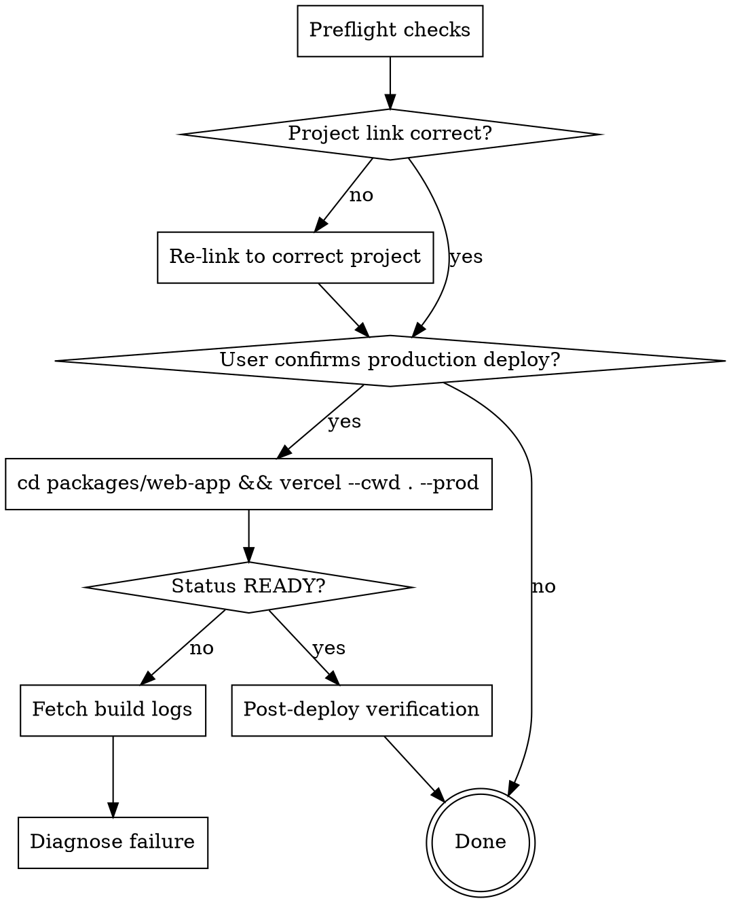

# Deploy Web-App to Production

## Overview

Deploy `packages/web-app` to Vercel production with safety checks to prevent linking to wrong project and ensure successful deployment.

## Core Problems

1. **Wrong Project Link:** Multiple Vercel projects with similar names exist. `.vercel/project.json` may link to WRONG project.
2. **Wrong Deploy Directory:** Deploying from monorepo root uploads wrong files. Must deploy from `packages/web-app`.

## Preflight Checks

Run BEFORE any deployment. Stop on failure.

### 1. Verify Project Link

```bash
# Check linked project
cat .vercel/project.json

# List all projects to confirm correct one
vercel project ls
```

**Critical validation:**
- Linked project name must match expected project (e.g., `oh-my-prompt-web-app`)
- Linked project must have production URL matching expected domain (e.g., `oh-my-prompt.com`)
- If wrong project linked: `vercel link --project <correct-project-name>`

### 2. Uncommitted Changes

```bash
git status --porcelain
```

If output non-empty: warn user changes won't be included. Ask to commit first or continue.

### 3. Build Command Verification

```bash
# Confirm build works locally
npm run build --workspace=@oh-my-prompt/web-app
```

Must pass before deploying to Vercel.

## Deployment Flow



## Commands

### Production Deploy (requires user confirmation)

**⚠️ CRITICAL:** Must deploy from `packages/web-app` directory, NOT from monorepo root.

```bash
# Deploy to production (from packages/web-app)
cd packages/web-app && vercel --cwd . --prod

# Get deployment details
vercel inspect <deployment-url>

# Check for runtime errors after deploy
vercel logs <deployment-url> --level error --since 1h
```

### Project Management

```bash
# List projects
vercel project ls

# Link to specific project
vercel link --project <project-name>

# Get project details via MCP
# Use mcp__plugin_vercel_vercel__get_project with projectId and teamId
```

## Failure Diagnosis

When deployment fails:

1. **Check build logs first** - most failures are build-time
2. **Verify environment variables** - run `vercel env ls`
3. **Check project link** - wrong project = empty codebase
4. **Local build test** - `npm run build --workspace=@oh-my-prompt/web-app`

## Post-Deploy Verification

After READY status:

1. **Inspect deployment** - `vercel inspect <url>`
2. **Check runtime errors** - `vercel logs <url> --level error --since 1h`
3. **Visit production URL** - verify site loads correctly

## Common Mistakes

| Mistake | Fix |
|---------|-----|
| Deploying from monorepo root | `cd packages/web-app && vercel --cwd . --prod` |
| Linked to wrong project | `vercel link --project <correct-name>` |
| Build fails on Vercel | Test `npm run build` locally first |
| Missing env vars | `vercel env ls` then add missing vars |
| TypeScript errors | Run `npx tsc --noEmit` in web-app package |

## Deploy Summary Format

```
## Deploy Result
- **URL**: <deployment-url>
- **Target**: production | preview
- **Status**: READY | ERROR | BUILDING | QUEUED
- **Commit**: <short-sha>
- **Framework**: <detected-framework>
- **Build Duration**: <duration>

### Post-Deploy Observability
- **Error scan**: <N errors found / clean>
- **Site accessible**: <yes/no>
```