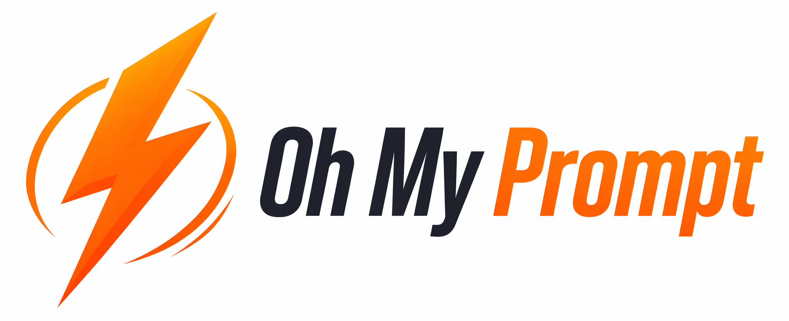
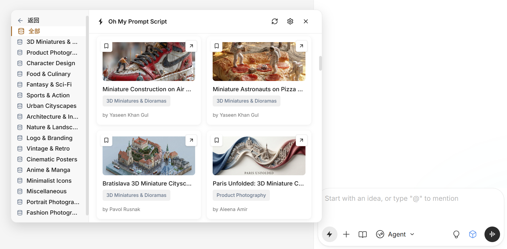
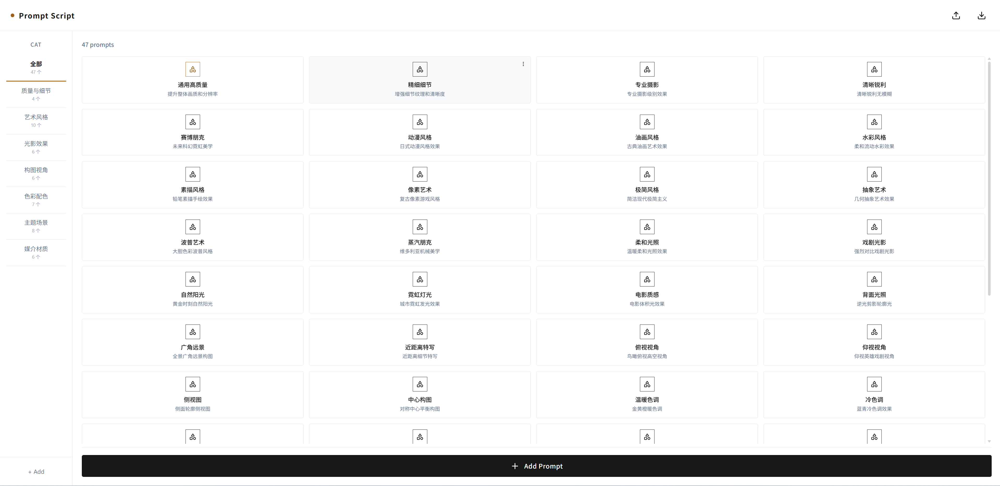

<div align="center">
  
  <h3>告别复制粘贴，一键插入你的提示词</h3>

[](LICENSE)
[]()
[]()

🌐 **官方网站**: [https://wk240.github.io/oh-my-prompt-script](https://wk240.github.io/oh-my-prompt-script)
</div>

## 这是什么？

Oh My Prompt Script 是一个 Chrome 扩展，专为 Lovart AI 设计平台打造。

**一句话说清楚：** 把常用提示词保存起来，下次创作时一键插入，不再重复输入相同内容。

## 解决什么痛点？

每次在 Lovart 创作时，你是否也在重复输入：
- 自己积累的优质提示词模板
- 常用的风格描述：「扁平化设计」「赛博朋克风格」「水彩插画」
- 技术参数：「高清渲染」「4K分辨率」「光影细腻」
- 网络中的提示词模板

一次输入，下次还得再输。Oh My Prompt Script 解决这个问题。

## 安装

### 方式一：下载安装包（推荐）

适合大多数用户，无需编译：

1. 前往 [Releases 页面](https://github.com/wk240/oh-my-prompt-script/releases)下载最新版本的 `dist.zip`
2. 解压到任意文件夹
3. 打开 Chrome，访问 `chrome://extensions/`
4. 启用「开发者模式」
5. 点击「加载已解压的扩展程序」，选择解压后的文件夹

### 方式二：从源码构建

适合开发者或需要自定义的用户：

**前提条件**：Node.js 18+ 环境

```bash
# 克隆项目
git clone https://github.com/wk240/oh-my-prompt-script.git
cd oh-my-prompt-script

# 安装依赖并构建
npm install
npm run build

# 在 Chrome 加载扩展
# 1. 打开 chrome://extensions/
# 2. 启用「开发者模式」
# 3. 点击「加载已解压的扩展程序」
# 4. 选择项目根目录下的 dist 文件夹
```

## 怎么用？

### 1、页面上一键插入

在 Lovart 的输入框旁，你会看到一个闪电图标按钮：

1. 点击闪电图标 → 打开下拉菜单
2. 选择提示词 → 内容自动插入输入框
3. 继续选择 → 可组合多个提示词



### 2、管理你的提示词

点击浏览器工具栏的扩展图标，打开管理界面：

- **分类管理**：按用途分组，拖拽调整顺序
- **增删改查**：添加、编辑、删除提示词
- **开启备份**：选择本地文件夹，自动备份数据
- **版本历史**：查看历史备份文件列表
- **恢复数据**：从任意历史版本一键恢复
- **导入导出**：JSON 格式备份和迁移



## 常见问题

**Q: 安装时出现 "Invalid script mime type" 错误怎么办？**

A: 这个错误说明选择了错误的目录。请按以下步骤重新安装：

1. 移除当前扩展
2. 确认选择的是项目根目录下的 `dist` 文件夹（不是项目根目录或 `src` 目录）
3. 重新加载扩展


**Q: 为什么在其他网站看不到闪电图标？**

A: 扩展仅在 Lovart 平台激活，避免影响其他网站。

**Q: 如何备份我的提示词？**

A: 有两种方式：
- **本地同步**：开启同步功能，自动备份到本地文件夹，保留历史版本
- **导入导出**：管理界面点击导出图标，下载 JSON 文件

**Q: 提示词插入后平台没反应？**

A: 确保输入框处于聚焦状态。如有问题，可手动输入几个字符后再插入。

**Q: 资源库的内容从哪里来？**

A: 来自社区贡献者分享的优质提示词，每条都标注了原作者信息。

**Q: 如何更新扩展？**

A: 更新步骤如下：

1. 扩展会自动检测新版本并提示，或点击管理界面的「检查更新」按钮
2. 点击提示，前往 Releases 页面下载新版本 `dist.zip`
3. 解压后，在 `chrome://extensions/` 点击扩展的「重新加载」按钮

## 许可证

[MIT License](LICENSE) - 自由使用、修改和分发。