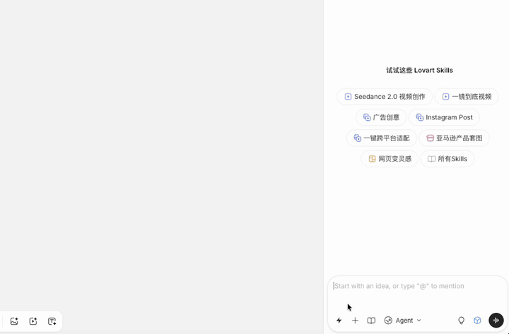

<div align="center">
  
  <h1>Oh My Prompt</h1>
  <h3>AI 提示词管理工具 | Prompt Manager for AI</h3>
  <p><strong>告别复制粘贴，一键插入你的提示词，无需离开创造界面</strong></p>
  
  [](LICENSE)
  []()
  []()
  []()
  
  🌐 [官方网站](https://oh-my-prompt.com/) | 📦 [下载安装](https://github.com/wk240/oh-my-prompt/releases)
</div>

---

<!-- SEO Keywords: Lovart AI, prompt manager, Chrome extension, 提示词管理, AI设计工具, prompt template, 提示词模板 -->

## ✨ 核心功能 | Features

**Oh My Prompt** 是一款专为 AI 设计平台打造的 Chrome 浏览器扩展，帮助你高效管理和使用提示词。

| 功能 | 说明 |
|------|------|
| 🚀 **一键插入** | 保存常用提示词，下次创作时一键插入，无需重复输入 |
| 🖼️ **图片转提示词** | 鼠标悬停任意图片，一键生成双语提示词（需配置 API） |
| 📁 **分类管理** | 按用途分组管理提示词，支持拖拽排序 |
| 🎨 **资源库** | 内置优质提示词模板，一键使用社区精选内容 |

**一句话说清楚：** 把常用提示词保存起来，下次创作时一键插入，不再重复输入相同内容。

---

## 🎯 解决什么痛点？

每次在 Lovart、星流、ChatGPT 等设计平台创作时，你是否也在重复输入：
- ✅ 自己积累的优质提示词模板
- ✅ 常用的风格描述：「扁平化设计」「赛博朋克风格」「水彩插画」
- ✅ 技术参数：「高清渲染」「4K分辨率」「光影细腻」
- ✅ 网络收集的提示词模板

**一次输入，下次还得再输。Oh My Prompt 解决这个问题。**

---

## 📦 安装指南

### 方式一：下载安装包（推荐）

适合大多数用户，无需编译：

1. 前往 [Releases 页面](https://github.com/wk240/oh-my-prompt/releases) 下载最新版本的 `oh-my-prompt-v*.zip`
2. 解压到任意文件夹
3. 打开 Chrome，访问 `chrome://extensions/`
4. 启用「开发者模式」
5. 点击「加载已解压的扩展程序」，选择解压后的文件夹

### 方式二：从源码构建

适合开发者或需要自定义的用户：

**前提条件**：Node.js 18+ 环境

```bash
# 克隆项目
git clone https://github.com/wk240/oh-my-prompt.git
cd oh-my-prompt

# 安装依赖并构建
npm install
npm run build

# 在 Chrome 加载扩展
# 1. 打开 chrome://extensions/
# 2. 启用「开发者模式」
# 3. 点击「加载已解压的扩展程序」
# 4. 选择项目根目录下的 dist 文件夹
```

---

## 📖 使用教程

### 1、页面上一键插入

在 Lovart 的输入框旁，你会看到一个闪电图标按钮：

1. 点击闪电图标 → 打开下拉菜单
2. 选择提示词 → 内容自动插入输入框
3. 继续选择 → 可组合多个提示词



### 2、备份管理

点击浏览器工具栏的扩展图标，打开备份管理界面：

- **开启备份**：选择本地文件夹，数据变更时自动同步
- **版本历史**：查看历史备份文件列表
- **恢复数据**：从任意历史版本一键恢复

### 3、图片转提示词

**前提条件**：需先配置 Vision API（在扩展设置页面配置 API Key）

使用步骤：
1. 在任意网站浏览图片
2. 鼠标悬停在图片上，出现 ✨ 按钮
3. 点击按钮 → 弹出分析窗口
4. 等待分析完成 → 查看生成的提示词
5. 可切换语言（中/EN）和格式（自然语言/JSON）
6. 提示词自动保存到临时库

---

## ❓ 常见问题 FAQ

<details>
<summary><strong>Q: 安装时出现 "Invalid script mime type" 错误怎么办？</strong></summary>

这个错误说明选择了错误的目录。请按以下步骤重新安装：

1. 移除当前扩展
2. 确认选择的是项目根目录下的 `dist` 文件夹（不是项目根目录或 `src` 目录）
3. 重新加载扩展


</details>

<details>
<summary><strong>Q: 为什么在其他网站看不到闪电图标？</strong></summary>

扩展在 Lovart、ChatGPT、Claude.ai、Gemini、LibLib、即梦等支持的平台上激活。如在其他网站看不到图标，说明该平台暂未支持，后续版本可能添加。
</details>

<details>
<summary><strong>Q: 如何备份我的提示词？</strong></summary>

有两种方式：
- **本地同步**：开启同步功能，自动备份到本地文件夹，保留历史版本
- **导入导出**：管理界面点击导出图标，下载 JSON 文件
</details>

<details>
<summary><strong>Q: 提示词插入后平台没反应？</strong></summary>

确保输入框处于聚焦状态。如有问题，可手动输入几个字符后再插入。
</details>

<details>
<summary><strong>Q: 资源库的内容从哪里来？</strong></summary>

来自社区贡献者分享的优质提示词，每条都标注了原作者信息。
</details>

<details>
<summary><strong>Q: 如何更新扩展？</strong></summary>

更新步骤如下：

1. 扩展会自动检测新版本并提示，或点击管理界面的「检查更新」按钮
2. 点击提示，前往 Releases 页面下载新版本安装包
3. 解压后，在 `chrome://extensions/` 点击扩展的「重新加载」按钮
</details>

<details>
<summary><strong>Q: 图片转提示词功能如何配置 API？</strong></summary>

需要配置 Vision API 才能使用此功能：
1. 点击扩展图标打开设置页面
2. 进入「API 配置」页面
3. 填写 API Base URL、API Key、模型名称
4. 选择 API 格式（OpenAI 格式或 Anthropic 格式）
5. 保存配置后即可使用

支持的服务：Claude API、OpenAI GPT-4V、或其他兼容服务。
</details>

<details>
<summary><strong>Q: 为什么有些图片看不到转提示词按钮？</strong></summary>

按钮只在满足以下条件时显示：
- 图片尺寸至少 100×100 像素
- 图片有有效的 URL（非 data URL）
- Vision 功能在设置中已启用（默认启用）
</details>

---

## 👤 作者

**Neo**（取自《黑客帝国》主角）—— Lovart AI 用户，为提升创作效率而开发。

社交媒体「Neo与AI」：公众号、小红书、抖音 | [GitHub](https://github.com/wk240)

---

## 📄 许可证

[MIT License](LICENSE) - 自由使用、修改和分发。

---

## 🤝 贡献

欢迎提交 Issue 和 Pull Request！

如果这个项目对你有帮助，请给个 ⭐ Star 支持一下！