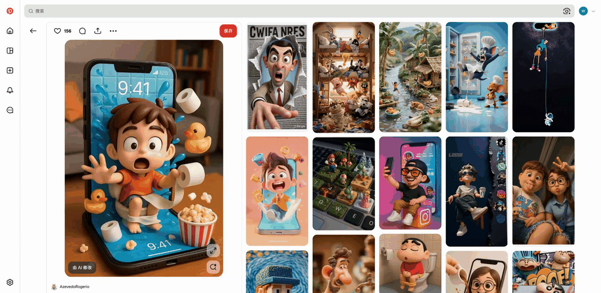

<div align="center">
  
  <h1>Oh My Prompt</h1>
  <h3>AI Prompt Manager</h3>
  <p><strong>Say goodbye to copy-paste. Insert your prompts with one click, without leaving your creative workspace.</strong></p>
  
  [](LICENSE)
[]()
[]()

  🌐 [Official Website](https://oh-my-prompt.com/) | 📦 [Download](https://github.com/wk240/oh-my-prompt/releases) | 🇨🇳 [中文](README.md)
</div>

---

## Project Structure

This project uses a **Monorepo** architecture:

```
packages/
├── extension/      # Chrome Extension (Open Source)
│   ├── src/        # Extension source code
│   └── dist/       # Build output (Chrome loads this directory)
│
├── shared/         # Shared type definitions (Open Source)
│   ├── types/      # TypeScript types
│   └── constants/  # Constant definitions
│
└── web-app/        # Web App (Private, official website & cloud sync service)
```

---

## ✨ Core Features

**Oh My Prompt** is a Chrome extension designed for AI design platforms, helping you efficiently manage and use prompts.

| Feature | Description |
|---------|-------------|
| 🚀 **One-Click Insert** | Save your frequently used prompts and insert them with one click next time - no repetitive typing |
| 🖼️ **Image to Prompt** | Hover over any image and generate bilingual prompts with one click (requires API configuration) |
| 📁 **Category Management** | Organize prompts by purpose with drag-and-drop sorting support |
| 🎨 **Resource Library** | Built-in quality prompt templates, one-click access to community curated content |

**In one sentence:** Save your commonly used prompts, insert them with one click next time, and stop typing the same content over and over.

---

## 🎯 What Problem Does It Solve?

When creating on Lovart, Xingliu, ChatGPT and other design platforms, are you also repeatedly typing:
- ✅ Your own accumulated high-quality prompt templates
- ✅ Common style descriptions: "flat design", "cyberpunk style", "watercolor illustration"
- ✅ Technical parameters: "HD render", "4K resolution", "soft lighting"
- ✅ Prompt templates collected from the internet

**Type it once, type it again next time. Oh My Prompt solves this problem.**

---

## 📦 Installation Guide

### Method 1: Download Package (Recommended)

Suitable for most users, no compilation needed:

1. Go to [Releases page](https://github.com/wk240/oh-my-prompt/releases) and download the latest `oh-my-prompt-v*.zip`
2. Extract to any folder
3. Open Chrome and visit `chrome://extensions/`
4. Enable "Developer mode"
5. Click "Load unpacked" and select the extracted folder

### Method 2: Build from Source

Suitable for developers or users who need customization:

**Prerequisites**: Node.js 18+ environment

```bash
# Clone the project
git clone https://github.com/wk240/oh-my-prompt.git
cd oh-my-prompt

# Install dependencies
npm install

# Build (production version)
npm run build

# Or development mode (with hot reload, recommended for development)
npm run dev
```

**Load Extension in Chrome**:

1. Open `chrome://extensions/`
2. Enable "Developer mode" (toggle in top right)
3. Click "Load unpacked"
4. **Select the `packages/extension/dist` directory** (not project root or src directory)

> ⚠️ **Note**: In development mode, source code changes will auto-rebuild, but you need to click the refresh button on the Chrome extensions page for changes to take effect.

---

## 📖 Usage Guide

### 1. One-Click Insert on Page

Next to the input box on Lovart, you'll see a lightning icon button:

1. Click the lightning icon → dropdown menu opens
2. Select a prompt → content auto-inserts into input box
3. Continue selecting → combine multiple prompts


### 2. Backup Management

Click the extension icon in browser toolbar to open the side panel. Click the settings icon in top right, go to "Backup" tab:

- **Enable backup**: Select a local folder, data syncs automatically on changes
- **Version history**: View list of historical backup files
- **Restore data**: One-click restore from any historical version

### 3. Image to Prompt

**Prerequisites**: Need to configure Vision API first (configure API Key in extension settings)

Usage steps:
1. Browse images on any website
2. Hover over an image, ✨ button appears
3. Click the button → analysis window pops up
4. Wait for analysis to complete → view generated prompt
5. Can switch language (Chinese/EN) and format (natural language/JSON)
6. Prompt auto-saves to temporary library



---

## ❓ Frequently Asked Questions (FAQ)

<details>
<summary><strong>Q: What to do when "Invalid script mime type" error appears during installation?</strong></summary>

This error means you selected the wrong directory. Reinstall following these steps:

1. Remove current extension
2. Confirm you selected **`packages/extension/dist` directory** (not project root, src directory, or entire packages directory)
3. Reload the extension


</details>

<details>
<summary><strong>Q: Why can't I see the lightning icon on other websites?</strong></summary>

The extension activates on supported platforms like Lovart, ChatGPT, Claude.ai, Gemini, LibLib, Jimeng, Kimi, Xingliu. If you don't see the icon on other websites, that platform is not yet supported - may be added in future versions.
</details>

<details>
<summary><strong>Q: How to backup my prompts?</strong></summary>

Two options:
- **Local sync**: Enable sync feature for automatic backup to local folder with version history
- **Import/Export**: Click export icon in management interface to download JSON file
</details>

<details>
<summary><strong>Q: Platform doesn't respond after prompt insertion?</strong></summary>

Make sure the input box is in focus. If issues occur, try typing a few characters manually before inserting.
</details>

<details>
<summary><strong>Q: Where does the Resource Library content come from?</strong></summary>

From community contributors sharing high-quality prompts, each tagged with original author information.
</details>

<details>
<summary><strong>Q: How to update the extension?</strong></summary>

Update steps:

1. Extension auto-detects new versions and prompts, or click "Check for updates" button in management interface
2. Click the prompt to go to Releases page and download new version package
3. After extracting, click "Reload" button for the extension on `chrome://extensions/`
</details>

<details>
<summary><strong>Q: How to configure API for image to prompt feature?</strong></summary>

Need to configure Vision API to use this feature:
1. Click extension icon to open side panel, click settings icon in top right, select "AI Vision" tab
2. Fill in API Base URL, API Key, model name
3. Select API format (OpenAI format or Anthropic format)
4. Save configuration and start using

Supported services: Claude API, OpenAI GPT-4V, or other compatible services.
</details>

<details>
<summary><strong>Q: Why can't I see the image to prompt button on some images?</strong></summary>

Button only shows when these conditions are met:
- Image size at least 100×100 pixels
- Image has valid URL (not data URL)
- Vision feature enabled in settings (default enabled)
</details>

---

## 👤 Author

**Neo** (named after "The Matrix" protagonist) - Lovart AI user, developed to improve creative efficiency.

Social media "Neo与AI": WeChat Official Account, XiaoHongShu, Douyin | [GitHub](https://github.com/wk240)

---

## 📄 License

[MIT License](LICENSE) - Extension and Shared packages are open source

---

## 🏗️ Architecture Design

See [Commercialization Architecture Design](docs/superpowers/specs/2026-05-08-commercialization-architecture-design.md)

---

## 🤝 Contributing

Issues and Pull Requests are welcome!

If this project helps you, please give it a ⭐ Star to show your support!