# GPT Image 2 Prompts 合集

> 本文档整理了 27 张使用 GPT Image 2 High 模型生成的图片及其对应 Prompt

---

## 目录

- [杜甫系列（社交媒体穿越）](#杜甫系列社交媒体穿越)
- [科普长图系列](#科普长图系列)
- [电商详情页系列](#电商详情页系列)
- [旅游地图系列](#旅游地图系列)
- [试卷课本系列](#试卷课本系列)
- [设计提案板系列](#设计提案板系列)
- [拆解图系列](#拆解图系列)
- [影评专栏](#影评专栏)
- [动漫角色系列](#动漫角色系列)

---

## 杜甫系列（社交媒体穿越）

### 1. 杜甫 X 平台推文截图

**核心创意**：使用 GPT Image 2 模型迭代杜甫 X 平台推文截图，杜甫吐槽茅屋破败 + 四位好友评论（李白、高适、严武、岑参）。

**完整 Prompt**：

```
使用 GPT Image 2 模型重新生成杜甫的 X 平台推文截图，画面模拟手机屏幕界面，背景为深灰色，左上角显示 X logo，用户头像为唐代文人半身像、用户名杜甫 (@dufu_poet)、蓝色认证徽章、简介写唐朝诗人 | 忧国忧民 | 诗史作者，时间显示762年·成都，主推文内容写秋风破屋，屋顶漏雨，孩子冻醒。隔壁富人歌舞升平，这世道没法看了。🕯️，下方显示回复 892 · 转发 3.2K · 喜欢 12K · 阅读 58K，评论区展开显示四条好友评论：

第一条：李白 (@libai_immortal) · 蓝色认证徽章 · 兄弟，给你寄两坛酒。茅屋漏雨就漏吧，月亮还是照样升起来。酒到成都了，喝完再写。🍶

第二条：高适 (@gao_shi_official) · 成都这边朝廷拨款迟迟不到，我上书了三次也没用。杜兄再撑一撑，我这边想办法。👊

第三条：严武 (@yanwu_yan_zhou) · 杜兄搬进我府里住吧，草堂太不安全了。成都刺史府有空房，随时来。

第四条：岑参 (@cen_shen_frontier) · 我在边塞的风比成都还大，帐篷都被吹跑了。诗人命都苦。🥶

底部导航栏显示 Home Search Notifications Profile 四个图标，整体配色为 X 平台深色模式风格，蓝灰色调，界面字体清晰现代，带真实产品截图的质感，比例 9:16。
```

**图片**：

---

### 2. 杜甫抖音直播访友

**核心创意**：把杜甫的"访友"场景做成抖音直播界面截图，让唐代诗人穿越到现代社交媒体，评论区全是他的诗人好友在点赞互动。

**完整 Prompt**：

```
杜甫抖音直播界面截图，画面模拟真实手机直播画面，中心是杜甫身着唐代布衣、背着行囊走在山路上的全身镜头，背景是秋日山林、茅屋远景，他手持自拍视角，表情认真又带点文人疲惫，画面叠加抖音直播 UI：左上角显示"杜甫·正前往草堂拜访严武"，右上角直播标识闪烁，底部评论区实时滚动，评论用户头像为唐代诗人工笔画像，昵称显示"李白·酒中仙"、"高适·边塞客"、"王维·诗佛"、"孟浩然·山人"、"岑参·雪中行"，评论内容写"子美兄又去蹭饭了"、"给老杜点赞"、"草堂路况如何"、"严武家的酒好喝吗"、"这路我走过，建议带两斤牛肉"，评论区夹杂现代直播用语与古代语境混搭，点赞数显示 8472，观看人数显示"12.3万正在观看"，整体画面像一张被截屏传播的直播截图，带有荒诞历史穿越感，比例 9:16。
```

**图片**：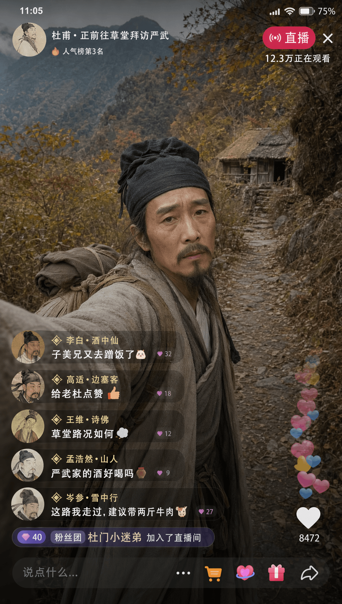

---

### 3. 李白杜甫抖音PK直播

**核心创意**：把唐代两大诗人杜甫和李白做成抖音 PK 直播连麦界面截图，两人分屏对战，各自展示才艺。

**完整 Prompt**：

```
抖音 PK 直播连麦界面截图，画面采用标准左右分屏布局，左侧是李白身着飘逸白衣、手持酒壶、醉态豪放，背景是月光下的江舟，头顶 PK 条显示"李白·诗仙派"，实时票数 52847，弹幕区刷屏"太白兄冲！""酒中仙无敌""蜀道难谁敢挑战"；右侧是杜甫身着朴素布衣、面容愁苦、手持纸笔，背景是秋风茅屋，头顶 PK 条显示"杜甫·忧民派"，实时票数 49231，弹幕区刷屏"子美稳住！""茅屋为秋风所破""现实主义才是主流"；中间顶部 PK 倒计时显示"剩余 02:35"，下方PK胜负奖励区写"胜者：明日头条推荐位"；底部评论区实时滚动，好友分成两派叫阵：王维站李白阵营发"太白这气质我服"，高适站杜甫阵营发"子美的诗有深度"，孟浩然发"两边都别吵了来喝酒"，岑参发"边塞派表示围观"，白居易发"晚辈表示膜拜两位"，整体界面叠加抖音标准 UI 元素（点赞心形、礼物图标、分享按钮），画面像一张被疯狂转发的 PK 截图，带有历史人物穿越网红直播的荒诞病毒传播感，比例 9:16。
```

**图片**：

---

### 4. 杜甫《登高》小红书笔记

**核心创意**：模拟真实小红书手机界面截图，以杜甫《登高》为主题，将古诗意境与登山路径图结合。

**完整 Prompt**：

```
小红书笔记页面截图，杜甫《登高》主题文旅笔记，页面顶部显示用户头像（古典文人风格头像）和昵称「唐诗漫游者」，下方主图区域展示一张登山路径手绘地图，路径从山脚蜿蜒至山顶，沿途标注"杜甫登高处"、"望江亭"、"风急楼"三个观景点，地图风格为古风山水水墨渲染叠加现代路线指示线，路径图上方叠加诗句"无边落木萧萧下，不尽长江滚滚来"的手写书法效果，笔记标题醒目位置写"秋日登高｜跟着杜甫走一遍《登高》原路"，正文区分段展示"📍坐标：夔州白帝城·秋日限定"、"📝杜甫当时：54岁，抱病独登"、"🌿必打卡：落木萧萧观景台、滚滚长江取景点"、"💡Tips：适合秋天去，风大记得带披风"，底部标签栏显示"#唐诗实地探访 #杜甫登高 #古诗旅行 #秋日限定"，页面右下角显示点赞数 2862、收藏数 1547、评论数 89，底部评论区展示两条热门评论"用户A：这个路线太绝了，秋天一定要去"、"用户B：杜甫这诗写得太苦了，实地走一遍更懂那份孤独"，整体为真实小红书 App 页面截图效果，界面元素清晰可读，无手机边框，直接是软件界面截图，比例 9:16
```

**图片**：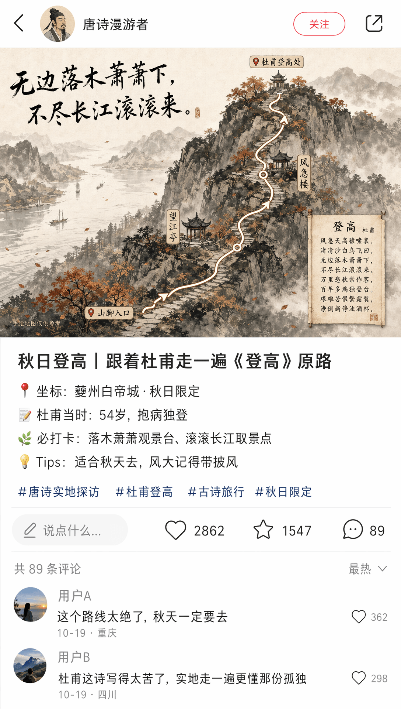

---

### 5. 杜甫朋友圈·茅屋被秋风所破

**核心创意**：把杜甫《茅屋为秋风所破歌》转化为微信朋友圈界面截图，严肃的历史诗歌场景变成社交媒体吐槽。

**完整 Prompt**：

```
微信朋友圈界面截图，手机屏幕比例 9:16，界面风格真实还原现代社交 App，顶部状态栏显示时间和信号。头像区域是一位中年文人水墨肖像风格头像，昵称「杜甫」，下方配文：「风这么大，家人们谁懂啊，房顶又没了」。配文下方是九宫格图片区，每张图展示茅草屋顶被秋风吹破的惨状：茅草四散飘飞、屋顶破洞露出天空、孩童抱着茅草跑、杜甫站在破屋前无奈叹息、狂风卷着茅草过江、竹筐散落、床头漏雨湿透、残破墙壁、夜色中破屋孤影，九张图风格统一，采用水墨淡彩写实画风，带有真实照片般的细节质感，同时又保持中国画笔触。配文下方显示「1小时前」，定位「成都·浣花溪草堂」。评论区第一层：严武评论「子美莫急，我这就派人来修屋」，头像为官服文人肖像；李白评论「哈哈哈，秋风也来催诗了？不如先来喝两杯」，头像为潇洒酒仙风格；高适、韩愈、白居易等头像均为不同风格的古代文人肖像。底部点赞区显示「严武、李白、高适、韩愈、白居易等28人」，点赞图标使用爱心符号。整体界面保持现代手机 App 界面的真实性——按钮、间距、字体、阴影都像真实的微信截图，但内容全是古代元素与现代网络语言的碰撞：严肃诗歌变成吐槽、经典场景变成九宫格、诗友们变成评论区好友、历史地点变成定位标签。画面制造出一种「杜甫穿越到 2026 年发朋友圈」的时空错乱幽默感，同时视觉上足够真实，像一张可以被截图转发传播的社交媒体图片。色彩控制在水墨黑白灰为主，少量暖色调点缀头像和爱心图标，整体既像真实 App 截图，又带有中国传统美学的克制与意境。
```

**图片**：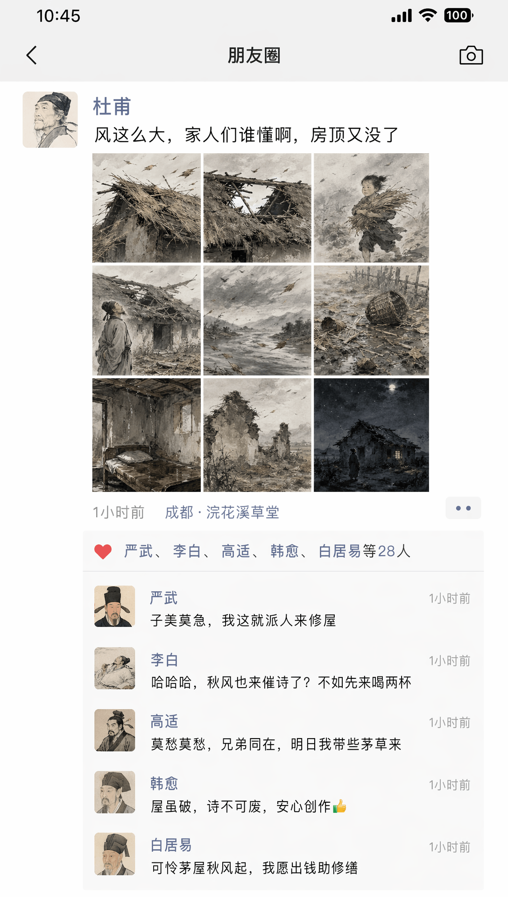

---

## 科普长图系列

### 6. 拉布拉多犬知识科普长图

**核心创意**：一张竖版科普长图，把拉布拉多犬的关键知识点拆成多个清晰模块。

**完整 Prompt**：

```
拉布拉多犬知识科普长图，竖版信息图设计，顶部是品种名称大标题"拉布拉多犬"搭配一张半写实风格的拉布拉多正面肖像图，眼神温和、毛色金黄，紧接着是品种档案区，列出原产地英国、分类寻回犬、寿命10-12年、体重25-36kg四项基础参数，采用图标+数值的卡片式排版；中间是颜色分类模块，横向并列展示黑色、金色、巧克力色三种经典毛色的小犬图样，每张下方标注颜色名称和比例说明；接下来是性格特点区，用四个圆形图标分别表达"友善亲人""聪明易训""活泼好动""耐力充沛"，图标旁配短句说明；下方是饲养要点模块，分为饮食、运动、健康三栏，每栏给出一条实用建议如"每日运动至少一小时""避免过度喂食易肥胖"等；底部是趣味小贴士区，写上"最适合初次养狗的家庭犬"和"导盲犬首选品种"两行醒目文字，整体配色以暖黄、奶油白、浅棕为主，带轻微犬类毛发质感，字体采用清晰无衬线体适合移动端阅读，比例 9:16。
```

**图片**：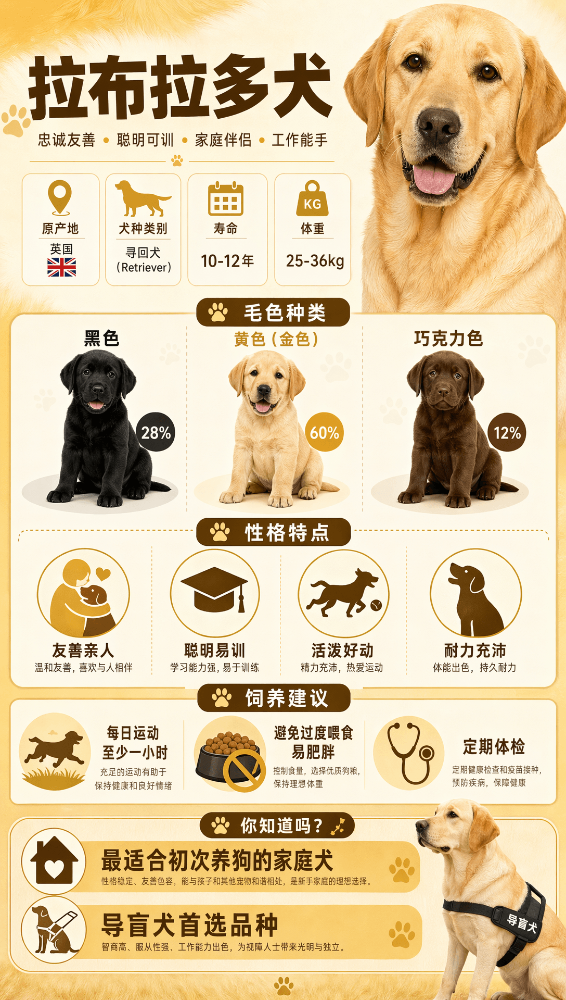

---

### 7. 边境牧羊犬知识科普长图

**核心创意**：一张竖版科普长图，展示边境牧羊犬的关键知识点，突出其"最聪明犬种"的核心特质。

**完整 Prompt**：

```
边境牧羊犬知识科普长图，竖版信息图设计，顶部是品种名称大标题"边境牧羊犬"搭配一张半写实风格的边牧正面肖像图，眼神机警灵动、黑白双色毛发，紧接着是品种档案区，列出原产地英国边境、分类牧羊犬、寿命12-15年、体重14-20kg四项基础参数，采用图标+数值的卡片式排版；中间是颜色分类模块，横向并列展示黑白经典、蓝陨色、红陨色、金白四种常见毛色的小犬图样，每张下方标注颜色名称；接下来是性格特点区，用四个圆形图标分别表达"智商排名第一""学习能力强""服从性极佳""精力旺盛"，图标旁配短句说明，重点突出"智商相当于6-8岁儿童"的标注；下方是饲养要点模块，分为智力刺激、运动需求、健康护理三栏，每栏给出一条实用建议如"需要大量益智游戏和训练""每日运动至少两小时""注意眼部遗传疾病筛查"等；底部是趣味小贴士区，写上"犬界智商天花板"和"能学会上百种指令"两行醒目文字，整体配色以黑白为主调搭配浅灰和草地绿点缀，带轻微犬类毛发质感，字体采用清晰无衬线体适合移动端阅读，比例 9:16。
```

**图片**：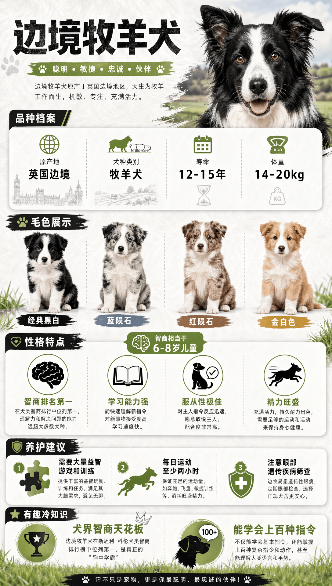

---

### 8. 人体免疫系统科普长图

**核心创意**：做一张超长比例的"人体免疫防线地图"长卷式信息图，从外部威胁到内部防线再到系统协作。

**完整 Prompt**：

```
人体免疫系统科普长图，信息图风格，画面呈超长纵向结构，比例 9:21，分为六个层级区段：

第一区段"外部威胁全景"：顶部展示病原体入侵场景，病毒、细菌、寄生虫以威胁图标呈现，标注"每秒接触10万+潜在威胁"；

第二区段"第一道防线"：皮肤城墙与黏膜屏障，城墙纹理盾牌图标表现物理阻挡，鼻毛、泪液、胃酸以关卡图标标注"阻挡90%入侵者"；

第三区段"第二道防线"：先天免疫战场，巨噬细胞坦克造型吞噬病原体，中性粒细胞穿刺攻击，炎症反应用火焰图标标注"无差别攻击·24小时巡逻"，补充"发热是防御不是敌人"注释；

第四区段"第三道防线"：特异性免疫指挥部，T细胞指挥官造型标注"识别敌情·指挥作战"，B细胞工厂造型标注"制造抗体·精准打击"，展示抗原呈递流程和抗体Y型锁定机制；

第五区段"系统协作"：展示免疫细胞协同作战链条，树突状细胞侦察兵→T细胞指挥→B细胞生产→抗体投放→巨噬细胞清理战场，用流程箭头和编号串联；

第六区段"免疫记忆与疫苗"：记忆细胞档案柜存储敌人档案，标注"下次入侵·秒速响应"，底部疫苗模块展示"主动训练免疫系统"原理，用注射图标和模拟敌人训练图示；

整体配色医疗蓝+警示红+安全绿三色系统，细胞角色边缘发光轮廓，背景人体剖面透视层，标题区写"人体免疫防线·一场看不见的战争"，底部附信息来源注释"基于《免疫学原理》简化呈现"。
```

**图片**：

---

### 9. 明朝女性服饰科普长图

**核心创意**：做一张"明朝女性服饰演变"主题的科普长图，以时间轴滚动式结构呈现不同时期女性服装形制。

**完整 Prompt**：

```
明朝女性服饰科普长图，竖版滚动式信息图，比例9:16，顶部标题区用楷体大字写'明代女子衣冠志'，下方配明代仕女工笔插画作为封面视觉，主体内容按时间轴纵向展开，分为'洪武初创''永乐盛世''嘉靖变革''万历繁丽''崇祯末世'五个时期板块，每个板块内嵌入三种身份层级的服装示例：皇后/命妇礼服、贵妇常服、平民女子衣装，每套服装配有正面全身像与服饰部件拆解图，拆解图以线稿形式标注'褙子''马面裙''云肩''霞帔''立领对襟'等关键部件名称，右侧配简短说明框介绍形制特点与社会背景，底部设置配饰演变区展示发髻款式变化、首饰材质等级、鞋履形制差异，整体色调以明代典型色系为主——赭石、石青、绛红、月白、藕荷，织物纹理需呈现丝绸光泽、锦缎暗花、棉麻质朴的质感对比，排版采用博物馆展板风格，标题使用碑刻感楷体，说明文字用细宋体，层次清晰、信息密集但不拥挤，视觉基调为古典雅致、学术严谨、科普亲和。
```

**图片**：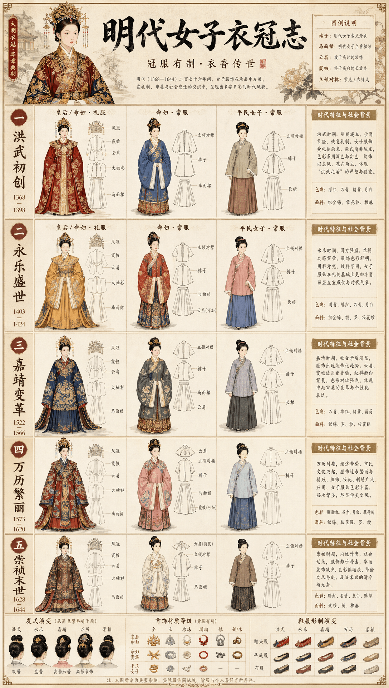

---

## 电商详情页系列

### 10. 全自动咖啡机电商详情页长图

**核心创意**：设计一张全自动咖啡机的电商详情页长图，从顶部氛围主图到底部参数表格形成完整的产品叙述链。

**完整 Prompt**：

```
全自动咖啡机电商详情页长图，竖版构图，比例 9:16，从上至下分为五个信息层。第一层为顶部主图区，占据画面约 20%，展示咖啡机整机置于木质台面，背景为清晨阳光洒落的咖啡角场景，蒸汽从咖啡杯升腾，整体氛围为居家清晨仪式感，光线柔和暖调，营造"一天从一杯好咖啡开始"的情境。第二层为核心功能图标区，横向排列六个图标模块：现磨咖啡豆图标配短文案"保留原香"、高压萃取图标配"19Bar 专业级"、花式咖啡图标配"一键卡布奇诺"、奶泡系统图标配"绵密奶泡"、触控屏图标配"智能触控"、自动清洗图标配"省心清洁"，图标采用线性设计风格，深棕色线条，米白填充，下方配功能名和一句话卖点，整体排列整齐留白充足。第三层为功能细节展示区，分为三组图文组合，每组左侧为场景图右侧为功能说明，场景图展示咖啡豆研磨过程、萃取时的金色油脂、奶泡系统出绵密泡沫，文字采用功能名加技术原理加用户体验描述的三段式结构，图片与文字间隔适当留白。第四层为使用流程区，标题"4步轻松享用"，四个步骤以数字编号横向排列：①选择饮品 → ②放入咖啡豆 → ③一键启动 → ④品味醇香，每步配简笔插图和一句话说明，箭头连接形成流程线，整体视觉节奏轻快简洁。第五层为产品参数表格区，底部收尾，表格以深棕为表头、米白为内容行，列出：产品尺寸、功率、水箱容量、适用咖啡豆类型、压力值、颜色选项等关键参数，表格线条干净，字体统一。整体配色为米白底色占约 70%，深棕色占约 20%，点缀咖啡金、奶油白、暖灰，营造温暖高级的居家生活方式感。排版采用中文无衬线字体，标题用粗体，正文用常规字重，信息层级清晰，留白克制但充足，整体像一份精心设计的品牌画册内页，视觉质感接近高端生活方式杂志的产品专题页。
```

**图片**：

---

### 11. 全自动洗碗机电商详情页长图（9:21比例）

**核心创意**：调整电商详情页比例为 9:21，介于咖啡机（9:16）和洗碗机超长版（9:32）之间的中等长度。

**完整 Prompt**：

```
全自动洗碗机电商详情页长图，竖版构图，比例 9:21，从上至下分为五个信息层。

第一层为顶部主图区，占据画面约 18%，展示洗碗机整机嵌入现代厨房橱柜，不锈钢面板反射柔和灯光，背景为整洁明亮的开放式厨房场景，餐桌旁摆放刚洗好的晶莹玻璃杯和光亮餐盘，整体氛围为现代家庭晚餐后的轻松时刻，光线明亮冷白调，营造"解放双手，享受生活"的情境。

第二层为核心功能图标区，横向排列七个图标模块：高温除菌图标配"72℃高温杀菌"、强力清洗图标配"360°喷淋系统"、智能感应图标配"自动识别油污"、节能省水图标配"比手洗省水80%"、大容量图标配"13套碗筷一次洗"、静音运行图标配"44dB安睡级"、烘干存储图标配"72小时抑菌存储"，图标采用线性设计风格，银灰色线条，白色填充，下方配功能名和一句话卖点，整体排列整齐留白充足。

第三层为功能细节展示区，分为三组图文组合，每组左侧为场景图右侧为功能说明，场景图展示喷淋臂360度旋转喷射、高温蒸汽杀菌过程、餐具烘干后整洁排列，文字采用功能名加技术原理加用户体验描述的三段式结构，图片与文字间隔适当留白。

第四层为使用流程区，标题"3步轻松搞定"，三个步骤以数字编号横向排列：①放入餐具 → ②添加洗碗粉 → ③一键启动，每步配简笔插图和一句话说明，箭头连接形成流程线，整体视觉节奏简洁高效。

第五层为产品参数表格区，底部收尾，表格以银灰为表头、白色为内容行，列出：产品尺寸、安装方式、洗涤程序、功率、用水量、噪音值、容量套数、颜色选项等关键参数，表格线条干净，字体统一。

整体配色为白色底色占约 75%，银灰色占约 15%，点缀金属银、科技蓝、清透玻璃质感，营造现代简约的智能家居科技感。排版采用中文无衬线字体，标题用中粗体，正文用常规字重，信息层级清晰，留白适中，整体像一份高端家电品牌的产品白皮书内页，视觉质感接近德国工业设计手册的精致度。
```

**图片**：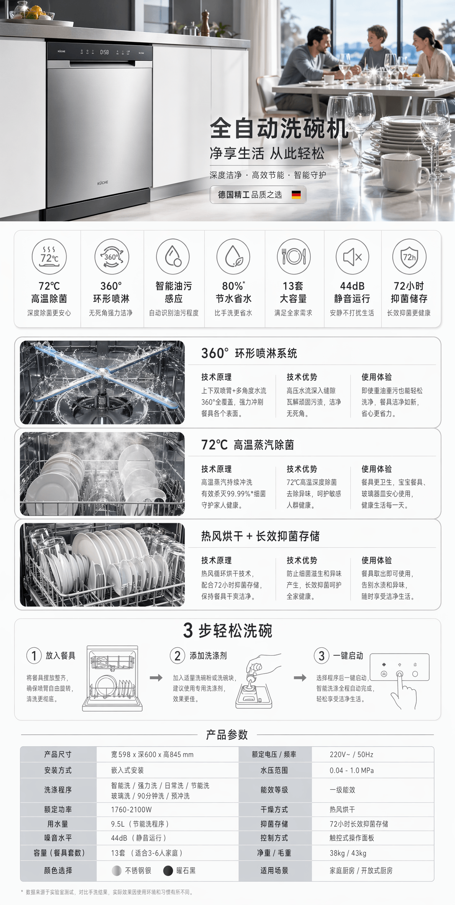

---

### 12. 健身蛋白粉电商详情页

**核心创意**：设计一张 9:21 竖版健身蛋白粉电商详情页长图，以"力量突破"为视觉主线。

**完整 Prompt**：

```
健身蛋白粉电商详情页长图，比例 9:21，顶部主视觉区采用深色背景配合金色光束，中心放置蛋白粉罐装产品，罐身带有金属质感与品牌 LOGO，四周环绕肌肉线条光影与能量粒子效果，向下依次分层：品牌价值区用三图标组合展示科学配方专业认证全球原料，产品卖点区以三张卡片呈现增肌塑形快速恢复能量补给每个配简短功效说明，成分参数区设计为透明营养成分标签样式标注蛋白质含量80%、BCAA比例、零添加等核心数据，使用场景区采用健身房实景风格展示运动后补充、晨间冲泡两种典型场景图，底部用户评价区以五星评分加真实反馈摘录形式呈现，整体配色为深黑底、金色强调、电蓝点缀、白色文案，视觉调性偏力量感专业感高端健身品牌风，字体采用现代无衬线粗体标题加精细正文组合，整图像真实电商详情页设计稿可直接落地使用。
```

**图片**：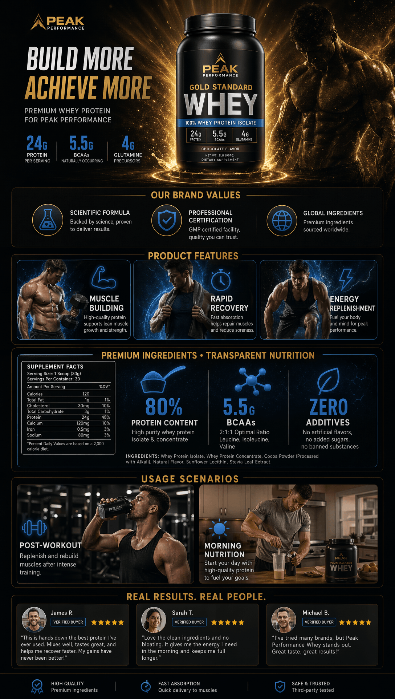

---

## 旅游地图系列

### 13. 成都手绘旅游攻略地图

**核心创意**：做一张成都手绘旅游攻略地图，竖版手机屏幕友好（9:16比例），融入火锅、熊猫、茶馆、宽窄巷子等成都特色元素。

**完整 Prompt**：

```
成都手绘旅游攻略地图，画面主体是一张带纸质纹理的城市俯视地图，竖版布局，道路以柔和线条勾勒，景点以手绘小图标标注（宽窄巷子用青砖门头、IFS熊猫用简笔熊猫爬墙、人民公园茶馆用手绘竹椅茶碗、锦里古街用红灯笼、火锅店用沸腾锅具图标），关键地点旁边配有手写体名称和推荐语如"宽窄巷子·必逛·掏耳朵绝了"、"IFS熊猫·网红打卡点"、"人民公园·鹤鸣茶社·体验成都慢生活"，地图中段嵌入美食推荐模块，列举火锅、串串、担担面、蛋烘糕配手绘小图和"本地人推荐"标注，底部留出行程建议区，写着"Day1：宽窄巷子→人民公园喝茶→春熙路→火锅局"，整体配色控制在米黄牛皮纸底、浅绿锦江水道、暖红火锅高亮、赭石古街标注，像是马克笔和水彩在牛皮纸上画的，边角有轻微折痕和胶带粘贴痕迹，比例 9:16，充满旅行者的真诚推荐感，适合手机屏幕收藏。
```

**图片**：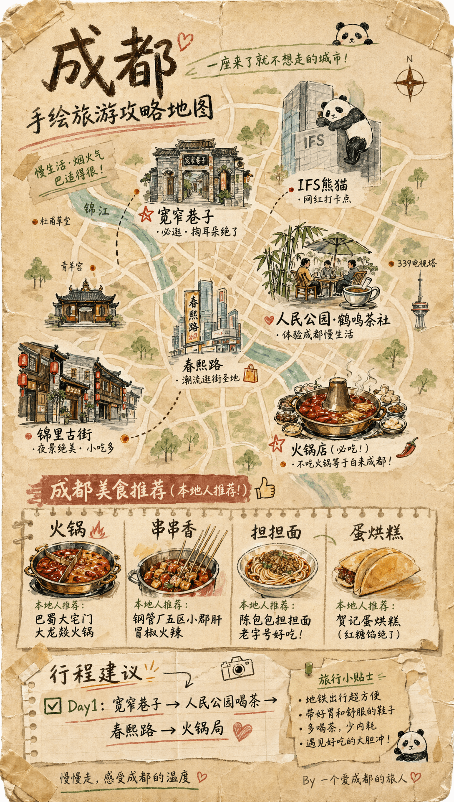

---

### 14. 云南手绘旅游线路图

**核心创意**：做一张云南全景旅游线路图，竖版布局（9:16比例），将昆明→大理→丽江→香格里拉经典路线串联。

**完整 Prompt**：

```
云南手绘旅游线路图，画面主体是一张带纸质纹理的云南省轮廓地图，竖版布局，从南到北串联昆明→大理→丽江→香格里拉经典路线，道路以蜿蜒曲线勾勒如"诗画之路"，景点以手绘小图标标注（昆明石林用奇石剪影、大理洱海用手绘波浪和帆船、丽江古城用青瓦木楼、玉龙雪山用雪峰轮廓、香格里拉用藏式经幡和寺庙、西双版纳用热带棕榈叶），关键地点旁边配有手写体名称和推荐语如"昆明·春城花海·四季如春"、"大理洱海·骑行环湖·风花雪月"、"丽江古城·纳西风情·夜游必去"、"玉龙雪山·蓝月谷·雪景震撼"、"香格里拉·人间天堂·梅里日照金山"，地图中段嵌入美食推荐模块，列举过桥米线、鲜花饼、普洱茶、野生菌火锅配手绘小图，底部留出行程建议区，写着"经典7日路线：昆明→大理2日→丽江2日→香格里拉2日→返程"，整体配色控制在米黄牛皮纸底、湛蓝洱海湖泊、雪白山峰高亮、翠绿热带雨林、赭石古城标注，像是马克笔和水彩在牛皮纸上画的，边角有轻微折痕和手绘小云朵装饰，比例 9:16，充满诗和远方的旅行梦想感，适合手机屏幕收藏。
```

**图片**：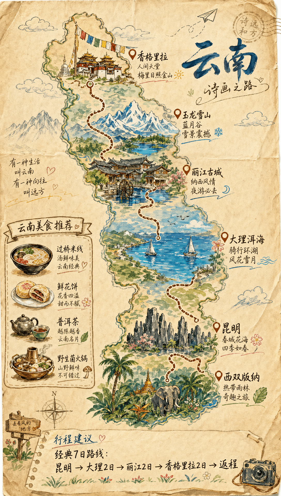

---

### 15. 西安实景旅游地图

**核心创意**：做一张西安实景旅游地图，采用真实照片拼贴+航拍视角的风格。

**完整 Prompt**：

```
西安实景旅游地图，画面主体是一张西安城市航拍俯视图作为底图，竖版布局，真实照片质感，城市道路和建筑以航拍视角呈现，景点以真实照片小卡片形式标注（兵马俑用实景武士俑照片、大雁塔用古塔实景照片、钟楼用夜间灯光实景照片、古城墙用城墙俯瞰实景照片、回民街用美食街实景照片、华清池用温泉宫殿实景照片、大唐芙蓉园用唐风建筑夜景照片），每个景点照片卡片配有白色边框和阴影，旁边标注景点名称和推荐指数星级评分，如"兵马俑★★★★★ 世界八大奇迹"、"大雁塔★★★★ 登塔俯瞰古城"、"钟楼★★★★ 夜景绝美"、"古城墙★★★★★ 骑行环城"，地图中段嵌入美食推荐模块，以实景美食照片拼贴形式展示肉夹馍、凉皮、羊肉泡馍、biangbiang面，底部留出行程建议区，写着"经典2日路线：Day1兵马俑→华清池→回民街→钟楼夜景，Day2古城墙→大雁塔→大唐芙蓉园"，整体视觉像高端旅游杂志专题版面，照片质感真实、光影自然、色彩饱满，比例 9:16，适合手机屏幕收藏和旅游规划参考。
```

**图片**：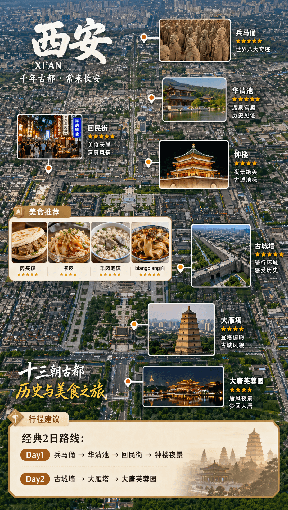

---

### 16. 厦门文艺海滨旅游地图攻略

**核心创意**：做一张厦门文艺海滨旅游地图攻略，采用清新水彩插画风格。

**完整 Prompt**：

```
厦门文艺海滨旅游地图攻略，画面主体是一张厦门城市海岸线地图，竖版布局，清新水彩插画风格，海浪以柔和蓝色水彩笔触勾勒，岛屿和沙滩以米白和浅棕渲染，景点以手绘小图标标注（鼓浪屿用钢琴和红砖洋楼剪影、厦门大学用校园拱门和凤凰花、环岛路用海边骑行自行车、曾厝垵用文艺小店门牌、南普陀寺用寺庙屋顶、沙坡尾用艺术区涂鸦墙、中山路用骑楼建筑），关键地点旁边配有手写体名称和文艺推荐语如"鼓浪屿·钢琴之岛·漫步历史建筑"、"厦门大学·最美校园·凤凰花开"、"环岛路·骑行海岸线·海风拂面"、"曾厝垵·文艺小渔村·民宿探店"，地图中段嵌入美食推荐模块，以水彩小图展示沙茶面、海蛎煎、土笋冻、花生汤，配标注"本地必尝"，底部留出行程建议区，写着"经典3日路线：Day1鼓浪屿一日游，Day2厦大→南普陀→沙坡尾→中山路，Day3环岛路骑行→曾厝垵→海边日落"，整体配色控制在海蓝、沙滩米白、凤凰花橙红、建筑浅棕、植被嫩绿，画面有轻微水彩晕染效果，边角点缀小海星和贝壳装饰，比例 9:16，充满文艺海滨度假的清新浪漫感，适合手机屏幕收藏。
```

**图片**：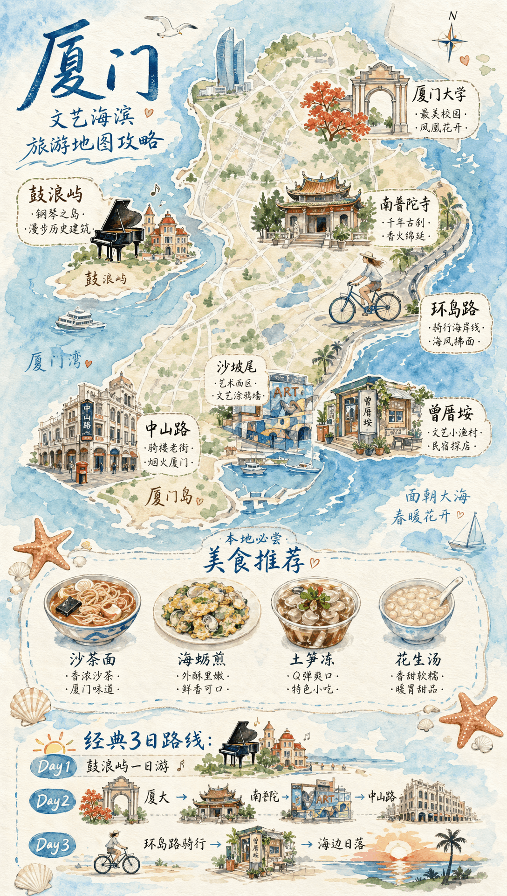

---

## 试卷课本系列

### 17. 出师表语文课本内页

**核心创意**：做一张中国语文课本的内页设计，以诸葛亮《出师表》为课文内容。

**完整 Prompt**：

```
中国语文课本内页设计，课文标题"出师表"居上，副标题标注"诸葛亮"，正文区域采用竖排古典排版风格，内容节选"先帝创业未半而中道崩殂，今天下三分，益州疲弊，此诚危急存亡之秋也……"，左侧或下方嵌入注释模块，解释"崩殂、秋、殊遇、驱驰"等关键词，右上角配有作者简介小栏，写"诸葛亮（181-234），字孔明，三国时期蜀汉丞相"，底部有学习提示区"体会作者报效国家的忠诚与恳切之情"，页眉显示"高中语文·必修三"，页码位于右下角，整体配色为米白纸张底、墨黑正文、赭石与石绿点缀装饰边框，字体融合宋体正文与书法标题感，画面像一本真实打开的课本页面，比例 3:4
```

**图片**：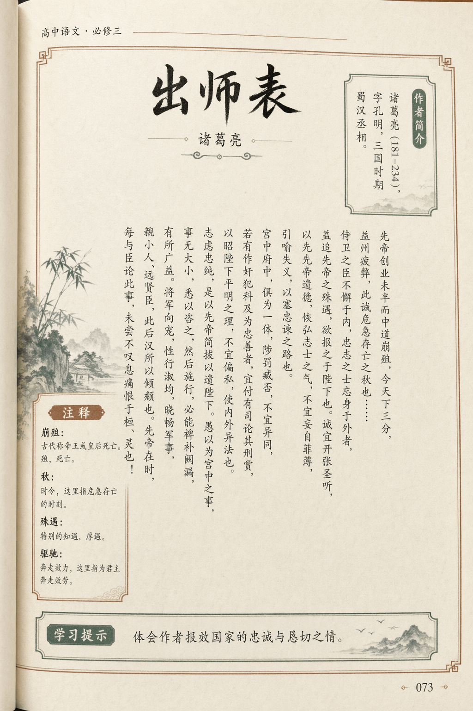

---

### 18. 高中语文模拟试卷

**核心创意**：一张逼真的高中语文模拟试卷，呈现标准高考考试排版格式。

**完整 Prompt**：

```
真实高中语文模拟试卷，16:9横向排版，试卷顶部有红色横线标题区写"2025年普通高等学校招生全国统一考试模拟卷（语文）"，右侧标注"满分150分 考试时间150分钟"，考生信息栏包含姓名、准考证号填涂区（带圆圈选项）、班级填写框，试卷主体分为四大板块：第一板块现代文阅读含一篇议论文节选（约300字）配三道选择题，题号标注"一、现代文阅读（35分）"；第二板块古诗文阅读含文言文节选和古诗一首，题号标注"二、古代诗文阅读（35分）"；第三板块语言文字运用含成语填空、病句修改等题型，题号标注"三、语言文字运用（20分）"；底部作文区占约三分之一页面，标注"四、写作（60分）"并给出材料作文题目和要求，整体采用打印纸张质感，轻微阴影和褶皱感，宋体印刷字体，黑色文字，红色标题线，页脚标注"第1页 共4页"，像真实发放的考试卷。
```

**图片**：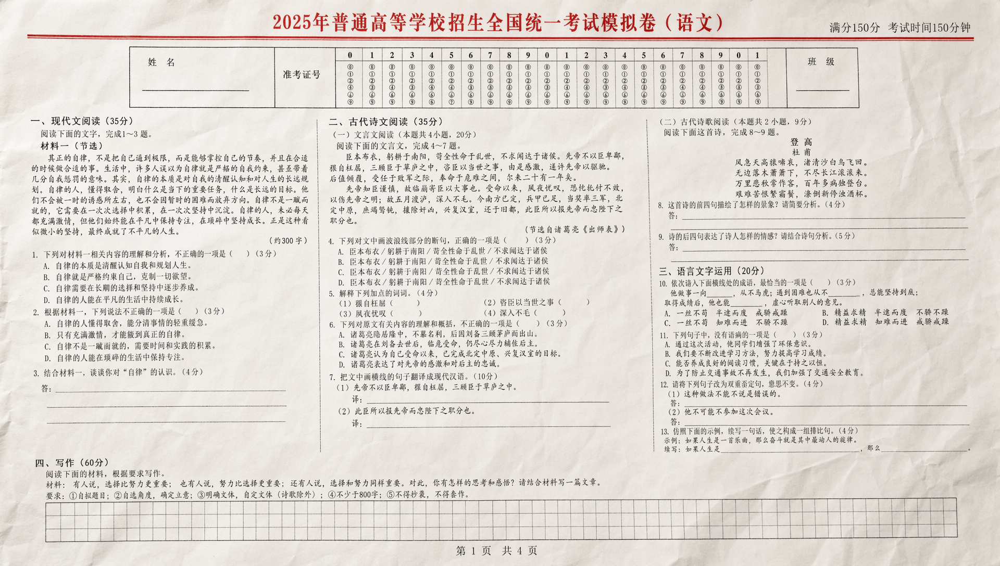

---

### 19. 高中语文试卷（极简版）

**核心创意**：极简prompt生成真实高中语文试卷。

**完整 Prompt**：

```
真实高中语文试卷，16:9比例，打印纸张质感
```

**图片**：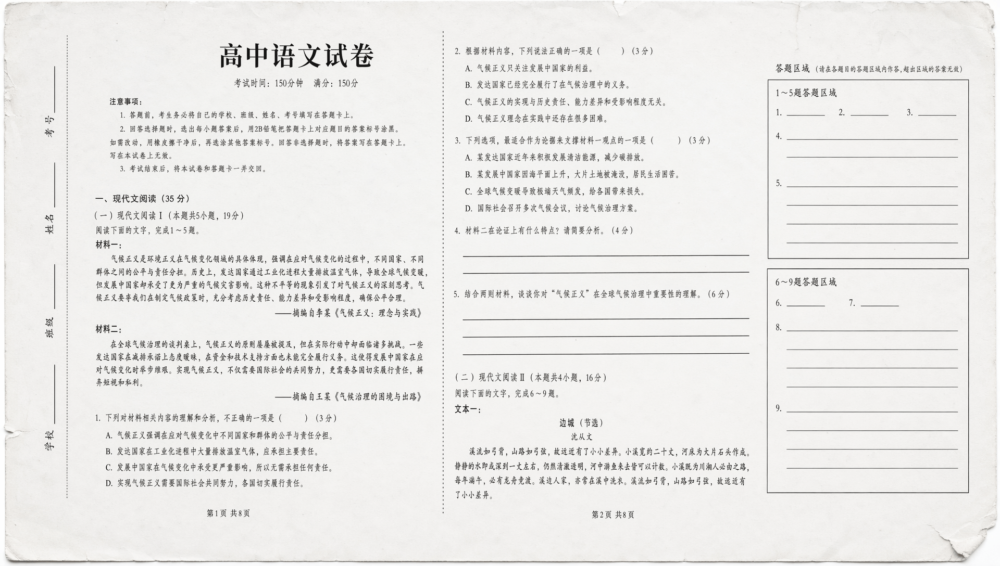

---

## 设计提案板系列

### 20. 家具设计提案板（椅子）

**核心创意**：做一张现代家具设计提案板，将一把设计师椅子以产品档案页的形式完整展示。

**完整 Prompt**：

```
家具设计提案板，画面中心是一把现代设计师椅子，采用45度侧视角作为主视图，左侧嵌入正面正视图、右侧嵌入背面视图，三视图统一用干净的白色背景和柔和的阴影处理，画面上方标题区域写"OBJECT NO.07 | CONTOUR CHAIR"，下方设计理念区写"Reduced to the essential curve that supports the human form"，右侧信息模块区包含材质标注（实木框架｜胡桃木色、座垫｜哑光黑皮革、腿部支撑｜镀铬钢管）、尺寸参数（总高 82cm、座高 45cm、座宽 58cm、座深 52cm），底部色块区展示三种可选配色方案：胡桃木原色、哑光黑、烟灰白，整体排版像北欧家具品牌的正式设计档案，画面干净克制，留白充足，字体使用细无衬线与等宽参数字，比例 3:4。
```

**图片**：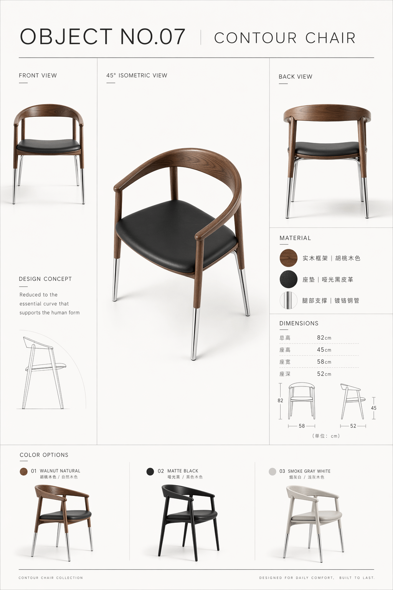

---

### 21. 餐桌设计提案板

**核心创意**：做一张现代餐桌设计提案板，以产品档案页的形式完整展示。

**完整 Prompt**：

```
家具设计提案板，画面中心是一张现代极简餐桌，采用俯视角度作为主视图展示桌面纹理与整体形态，左下角嵌入侧面视图展示桌腿结构、右下角嵌入细节特写展示桌面与桌腿的连接工艺，三视图统一用干净的白色背景和柔和阴影处理，画面上方标题区域写"OBJECT NO.12 | EDGE TABLE"，下方设计理念区写"A surface that disappears into its supports, leaving only the essential plane"，右侧信息模块区包含材质标注（桌面｜白橡木实木、桌腿｜哑光黑钢架、边缘｜45度斜切工艺）、尺寸参数（总长 180cm、总宽 90cm、总高 75cm、桌面厚度 3cm）、适用场景标注（4-6人用餐｜现代餐厅｜开放式厨房），底部色块区展示三种可选配色方案：白橡木原色、烟熏橡木色、全黑钢化玻璃版，整体排版像北欧家具品牌的正式设计档案，画面干净克制，留白充足，字体使用细无衬线与等宽参数字，比例 3:4。
```

**图片**：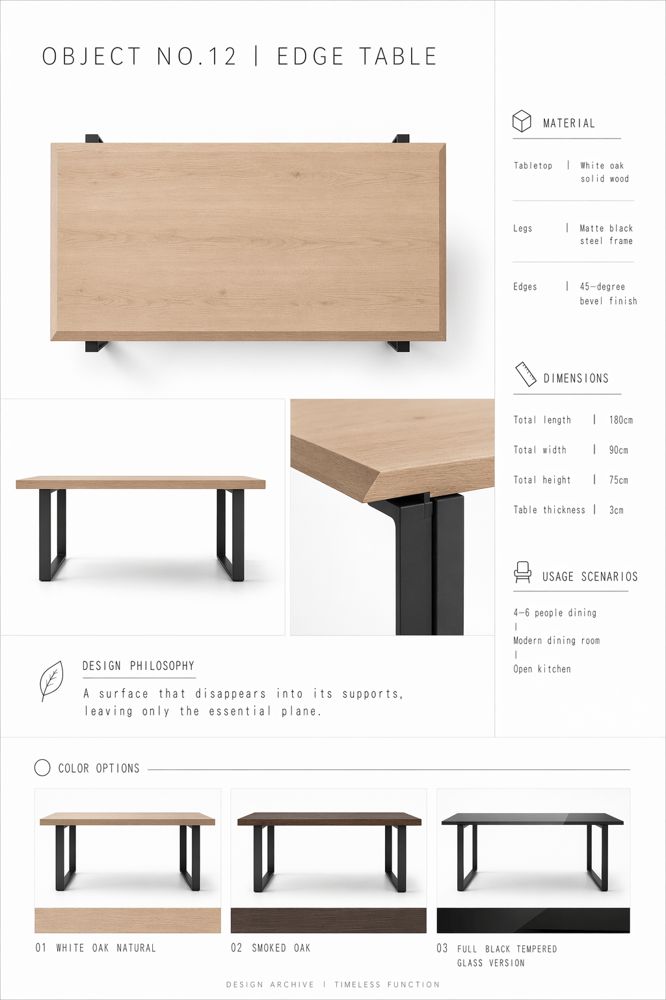

---

## 拆解图系列

### 22. 徕卡相机拆解图

**核心创意**：做一张精密机械档案风格的徕卡相机爆炸拆解图。

**完整 Prompt**：

```
徕卡相机爆炸拆解图，精密机械档案风格，画面中心为经典徕卡 M 系列机身主体，四周以爆炸图形式展开分解零部件——镜头组、快门幕帘、齿轮传动系统、测距联动装置、取景器棱镜、胶片仓、金属机身壳体，每个部件配有技术标注线，左下角嵌入零件清单表格（编号、名称、材质、精度等级），右下角放置装配顺序简化流程图，整体采用工程图纸美学——米白底色、深灰描边、精密标注字体，标注线使用细虚线和箭头，配件编号以圆圈标注，整体构图像高端产品技术手册页，留有足够的档案白边，比例 3:4。
```

**图片**：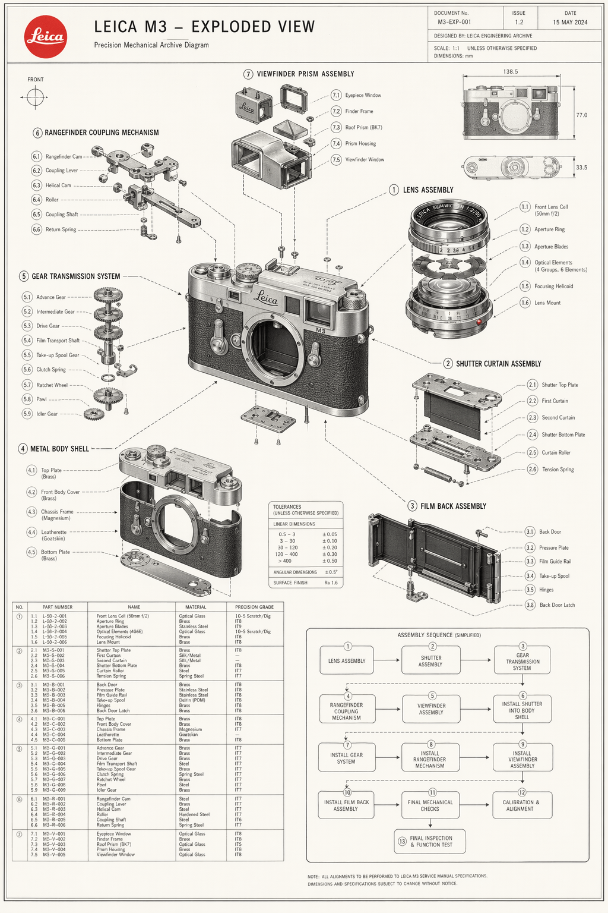

---

### 23. 电动牙刷拆解图

**核心创意**：做一张现代科技消费品风格的电动牙刷爆炸拆解图。

**完整 Prompt**：

```
电动牙刷爆炸拆解图，现代科技消费品白皮书风格，画面中心为电动牙刷完整机身，四周以爆炸图形式展开分解零部件——声波振动马达、锂电池组、主控电路板、压力感应模块、无线充电线圈、硅胶防水密封圈、刷头卡扣结构、尼龙刷毛刷头，每个部件配有技术标注线，左下角嵌入核心参数面板（振动频率 31000次/分钟、续航 30天、防水等级 IPX7、充电方式 磁吸无线充），右下角放置功能模块图标组（智能压力感应、5种清洁模式、2分钟定时提醒），整体采用科技产品美学——纯白底色、浅灰描边、蓝色功能高亮、现代无衬线标注字体，标注线使用细实线和圆点标记，配件以序号标签，整体构图像高端产品技术白皮书页，比例 3:4。
```

**图片**：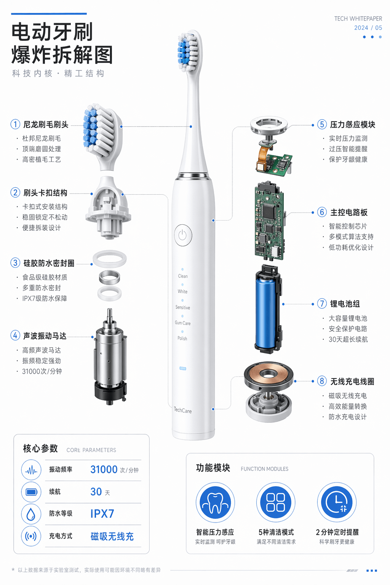

---

## 影评专栏

### 24. 《黑客帝国》影评专栏内页

**核心创意**：《黑客帝国》深度影评专栏内页，采用杂志编辑性双栏布局。

**完整 Prompt**：

```
《黑客帝国》深度影评专栏内页，画面采用杂志编辑性双栏布局，左侧区域展示三帧节选电影画面剪影：上方是尼奥伸手触碰红色药丸的特写、中间是子弹时间慢动作镜头俯视构图、下方是矩阵觉醒后睁眼的半身像，三帧画面以影院黑边框呈现，中间用细线分割；右侧区域是影评专业文字模块：顶部是五星评分条显示"视觉革新 5/5 / 剧本架构 4.5/5 / 哲学深度 5/5"，中部是主题分析段落写"虚拟与现实的边界消融，主体性觉醒的视觉化叙事"，下方是镜头语言解读写"子弹时间不只是特效，而是让观众看见时间的操控权转移"，底部是影评金句摘录框"选择红药丸的那一刻，电影就不再是电影，而是一场关于自由的哲学演示"；背景是电影标志性绿色代码瀑布流从上至下贯穿画面，营造矩阵数字世界氛围；标题"电源影评"位于页面上方，副标题写"《黑客帝国》：选择本身就是反抗"，整体色调以影院黑为主底色，绿色代码流为矩阵标志性绿，影评文字模块用白色和少量霓虹蓝，画面像一张专业电影评论杂志内页，比例 4:5
```

**图片**：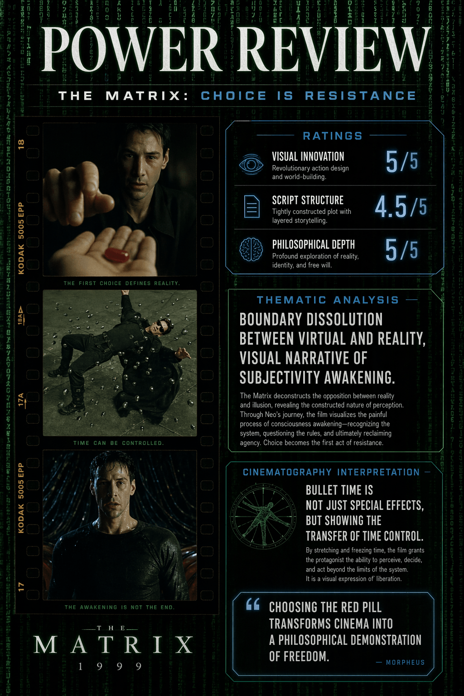

---

## 动漫角色系列

### 25. 动漫角色分镜图

**核心创意**：一张16格分镜图，完整展示一个动漫角色从日常平静到战斗高潮的叙事序列。

**完整 Prompt**：

```
动漫角色分镜图，16格网格布局，每格画面展示完整的叙事序列：第1-4格为晨起日常（少年睁眼醒来、伸懒腰、洗漱镜前、书包出门），第5-8格为校园场景（教室交谈、走廊奔跑、操场运动、黄昏放学），第9-12格为情绪转折（收到消息、表情震惊、愤怒握拳、奔跑出发），第13-16格为战斗高潮（力量觉醒光芒四射、战斗姿态蓄力、冲击动作动态线、胜利定格俯视），每个分镜格左下角有场景编号01-16，右下角有简短动作标注如睁眼/醒来、奔跑/紧急，底部有时间轴清晨→校园→转折→高潮四段标注，整体采用日式动漫线稿风格，墨线粗细变化明显，角色为少年主角设定，服装从校服逐渐转变为战斗装，背景从简约室内到动态战斗场渐变，分镜格之间有叙事流向箭头连接关键转折，画面整洁像真实动画制作分镜稿，比例4:3
```

**图片**：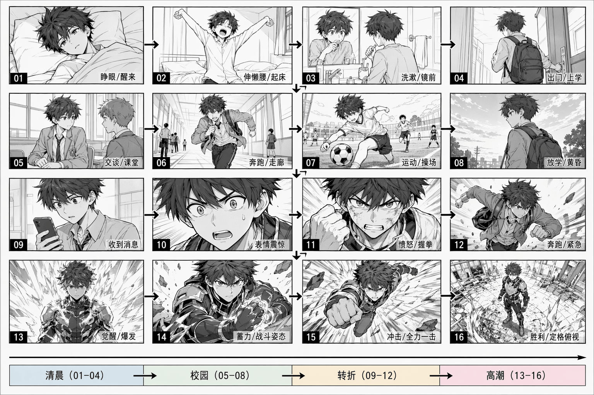

---

### 26. 动漫人物参考图

**核心创意**：制作一张完整的动漫角色设定参考图，包含角色三视图、表情变化组、配色板、角色基本信息标注。

**完整 Prompt**：

```
动漫角色设定参考图，画面分为五个信息区：左上区为角色正面全身立绘，右上区为侧面和背面剪影并列展示，左下区为表情变化组（包含标准表情、喜悦、愤怒、悲伤、惊讶五种表情头像），右下区为配色方案板（展示头发色、瞳色、服装主色、辅色、点缀色的色块标注），中间为角色信息卡片区（包含角色名、年龄、身高、职业/身份、性格关键词），整体采用日系赛璐璐风格线条，背景为浅灰设计纸质感，标注使用清晰的无衬线字体，比例 3:4，画面整洁专业，适合作为角色设计档案。
```

**图片**：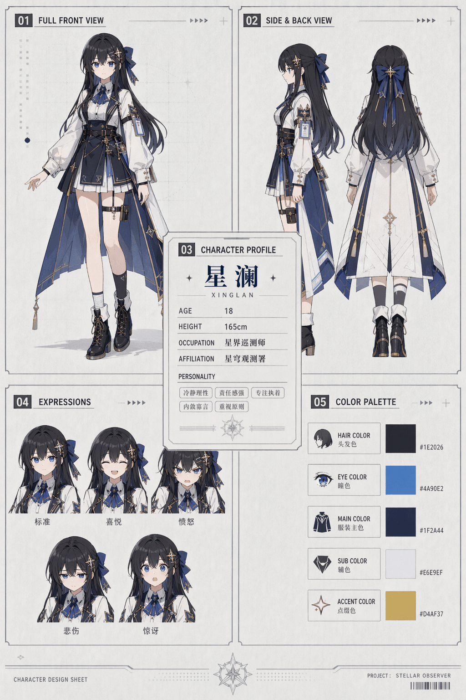

---

### 27. 男性动漫角色参考图

**核心创意**：制作一张男性动漫角色设定参考图，包含三视图、表情组、配色板和基本信息。

**完整 Prompt**：

```
男性动漫角色设定参考图，画面分为五个信息区：左上区为男性角色正面全身立绘（短发利落造型、挺拔站姿），右上区为侧面和背面剪影并列展示（强调肩宽和身形轮廓），左下区为表情变化组（包含冷静、自信、专注、坚定、轻笑五种表情头像），右下区为配色方案板（展示发型色、瞳色、服装主色、辅色、点缀色的色块标注），中间为角色信息卡片区（包含角色名、年龄、身高、职业/身份、性格关键词），整体采用日系赛璐璐风格线条，配色偏向冷色调（深蓝、灰黑、银白为主），背景为浅灰设计纸质感，标注使用清晰的无衬线字体，比例 3:4，画面整洁专业，适合作为角色设计档案。
```

**图片**：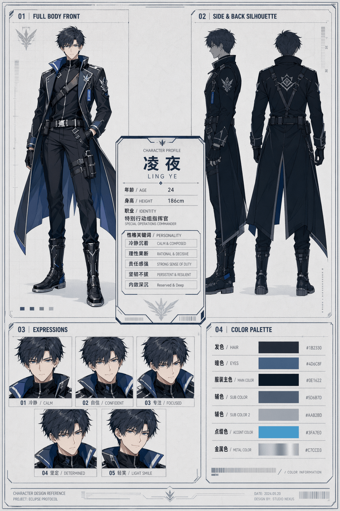

---

## 附录：图片文件列表

| 序号 | 图片文件名 | 主题类别 |
|------|------------|----------|
| 1 | lovart_67d0a0b6f6a8.png | 杜甫X推文 |
| 2 | lovart_409f0bdb9b5c.png | 杜甫抖音直播 |
| 3 | lovart_aacbf416531f.png | 李白杜甫PK |
| 4 | lovart_808f49d73279.png | 杜甫登高小红书 |
| 5 | lovart_171515c69401.png | 杜甫朋友圈茅屋被秋风所破 |
| 6 | lovart_7d722461b78f.png | 拉布拉多犬科普 |
| 7 | lovart_b623c9048b32.png | 边境牧羊犬科普 |
| 8 | lovart_af389f34a432.png | 人体免疫系统科普 |
| 9 | lovart_df36c9564bff.png | 明朝女性服饰科普 |
| 10 | lovart_b867715b5f36.png | 咖啡机电商详情页 |
| 11 | lovart_f9a18f8bf298.png | 洗碗机详情页9:21 |
| 12 | lovart_4402d0a8cac2.png | 健身蛋白粉电商详情页 |
| 13 | lovart_7c11c9198f07.png | 成都手绘旅游地图 |
| 14 | lovart_5218b899a7e7.png | 云南手绘旅游线路图 |
| 15 | lovart_5489721c40e9.png | 西安实景旅游地图 |
| 16 | lovart_7f108bc686c6.png | 厦门文艺海滨旅游地图 |
| 17 | lovart_7427ded45f3b.png | 出师表语文课本内页 |
| 18 | lovart_4ab2ccba3a73.png | 高中语文模拟试卷 |
| 19 | lovart_09f1e30d27f9.png | 高中语文试卷极简版 |
| 20 | lovart_6b51c0b49e88.png | 家具设计提案板椅子 |
| 21 | lovart_96d2b63ed1a8.png | 餐桌设计提案板 |
| 22 | lovart_95fd0d21e273.png | 徕卡相机拆解图 |
| 23 | lovart_194c8bc10231.png | 电动牙刷拆解图 |
| 24 | lovart_f32434f818dc.png | 黑客帝国影评专栏 |
| 25 | lovart_9e03a6e8cf0d.png | 动漫角色分镜图 |
| 26 | lovart_5c648646a982.png | 动漫人物参考图 |
| 27 | lovart_f77259ab2668.png | 男性动漫角色参考图 |

---

*本文档由 Claude Code 整理，所有图片使用 GPT Image 2 High 模型生成*