## 案例 1: 真人3D手办​

### 效果展示


  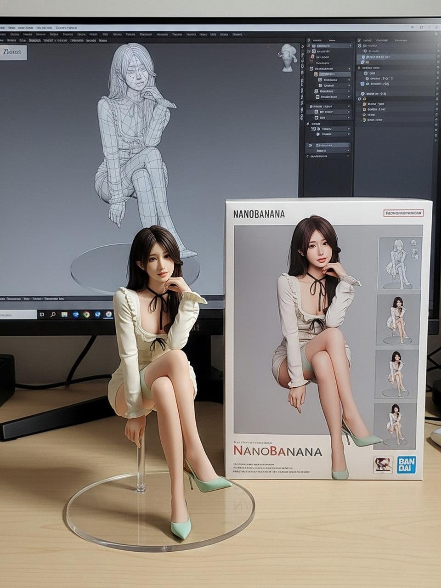


### 提示词 1

```
Use the nano-banana model to create a 1/7 scale commercialized figure of
thecharacter in the illustration, in a realistic styie and environment.Place
the figure on a computer desk, using a circular transparent acrylic base
without any text.On the computer screen, display the ZBrush modeling process
of the figure.Next to the computer screen, place a BANDAl-style toy packaging
box printedwith the original artwork
```

### 提示词 2

```
A hyper-realistic 1/7 scale figure of the character, on a computer desk,
computer screen shows ZBrush modeling software, next to it a Bandai-style box
with original art, all on a clear acrylic base, professional product
photography, sharp focus
```

### 中文提示词

```
将指定角色单独生成高精度手办，采用PVC与ABS材质，表面光滑抛光并带有局部哑光磨砂与金属漆细
节，颜色采用手工涂装般的渐变与细腻阴影，刻画精致细节（如衣纹、机械零件、五官特征），比例为
1/7 / Q版，配备透明亚克力或场景底座，整体呈现高端收藏级手办质感，采用专业摄影灯光展示，真
实商业展示图风格。
```
## 案例 2: Q版木雕人偶 (来源 @samann_ai)​

### 效果展示


  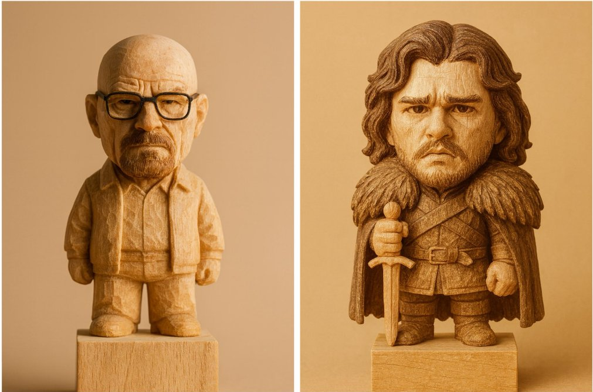


### 中文提示词

```
超写实[人物]木雕人偶，Q版比例（大头短身），站立于一块普通木块上。保留关键面部特征和标志性
[服装/道具]。木纹和凿痕清晰可见，哑光饰面。工作室暖光，柔和阴影，米色背景浑然一体。全身居
中，略微3/4视角，浅景深（85毫米画质）。细节丰富，照片级写实，暖棕褐色调。宽高比为[3:4]。
```

### 英文提示词

```
Hyper-realistic carved wooden figurine of [CHARACTER], chibi proportions (big
head, short body), standing on a plain wood block. Keep key face traits and
iconic [OUTFIT/PROP]. Visible wood grain and chisel marks, matte finish. Warm
studio light, soft shadow, seamless beige background. Centered full-body,
slight 3/4 angle, shallow depth of field (85mm look). Ultra-detailed,
photoreal, warm sepia grading. Aspect ratio [3:4].
```
## 案例 3: 卡通插图药丸形象 (来源 @gnrlyxyz)​

### 效果展示


  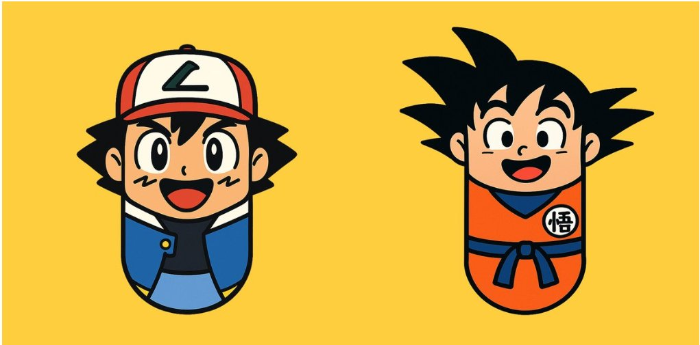


### 中文提示词

```
为 [CHARACTER] 创建一幅风格化的卡通插图，其身体呈平滑的垂直药丸状（上下呈圆形，左右对
称）。身体应为单一、统一的胶囊形状，没有四肢。不要改变角色的核心设计或个性，而是将其简化为
这种俏皮的胶囊形状。使用粗黑色轮廓、扁平矢量风格的配色和简单的几何特征。赋予角色大而富有表
现力的眼睛和有趣、夸张的面部表情，以反映其原始个性。如果角色穿着衣服，请包含其服装的极简标
志性版本。如果没有，请保持身体干净，不穿衣服。使用纯亮黄色背景。将角色置于方形框架的中心。
仅使用扁平颜色。不要使用渐变。不要使用阴影。不要使用纹理。不要使用晕染。最终结果应该干净、
现代、矢量友好且清晰的药丸形状。
```

### 英文提示词

```
Create a stylized cartoon illustration of [CHARACTER] with a smooth, vertical
pill-shaped body (rounded on top and bottom, symmetrical left to right). The
body should be a single, unified capsule shape with no limbs. Do not alter the
character's core design or personality, but simplify them into this playful
capsule form. Use bold black outlines, flat vector-style coloring, and simple
geometric features. Give the character large, expressive eyes and a fun,
exaggerated facial expression that reflects their original personality. If the
character wears clothes, include a minimal, iconic version of their outfit. If
they do not, keep the body clean and unclothed. Use a solid bright yellow
background. Center the character in a square frame. Use only flat colors. No
gradients. No shadows. No texture. No smudging. The final result should be
clean, modern, vector-friendly, and clearly pill-shaped.
```
## 案例 4: 字母毛茸茸形象 (来源 @TechieBySA)​

### 效果展示


  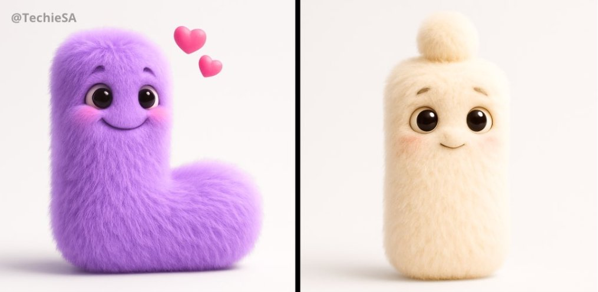


### 中文提示词

```
在 1080x1080 像素的正方形尺寸中，将可爱的字母 “[字母]” 渲染成一个讨人喜欢的毛茸茸形象。
把字体转化为一个 “活物”，字母本身的形态作为这个形象的主体结构。添加富有表现力的活动眼球和
欢快的嘴巴，并将其作为字母设计中不可或缺的组成部分。为形象表面赋予质感，覆盖上浓密的 [颜
色] 绒毛 —— 这种绒毛需模拟高品质毛绒玩具的材质，呈现出具有照片级真实感的纤维细节。以纯净的
白色背景衬托主体，通过强烈对比最大程度吸引视线聚焦于这个字母形象。通过精心设计面部位置与表
情，为这个创作注入 [情感]。整体保持简洁雅致的风格：避免复杂的身体结构或多余的肢体部件。采
用电影级打光技巧进行照明：主光用于突出表面质感，辅助轮廓光塑造立体形态，再配合环境补光柔化
阴影对比。最终呈现出顶级动画工作室的美学质感。
```

### 英文提示词

```
Render a delightful alphabet character ‘[LETTER]’ as a lovable fuzzy being in
square 1080x1080 dimensions. Transform the typography into a living creature
where the letterform itself becomes the main structure. Position expressive
googly eyes and a cheerful mouth as integrated features of the alphabetic
design. Texture the surface with luxurious [COLOR] fuzz that mimics high-
quality stuffed animal material with photorealistic fiber details.Frame
against a stark white void to maximize contrast and draw attention to the
subject. Infuse the creation with [EMOTION] through strategic facial
positioning and expression. Maintain elegant simplicity - avoid anatomical
complications or additional appendages. Illuminate using cinematic techniques:
primary key lighting to accentuate surface textures, secondary edge
illumination for three-dimensional form, plus ambient fill to soften shadow
contrasts. Target premium animation studio aesthetics.
```
## 案例 5: 精致纸艺折纸模型 (来源 @Kerroudjm)​

### 效果展示


  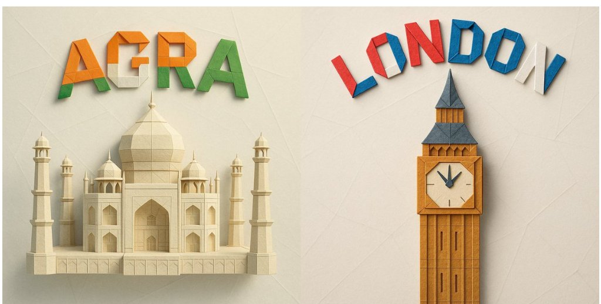


### 中文提示词

```
一张 1:1 正方形比例的数码照片，画面中央是用纹理彩纸折叠而成的精致纸艺折纸模型，该模型复刻
了（纪念碑名称）的造型。模型上方，“（城市名称）” 一词以粗体折纸风格呈现：字母采用该国国色
的鲜艳纸张折叠而成，整体排列成优雅的拱形。背景风格柔和简约，采用浅淡的马卡龙色系或中性色
调，点缀着细微的纸张纹理或抽象几何元素。光线柔和且均匀扩散，投射出自然的阴影，既增强了每一
处折痕的立体感，也让折痕轮廓更清晰。整体风格简洁、写实且充满手工质感，着重凸显材料纹理、几
何精度与视觉和谐感。
```

### 英文提示词

```
A square 1:1 format digital photograph of an intricate paper origami model
representing (MONUMENT_NAME), folded from textured colored paper and centered
in the frame. Above it, the word (CITY_NAME) appears in bold origami-style
letters, folded from vibrant paper using the national colors of the country,
and arranged in a graceful arch. The background is soft and minimal, in a
light pastel or neutral tone with subtle paper textures or abstract geometric
details. Lighting is soft and diffused, casting natural shadows that enhance
the depth and sharpness of each fold. The overall style is clean, realistic,
and handcrafted, emphasizing material texture, geometric precision, and visual
harmony.
```
## 案例 6: 品牌模切乙烯基贴纸 (来源 @TechieBySA)​

### 效果展示


  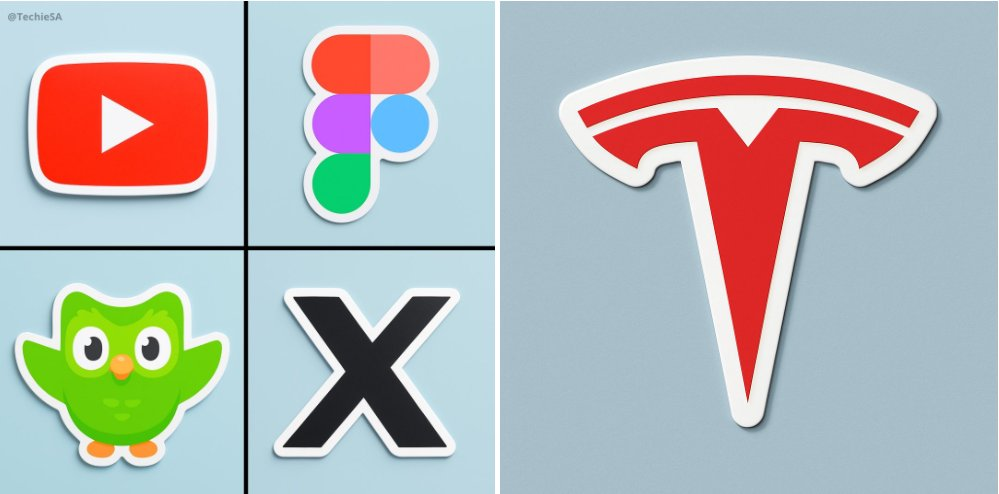


### 中文提示词

```
背景之上。从正上方垂直正视贴纸，其下方带有逼真的投影效果。整体采用简洁的扁平化设计，同时呈
现出细微的 3D 立体感。贴纸占据画面的大部分空间，并保留品牌原有的色彩。尺寸为 1080x1080
像素的正方形格式。
```

### 英文提示词

```
Generate a large die-cut vinyl sticker of the [BRAND] logo with thick white
border, perfectly centered on a soft light blue background. The sticker is
viewed straight-on from directly above with realistic drop shadows beneath.
Clean, flat design with subtle 3D depth. The sticker takes up most of the
frame and maintains original brand colors. 1080x1080 square format.
```
## 案例 7: 创建Airbnb创意广告 (来源 @egeberkina)​

### 中文提示词

```
创建 Airbnb 创意广告，展示一个像玩具屋一样打开的行李箱，露出里面舒适的房间，标语：“随时随
地有家的感觉。”
```

### 英文提示词

```
Create Airbnb creative ad, show a suitcase opening like a dollhouse, revealing
a cozy room inside, tagline: “Feel at home, anywhere.”
```
## 案例 8: 制作照片中人物的玩具 (来源 @egeberkina)​

### 效果展示


  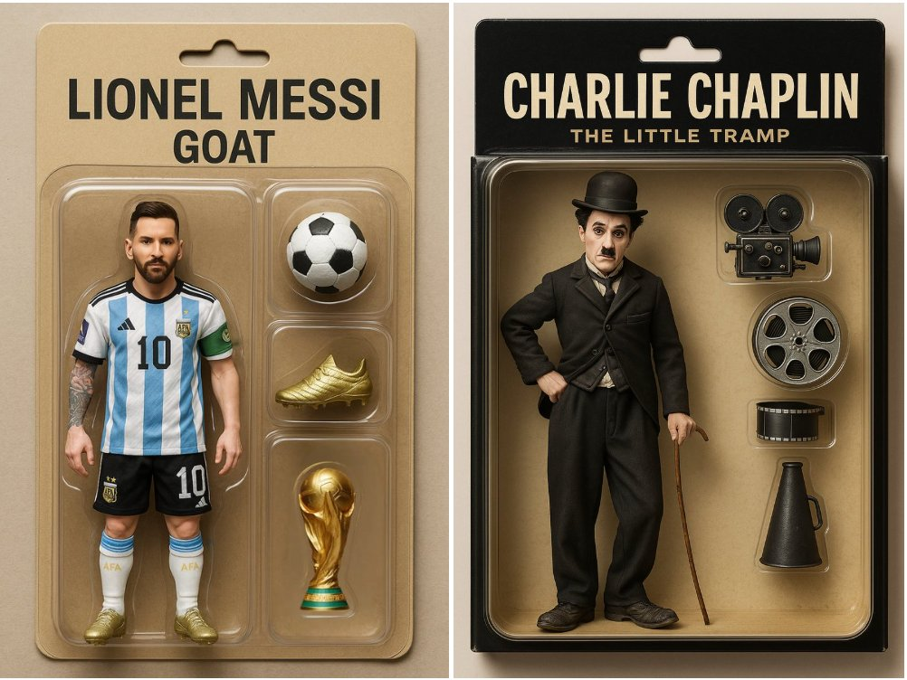


### 中文提示词

```
制作照片中人物的玩具，做成一个可动人偶。人偶旁边要有玩具装备，比如足球、足球鞋和世界杯奖
杯。另外，在包装盒顶部写上“LIONEL MESSI”，其下方写上“GOAT”。请以写实的风格呈现这一画面。
```

### 英文提示词

```
Create a toy of the person in the photo. Let it be an
action figure. Next to the figure, there should be the toy's
equipment like a football and football boot and world cup. Also,
on top of the box, write 'LIONEL MESSI and underneath it,
'GOAT'.Visualize this in a realistic way.
```
## 案例 9: 俏皮现代的应用程序图标设计​

### 效果展示


  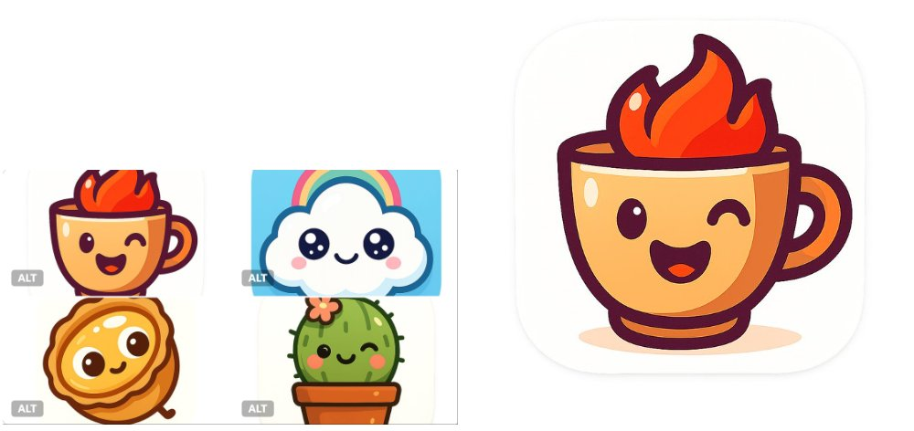

### 中文提示词

```
一个俏皮现代的应用程序图标设计：一个可爱的咖啡杯形象，带着眨眼的眼睛和微笑的嘴巴，顶部有橙
红色火焰状的“头发”，采用极简扁平矢量风格，带有光泽高光和柔和阴影，构图居中，对比度高，色彩
鲜艳，边角圆润，背景透明，适合作为图标使用，无文字，边框外无细节，尺寸为1024x1024。
```

### 英文提示词

```
A playful and modern app icon design of a cute coffee cup character with a 
winking eye and smiling mouth, red-orange flame-like hair on top, minimal flat 
vector style, glossy highlights, soft shadows, centered composition, high 
contrast, vibrant colors, rounded corners, on a transparent background, icon-
friendly, no text, no details outside the frame, size is 1024x1024.
```
## 案例 10: 3D卡通钥匙扣 (来源 @miilesus)​
### 效果展示


  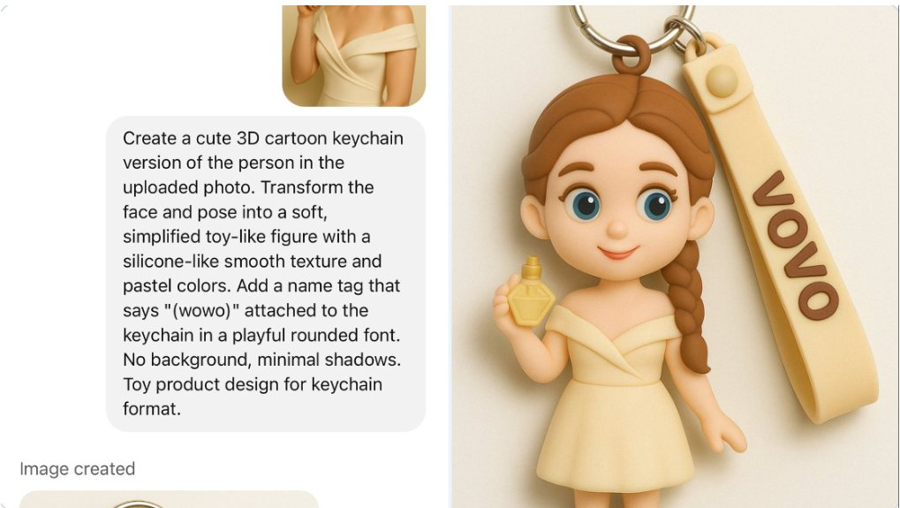

### 中文提示词

```
将上传照片中的人物制作成可爱的3D卡通钥匙扣版本。将面部和姿势转变为柔和、简化的玩具般造型，
具有类似硅胶的光滑质感和柔和的粉彩色调。添加一个写有“[姓名]”的姓名牌，用俏皮的圆体字附着在
钥匙扣上。无背景，阴影极少。适合钥匙扣格式的玩具产品设计。
```

### 英文提示词

```
Create a cute 3D cartoon keychain version of the person in the uploaded photo. 
Transform the face and pose into a soft, simplified toy-like figure with a 
silicone-like smooth texture and pastel colors. Add a name tag that says "
[NAME]" attached to the keychain in a playful rounded font. No background, 
minimal shadows. Toy product design for keychain format.
```
## 案例 11: 极简风格插画 (来源 @miilesus)

### 效果展示


  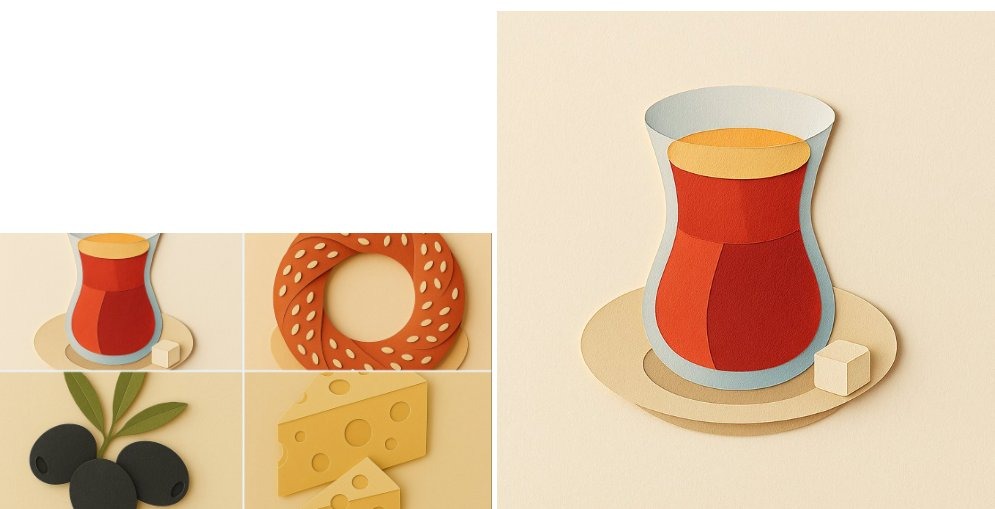


### 中文提示词

```
创作一幅[物体或场景]的极简风格插画，采用剪纸艺术风格。使用柔和的 pastel（粉蜡笔色调的）色
彩和简单的形状。融入分层的纸张纹理和细微的阴影以营造深度感。将物体置于纯色背景上。确保构图
简洁、现代且富有美感，并采用略带等距的透视角度。
```

### 英文提示词

```
Create a minimalistic illustration of [object or scene] in a paper cut-out 
style. Use soft, pastel colors and simple shapes. Include layered paper 
textures and subtle shadows to create depth. Place the object on a plain 
background. Ensure a clean, modern, and aesthetically pleasing composition 
with a slightly isometric perspective.
```
## 案例 12: 马赛克彩色玻璃徽章 (来源 @miilesus)

### 效果展示


  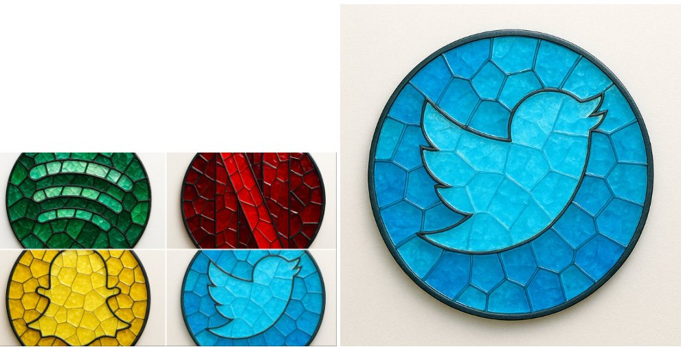


### 中文提示词

```
创建图像：
{
"风格": "马赛克彩色玻璃徽章",
"对象": "品牌标志",
"品牌": {
"名称": "Spotify",
"标志形状": "圆形",
"图标风格": "三条弯曲的长条",
"色彩搭配": {
"主色": "#1DB954",
"辅助色": "#1ED760",
"玻璃变体色": ["#147A3E", "#0F5C30", "#26C178"]
}
},
"材质": {
"类型": "彩色玻璃",
"效果": "半透明带光线反射",
"轮廓": {
"颜色": "#111111",
"宽度": "中等",
"风格": "传统马赛克铅线"
}
},
"构图": {
"布局": "由镶嵌玻璃片组成的标志",
"几何形状": "不规则但拼接契合的玻璃造型",
"对比度": "深色轮廓清晰界定形状"
},
"光线": {
"类型": "漫射自然光",
"高光": "突出玻璃质感和色彩深度"
},
"背景": {
"类型": "平面",
"颜色": "#F4F4F4"
},
"镜头": {
"角度": "俯视",
"焦点": "居中于整个标志"
},
"渲染": {
"质量": "高",
"阴影": "柔和",
"反射": "轻微"
}
}
```

### 英文提示词

```
create image:
{
  "style": "mosaic stained glass emblem",
  "object": "brand logo",
  "brand": {
    "name": "Spotify",
    "logo_shape": "circular",
    "icon_style": "three curved bars",
    "color_palette": {
      "primary": "#1DB954",
      "secondary": "#1ED760",
      "glass_variants": ["#147A3E", "#0F5C30", "#26C178"]
    }
  },
  "material": {
    "type": "colored glass",
    "effect": "semi-transparent with light reflections",
    "outline": {
      "color": "#111111",
      "width": "medium",
      "style": "lead-line traditional mosaic"
    }
  },
  "composition": {
    "layout": "logo composed of tessellated glass pieces",
    "geometry": "irregular but fitted glass shapes", 2 4 6 8 10 12 14 16 18 20 22 24 26

    "contrast": "dark outlines define shape clearly"
  },
  "lighting": {
    "type": "diffused natural light",
    "highlight": "glass texture and color depth emphasized"
  },
  "background": {
    "type": "flat surface",
    "color": "#F4F4F4"
  },
  "camera": {
    "angle": "top-down",
    "focus": "centered on entire logo"
  },
  "render": {
    "quality": "high",
    "shadows": "soft",
    "reflections": "minimal"
  }
}
```
## 案例 13: 品牌着陆页-年轻女性运动后的面部特写 (来源

### 效果展示


  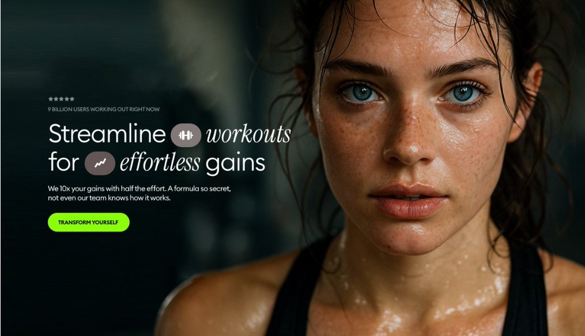

### 中文提示词

```
创作一张年轻女性运动后的面部特写：她满头大汗，有着深蓝色的眼睛，照片左侧是略微模糊的健身房
背景，比例为5:3。她正直视镜头，脸上有一些雀斑，头发有些凌乱，整体呈现出美丽的 editorial
（时尚编辑风格）效果。
```

### 英文提示词

```
Create a closeup face of a young woman after a workout, sweaty, deep blue 
eyes, with a bit of blurred gym background on the left side of the photo, 5:3 
proportions, she's looking right at the camera, some freckles and messy hair, 
beautiful, editorial
```
## 案例 14: 创作漫画风格插画 (来源 @miilesus)

### 效果展示


  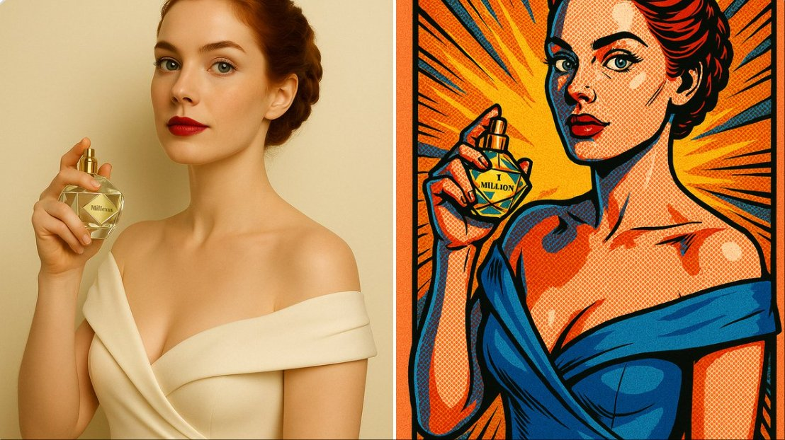


### 中文提示词

```
创作漫画风格插画：
{
"风格": "漫画书插画",
"线稿": {
"类型": "粗黑轮廓线",
"粗细": "中等",
"细节": "突出的轮廓和阴影线条"
},
"上色": {
"调色板": "鲜艳饱和的色彩",
"阴影": "半色调网点和赛璐珞 shading",
"高光": "强烈对比，带有波普艺术效果"
},
"质感": {
"表面": "平坦，带有可见的笔触",
"效果": "印刷漫画纸质感"
},
"构图": {
"布局": "主体居中",
"背景": "简洁，带有放射状爆发图案或漫画风格线条",
"边框": "漫画分镜边框"
},
"光线": {
"类型": "戏剧性",
"角度": "左上角，带有强烈的高光和阴影"
},
"后期处理": {
"效果": ["半色调网点", "墨水轮廓", "颗粒感"],
"饱和度": "高",
"对比度": "高"
},
"氛围": "充满动感和动作感",
"格式": "根据原图，为竖版或正方形"
}
```

### 英文提示词

```
create comic style illustration:
{
"style": "comic book illustration",
"line_art": {
"type": "bold black outlines",
"thickness": "medium",
"detail": "emphasized contours and shading lines"
},
"coloring": {
"palette": "vibrant and saturated colors",
"shading": "halftone dots and cel shading",
"highlighting": "strong contrast with pop art effects"
},
"texture": {
"surface": "flat with visible ink strokes",
"effect": "printed comic paper texture"
},
"composition": {
"layout": "centered subject",
"background": "simple with radial burst or comic-style lines",
"framing": "comic panel border"
},
"lighting": {
"type": "dramatic", 2 4 6 8 10 12 14 16 18 20 22 24

"angle": "top-left with bold highlights and shadows"
},
"post_processing": {
"effect": ["halftone dots", "ink outline", "grain"],
"saturation": "high",
"contrast": "high"
},
"mood": "dynamic and action-oriented",
"format": "vertical or square depending on original image"
}
```
## 案例 15: 超现实主义极简概念广告 (来源 @aziz4ai)​

### 效果展示


  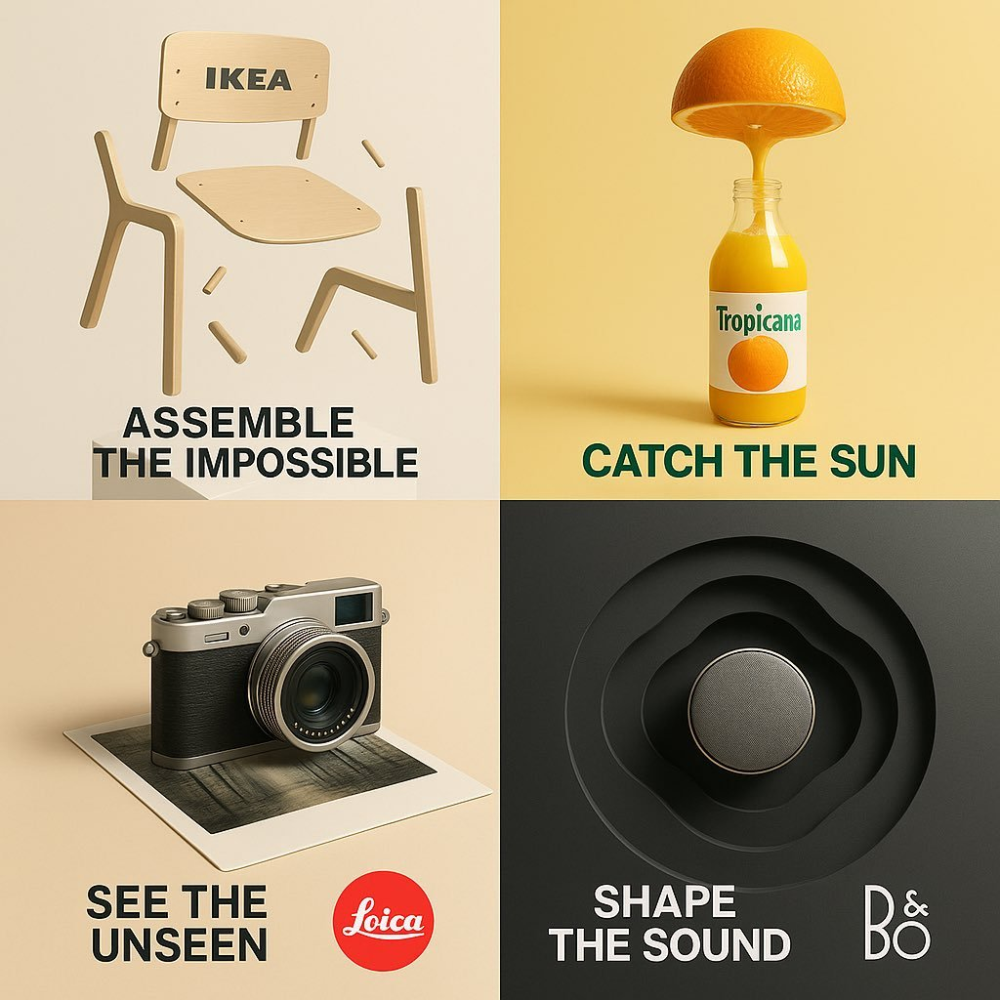


### 中文提示词

```
“{品牌或产品名称}”——超现实主义极简概念广告
创建 1：1 高分辨率海报，使用最少的元素和象征性的故事讲述将品牌/产品重新想象为超现实的欲望
对象。
• 视觉风格：超干净的背景（浅色或柔和的色调）、柔和的灯光、强烈的负空间
• 场景概念：将产品本质转化为隐喻或梦幻般的场景
• 添加一个简短、有力的口号（2-3 个词），在情感上与概念产生共鸣
• 以简洁、现代的风格包含品牌标识（自然融入布局）
• 构图：居中或三分法对齐，巧妙运用阴影和深度
• 氛围：艺术、优雅、发人深省——就像博物馆装置
• 没有混乱，没有现实主义超载——只有概念清晰
```

### 英文提示词

```
“{BRAND or PRODUCT NAME}” — surreal minimal conceptual advertisement 33 1

Create a 1:1 high-resolution poster that reimagines the brand/product as a 
surreal object of desire using minimal elements and symbolic storytelling.
• Visual Style: ultra-clean background (light or muted tone), soft lighting, 
strong negative space
• Scene Concept: transform the essence of the product into a metaphorical or 
dreamlike scene
• Add a short, punchy slogan (2–3 words) that emotionally resonates with the 
concept
• Include the brand’s logo in a clean, modern style (integrated naturally into 
the layout)
• Composition: centered or rule-of-thirds alignment, use shadows and depth 
tastefully
• Mood: artistic, elegant, and thought-provoking — like a museum installation
• No clutter, no realism overload — just conceptual clarity
```
## 案例 16: 铅笔素描画 (来源 @CharaspowerAI)​

### 效果展示


  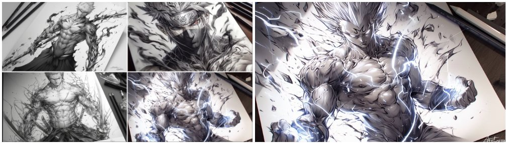

### 中文提示词

```
一幅[你的角色]的铅笔素描画，在白纸上用细致的线条和阴影描绘，捕捉其肌肉发达的身体中蕴含的活
力与力量，角色周围带有[元素效果]，呈现出充满动感的姿势，纸上有纹身图案，采用漫画艺术风格，
背景偏暗，对比度高，阴影强烈，有光影效果，为黑色墨水画，姿势富有动感。
```

### 英文提示词

```
A pencil drawing of [Your character], with detailed lines and shading on white 
paper, capturing the energy and strength in his muscular body [with element 
effects] around  the character, in a dynamic pose,   tattoo design on paper, 
manga art style, dark background, high contrast, strong shadows, light and 
shadow effects, black ink drawing,  dynamic pose
```
## 案例 17: 超现实几何艺术风格的数字插画 (来源 @fy360593)​

### 效果展示


  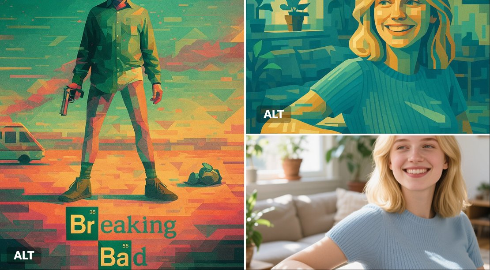


### 中文提示词

```
将这张图片转换为具有超现实几何艺术风格的数字插画。应用故障纹理、抽象形状和电影化构图。以原
始照片的光线和色彩为基调来营造氛围，同时以一种风格化、梦幻且复古未来主义的方式重新构想这个
场景。
```

### 英文提示词

```
Transform this image into a digital illustration with a surreal, geometric art 
style. Apply glitch textures, abstract shapes, and cinematic composition. Use 
the original photo’s lighting and color palette to guide the atmosphere, while 
reimagining the scene in a stylized, dreamy, retro-futuristic way.
```
## 案例 18: 乐高超级英雄摆出充满动感的动作姿势 (来源 @TechieBySA)​

### 效果展示


  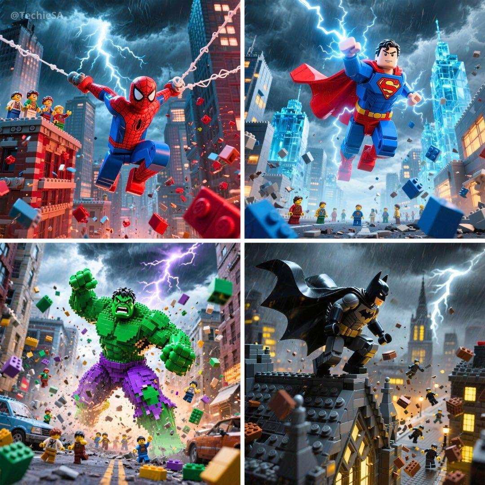


### 中文提示词

```
史诗级乐高【超级英雄】摆出充满动感的动作姿势，展现其标志性超能力，身着标志性服装，色彩和细
节真实还原。戏剧性的暴风雨天空中，耀眼的闪电照亮整个场景。超级英雄摆出英勇姿态，周围是旋转
的乐高碎片和飞舞的积木块，场景中散落着小型乐高小人仔，它们正惊叹地注视着这一切。整体采用电
影海报式构图，配以逼真渲染效果，营造出史诗般的超级英雄氛围，色彩浓郁饱和，运用专业的景深和
富有戏剧性的光影效果，尺寸为1080x1080的正方形格式。
```

### 英文提示词

```
Epic LEGO [SUPERHERO] in dynamic action pose showcasing their signature 
powers, wearing their iconic costume with authentic colors and details, 
dramatic stormy sky with brilliant lightning bolts illuminating the scene, 
heroic stance amid swirling LEGO debris and flying bricks, small LEGO 
minifigures scattered throughout the scene watching in awe, cinematic movie 
poster composition with photorealistic rendering, epic superhero atmosphere 
with rich saturated colors, professional depth of field and dramatic lighting 
effects, 1080x1080 square format 

--- Page 23 ---
```
## 案例 19: 透明X光扫描面板后面 (来源 @TheRelianceAI)​

### 效果展示


  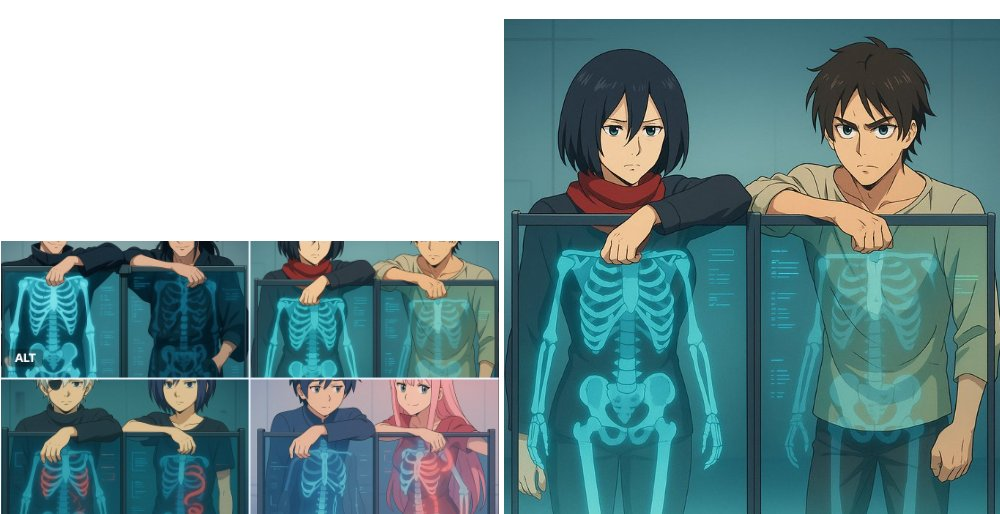


### 中文提示词

```
两个动漫风格的角色站在一个未来感的透明X光扫描面板后面，各自随意地靠在面板上。透过发光的玻
璃，可以看到他们的全身呈现出风格化的半透明X光扫描效果。【在此插入扫描细节——例如混合解剖结
构、超自然标记、植入物等】。玻璃上叠加着未来科幻界面，还有全息平视显示元素和发光的数字文
本。背景简洁而无菌，类似一个高科技医疗舱。角色是【在此插入角色姓名和描述——外貌、表情、服
装】，采用现代高品质动漫风格绘制。场景使用柔和的彩色灯光（例如根据角色组合使用青色、粉色、
红色等），富有表现力的动态效果和电影化的构图。
```

### 英文提示词

```
Two anime-style characters standing behind a futuristic transparent X-ray 
scanning panel, each leaning on it casually. Their full bodies are visible 
through the glowing glass as stylized, semi-transparent X-ray scans. [INSERT 
SCAN DETAILS HERE — e.g. hybrid anatomy, supernatural markings, implants, 
etc.]. Futuristic sci-fi interface overlays on the glass, with holographic HUD 
elements and glowing digital text. The background is minimal and sterile, 
resembling a high-tech medical chamber. The characters are [INSERT CHARACTER 
NAMES & DESCRIPTION HERE — appearance, expression, outfit], drawn in modern 
high-quality anime style. The scene uses soft colored lighting (e.g. cyan,  1

pink, red depending on the pair), expressive animation, and cinematic 
composition.
```
## 案例 20: 童趣插画 (来源 @gnrlyxyz)​

### 效果展示


  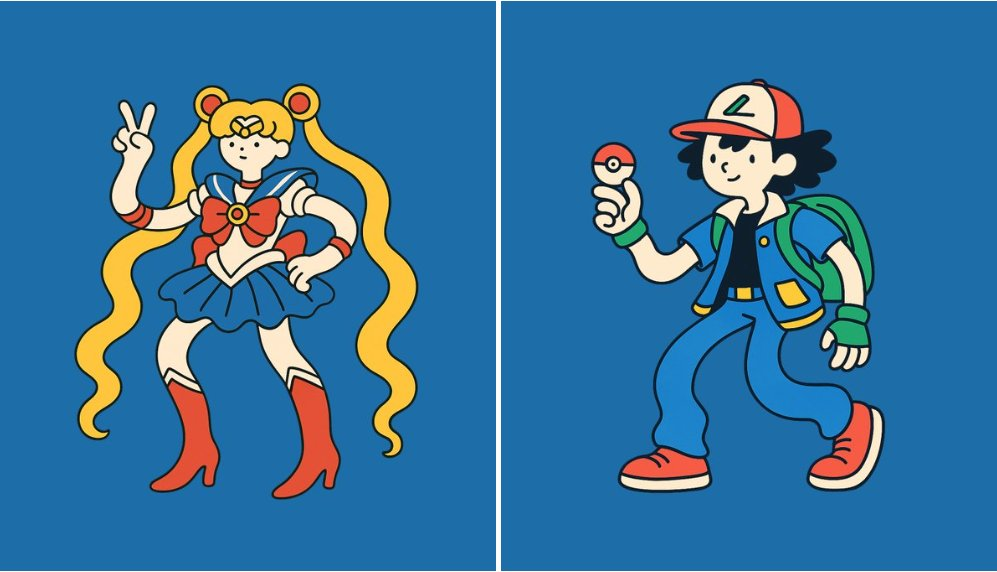


### 中文提示词

```
创作一幅[角色]的全身扁平矢量插画，采用异想天开的波浪卡通风格。使用纤细的黑色轮廓和流畅的圆
形造型。角色应有一个小小的白色头部，上面有极小的圆点眼睛以及简单的鼻子和嘴巴。身体比例要夸
张且富有童趣。服装采用鲜明的扁平色彩。不使用渐变、阴影和晕染效果。将角色置于纯蓝色背景上。
适合矢量格式。采用正方形比例。
```

### 英文提示词

```
Create a full body, flat vector illustration of [CHARACTER] in a whimsical, 
wavy cartoon style. Use thin black outlines and smooth, rounded shapes. The  1

character should have a tiny white-colored head with tiny dot eyes and a 
simple nose and mouth. The body should have exaggerated, playful proportions. 
Use bold, flat colors for the clothing. No gradients. No shading. No smudging. 
Place the character on a solid blue background. Vector friendly. Square aspect 
ratio.
```
## 案例 21: 一个复古茶包 (来源 @TheRelianceAI)​

### 效果展示


  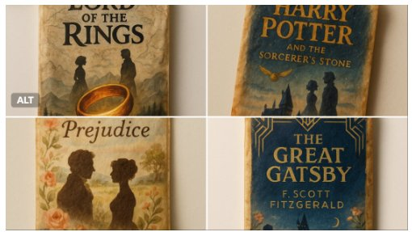


### 中文提示词

```
一个复古茶包孤零零地放在干净的白色背景上，上面手绘着类似书籍封面的复杂图案。这个茶包有着细
腻的陈旧纸张质感，搭配柔和温暖的光线，细节逼真。在手绘图案上，留出一块清晰的空白区域，并标
注为【BOOK】，用于填写书名。整体呈现电影般的质感，高分辨率，采用9:16的竖版格式。
```

### 英文提示词

```
A single vintage tea bag lying on a clean white background, hand-painted with 
an intricate illustration resembling a book cover. The tea bag has delicate 
aged paper texture, soft warm lighting, and realistic details. On the painted 
design, leave a clear blank space labeled [BOOK] for the book title. 
Cinematic, high-resolution, vertical format 9:16. 1


--- Page 26 ---
```
## 案例 22: 树上挂着产品 (来源 @TheRelianceAI)​

### 效果展示


  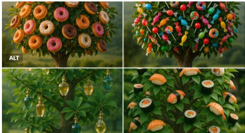


### 中文提示词

```
一张超写实的照片，画面中是一片风景优美的草地上的一棵树。树干坚固，树皮纹理清晰，树叶郁郁葱
葱、绿意盎然。树枝上长的不是果实，而是自然悬挂着[产品]，它们与树叶无缝融合，纹理逼真。照片
采用自然光线，搭配柔和的阴影，带有细微的瑕疵，以平视角度拍摄，景深较浅，细节极致丰富，分辨
率为8k。
```

### 英文提示词

```
A hyper-realistic photograph of a tree in a scenic meadow, with a sturdy, 
detailed bark trunk and lush green leaves, where instead of fruits, the 
branches naturally bear [PRODUCT], seamlessly integrated into the foliage, 
with realistic textures, natural lighting, soft shadows, subtle imperfections, 
shot at eye level with a shallow depth of field, ultra-detailed, 8k
```
## 案例 23: 品牌杂志 (来源 @TheRelianceAI)​

### 效果展示


  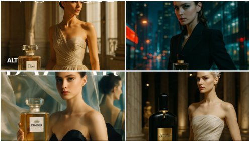

### 中文提示词

```
一个超写实的编辑概念，用于[品牌]与[杂志品牌]的合作。1:1的正方形构图，在时尚的巴黎室内拍
摄，室内设有大理石地板和高大的窗户，金色的午后阳光照亮整个场景。一位身着高级定制礼服的模特
优雅地摆着姿势，身旁是一个尺寸逼真的[品牌]香水瓶，瓶身上清晰可见[品牌]的标志，香水瓶放置在
大理石基座上。超精细的纹理，电影般的写实感，《 Vogue》风格的摄影。
```

### 英文提示词

```
A hyper-realistic editorial concept for a collaboration between [BRAND] and 
[MAGAZINE BRAND]. Square 1:1 composition, shot in a sleek Parisian interior 
with marble floors and tall windows, golden afternoon light illuminating the 
scene. A single model in a couture gown poses gracefully beside a 
realistically sized [BRAND] perfume bottle with the [BRAND] logo clearly 
visible placed on a marble pedestal. Ultra-refined textures, cinematic 
realism, Vogue-style photography.
```
## 案例 24: 纸制玩具版本 (来源 @TechieBySA)​

### 效果展示


  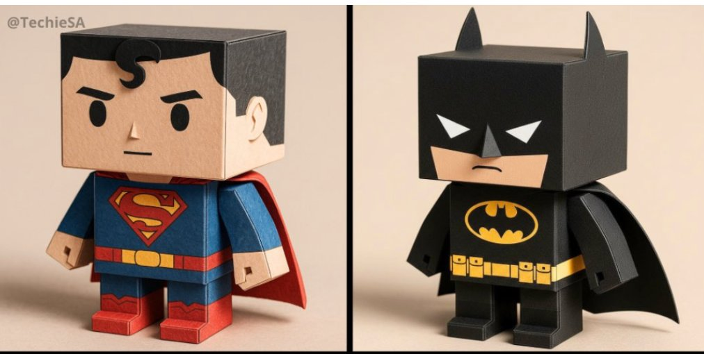

### 中文提示词

```
超细节渲染的[角色名称]纸制玩具版本，呈盒子形状（纸制玩具），由哑光折叠纸板制成，带有可见的
纸张纹理，边缘干净，折叠整齐。头部和身体为立方体，四肢为方形，面部特征简化，采用平面印刷色
彩和微妙阴影以增强深度。服装和配饰以极简几何纸艺风格忠实地模仿参考图的外观，保持紧凑比例和
Q版风格。中性工作室灯光，柔和阴影，平滑背景，逼真的产品摄影效果，4K分辨率，无文字或标志。
尺寸为1080x1080。
```

### 英文提示词

```
Ultra-detailed render of a [CHARACTER NAME] paper toy version in box form 
(papertoy) made from matte folded cardboard and cut with visible paper 
texture, clean edges and neat folds. Cubic head and body, square extremities, 
simplified facial features, flat printed colors and subtle shading for greater 
depth. The clothing and accessories faithfully imitate the appearance of the 
reference image in a minimalist geometric papercraft style, maintaining 
compact proportions and chibi style. Neutral studio lighting, soft shadows, 
smooth background, photorealistic product photography, 4K, no text or logos. 
1080x1080 dimension.
```
## 案例 25: 低多边形马赛克风格 (来源 @fy360593)​

### 效果展示


  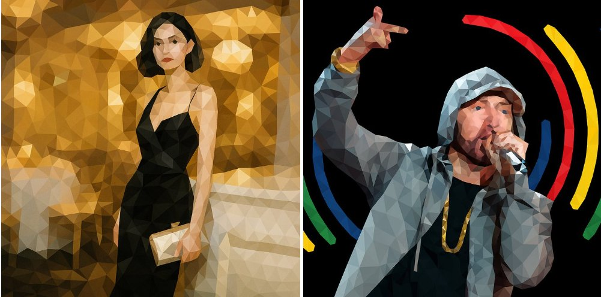

### 中文提示词

```
将这张图片转换为精致的低多边形马赛克风格。保留原始结构和可识别的细节，尤其是面部特征和轮
廓。使用小而密集的多边形，在保持清晰度和辨识度的同时，营造出水晶般的多面效果。保留原始色
调，以获得和谐自然的美感。避免修改或添加新元素。
```

### 英文提示词

```
Transform this image into a refined low-poly mosaic style. Preserve the 
original structure and recognizable details, especially facial features and 
contours. Use small, high-density polygons to maintain clarity and identity 
while creating a crystalline, faceted look. Keep the original color palette 
for a harmonious and natural aesthetic. Avoid altering or adding new elements.
```
## 案例 26: 街头顽童（Gorillaz）风格插画 (来源 @azed_ai)​

### 效果展示


  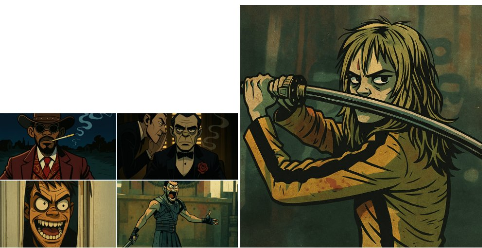

### 中文提示词

```
将这张图片重新设计成粗粝的街头顽童（Gorillaz）风格插画，采用粗重的黑色轮廓线、锐利的棱
角、扁平化的富有表现力的光线、风格化的高对比度阴影、粗糙破旧的表面纹理；色彩搭配柔和暗淡：
褪色的蓝绿色、橄榄绿、锈红色、芥末黄、土褐色；营造出原始粗粝的都市氛围，融合漫画的扁平化与
绘画的颗粒感，带有褪色渐变效果的手绘质感，呈现出漫画小说的美学风格，整体基调叛逆、生动且时
尚暗黑，充满个性。
```

### 英文提示词

```
Restyle this image into a gritty Gorillaz-style illustration, bold thick black 
outlines, sharp angular edges, flat expressive lighting, stylized high-
contrast shadows, dirty distressed surface textures, muted color palette: 
washed-out teals, olive greens, rusty reds, mustard yellows, dusty browns, raw 
grungy urban atmosphere, comic book flatness mixed with painterly grit, hand-
drawn finish with faded gradients, graphic novel aesthetic
with a rebellious, animated tone, dark stylish tone, full of attitude.
```
## 案例 27: 城市糖果传奇的风格 (来源 @miilesus)

### 效果展示


  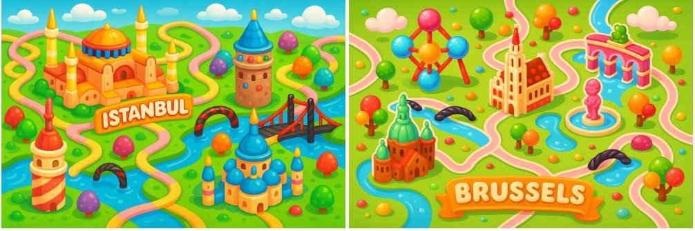

### 中文提示词

```
一幅色彩丰富、充满童趣的[城市名称]2D地图，采用《糖果传奇》的风格，将城市的标志性地标设计成
糖果风格的建筑，还有可爱的软糖树、甘草桥、柔和色调的道路、富有光泽的水域元素、漂浮的云朵，
整体为鲜艳的卡通风格，采用俯视视角，具有适合儿童的游戏美学，为横向布局。
```

### 英文提示词

```
A colorful, playful 2D map of [city name], in the style of Candy Crush Saga, 
featuring the city’s iconic landmarks as candy-inspired buildings, cute 
gumdrop trees, licorice bridges, pastel roads, and glossy water elements, 
floating clouds, vibrant cartoon style, top-down view, kid-friendly game 
aesthetics, horizontal layout
```
## 案例 28: 20世纪20年代亚瑟·拉克姆风格的童话插画 (来源 @vkuoo)​

### 效果展示


  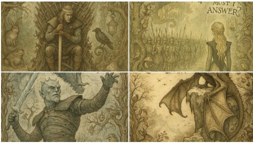

### 中文提示词

```
将这张图片转换成20世纪20年代亚瑟·拉克姆风格的童话插画。采用柔和的水彩色调和精致的墨水线
条。场景中要充满奇幻的森林生物、扭曲的树枝和隐藏的魔法物品。整体基调应神秘、迷人且略带诡
异。添加手写书法风格的说明文字和谜语。
```

### 英文提示词

```
Transform this image into a 1920s fairy tale illustration in the style of 
Arthur Rackham. Use muted watercolor tones and intricate ink linework. Fill 
the scene with whimsical forest creatures, twisted tree branches, and hidden 
magical objects. The overall tone should be mysterious, enchanting, and 
slightly eerie. Add handwritten calligraphy-style captions and riddles.
```
## 案例 29: 20世纪30年代弗莱舍工作室风格的动画 (来源 @vkuoo)​

### 效果展示


  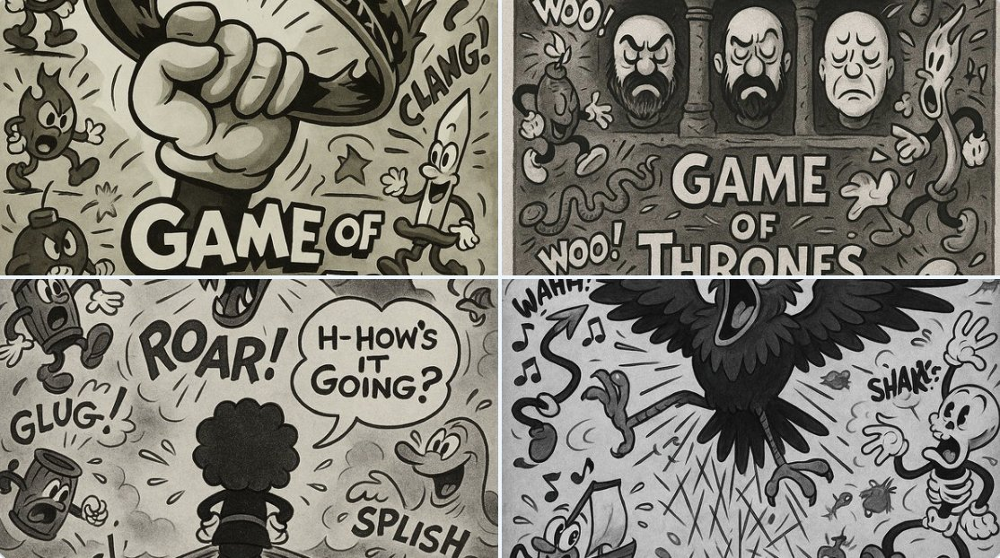

### 中文提示词

```
将这张图片转换成20世纪30年代弗莱舍工作室风格的动画分镜。采用灰度色调，搭配富有表现力的墨色
阴影和“橡胶管”式肢体线条。场景中要加入拟人化的物体、富有弹性的运动线和闹剧式的动作。整体基
调应充满爵士感、活力与趣味。添加手写风格的音效文字和古怪的对话标牌。
```

### 英文提示词

```
Transform this image into a 1930s animation storyboard in the style of 
Fleischer Studios. Use greyscale with expressive inky shading and rubber-hose 
limbs. Surround the scene with anthropomorphic objects, bouncy motion lines, 
and slapstick action. The overall tone should be jazzy, lively, and playful. 
Add hand-lettered sound effects and quirky dialogue signs.
```
## 案例 30: 20世纪50年代的海报 (来源 @vkuoo)​

### 效果展示


  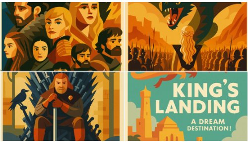

### 中文提示词

```
将这张图片转换成20世纪50年代的海报，风格参考中世纪现代平面设计师的作品。采用扁平的几何色
块，搭配醒目的排版元素。整体基调应乐观、怀旧且具有宣传性。添加醒目的地点标签和宣传标语。
```

### 英文提示词

```
Transform this image into a 1950s poster in the style of mid-century modern 
graphic designers. Use flat, geometric color blocks with strong typographic 
elements.  The overall tone should be optimistic, nostalgic, and promotional. 
Add bold location labels and promotional slogans.
```
## 案例 31: 透明蜂窝状变形 (来源 @miilesus)

### 效果展示


  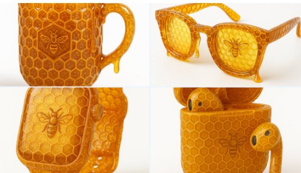


### 中文提示词

```
{
"物体": "OBJECT_NAME",
"风格": "透明蜂窝状变形",
"描述": "将该物体转变为由完全结晶的金色蜂蜜制成的结构，具有高度透明度。表面应呈现超
glossy 质感、半液态状态和反光效果，带有清晰可辨且透明的六边形蜂窝图案。物体的部分区域应允
许光线穿透，以展现内部层次和结构。为增强真实感，需加入自然垂落的蜂蜜滴。",
"材质": {
"主要材质": "清澈透明的琥珀色蜂蜜",
"次要材质": "半透明的蜂窝单元"
},
"纹理": {
"表面": "超 glossy 且呈半液态",
"图案": "透明的六边形蜂窝",
"滴落效果": true
},
"特效": {
"半透明性": "高度半透明",
"内部光晕": "源自内部的柔和暖光",
"标志": "精致的蜜蜂图标巧妙嵌入结构中"
},
"呈现方式": {
"背景": "纯净白色或柔和渐变",
"光线": "背光搭配柔和漫射效果，以增强半透明感",
"悬浮效果": true,
"格式": "正方形"
}
}
```

### 英文提示词

```
{
  "object": "OBJECT_NAME",
  "style": "Transparent Honeycomb Transformation",
  "description": "Transform the object into a structure made entirely of 
crystallized golden honey with high transparency. The surface should be ultra-
glossy, semi-liquid, and light-reflective, with defined yet see-through 
hexagonal honeycomb patterns. Parts of the object should allow light to pass 
through, revealing inner layers and structure. Include gentle honey drips for 
realism.",
  "material": {
    "primary": "Crystal-clear amber honey",
    "secondary": "Translucent honeycomb cells"
  },
  "texture": {
    "surface": "Ultra glossy and semi-liquid",
    "pattern": "See-through hexagonal honeycomb",
    "drips": true
  },
  "effects": {
    "translucency": "highly translucent",
    "internal_glow": "Soft warm light from within",
    "emblem": "Delicate bee icon subtly embedded in the structure"
  },
  "presentation": {
    "background": "Clean white or soft gradient",
    "lighting": "Backlit with soft diffusion to enhance translucency",
    "floating": true,
    "format": "Square"
  }
} 2 4 6 8 10 12 14 16 18 20 22 24 

--- Page 36 ---
```
## 案例 32: 漂浮玻璃霓虹3D (来源 @egeberkina)​

### 效果展示


  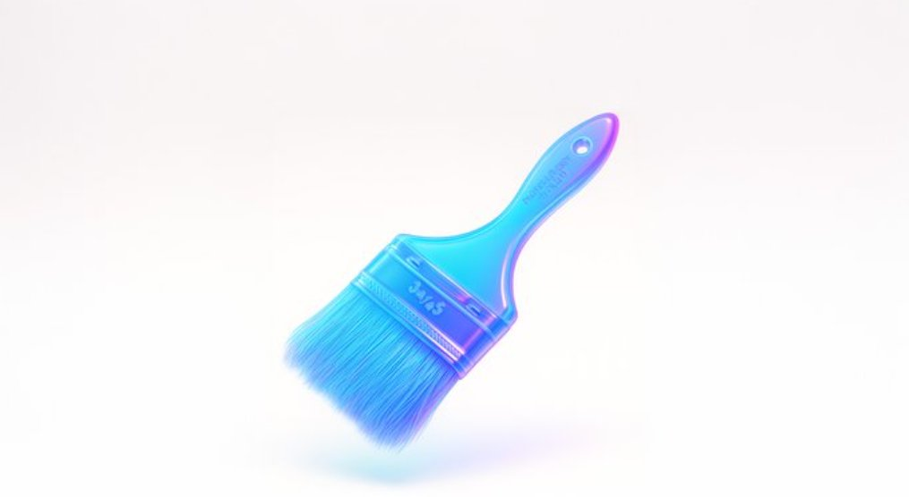


### 中文提示词

```
根据以下JSON对附加图片进行重新纹理处理：
{
"风格名称": "漂浮玻璃霓虹3D",
"重纹理模式": "形状锁定",
"对象分析": {
"保留轮廓": true,
"几何敏感映射": true,
"细节保留": "维持轮廓、体积和层次感"
},
"材质属性": {
"基础材质": "半透明霓虹玻璃胶",
"表面处理": "半光泽，边缘带有柔和光晕",
"透明度": "高，带有柔和的光折射",
"折射效果": "轻微弯曲，曲线处有微妙光晕",
"内置效果": "内部光散射和边缘霓虹发光",
"色彩混合": {
"主色": ["水绿色", "电蓝色", "霓虹紫"],
"渐变方向": "左上角至右下角",
"过渡平滑度": "非常平滑"
}
},
"光照": {
"类型": "柔光箱HDRI",
"强度": "柔和明亮",
"光源方向": " overhead 且略微偏前",
"高光表现": "柔和光晕，带有玻璃闪光"
},
"阴影表现": {
"类型": "漂浮接触阴影",
"外观": "极其柔和、模糊的椭圆形",
"不透明度": 0.07,
"物体下方距离": "适中",
"颜色": "中性灰"
},
"背景": {
"类型": "纯色",
"颜色": "#ffffff",
"发光效果": "无",
"渐变": "无"
},
"渲染": {
"景深": "轻微，带有轻微渐晕",
"焦点": "漂浮物体的中心",
"环境光遮蔽": "最小化以保持明亮感",
"渲染引擎": "3D风格化，带有光扩散和高镜面细节",
"相机角度": "略高于物体，正面视角",
"分辨率": "极高，适用于产品品牌推广"
},
"特殊效果": {
"漂浮效果": true,
"视觉失重感": true,
"阴影柔和度": "最大"
}
}
```

### 英文提示词

```
retexture the image attached based on the JSON below:
{
  "style_name": "Floating Glassy Neon 3D",
  "retexture_mode": "shape_lock",
  "object_analysis": {
    "preserve_silhouette": true,
    "geometry_sensitive_mapping": true,
    "detail_retention": "maintain contours, volumes, and layering"
  },
  "material_properties": {
    "base_material": "translucent neon glass-gel",
    "surface_finish": "semi-gloss with soft glow edges",
    "transparency": "high, with soft light refraction",
    "refraction": "gentle bend with subtle halo on curves",
    "embedded_effects": "internal light scatter and edge neon glow",
    "color_blend": {
      "primary": ["aqua", "electric blue", "neon violet"],
      "gradient_direction": "top-left to bottom-right",
      "transition_smoothness": "very smooth"
    }
  },
  "lighting": {
    "type": "softbox HDRI",
    "intensity": "soft and bright", 2 4 6 8 10 12 14 16 18 20 22 24 
    "source_direction": "overhead and slightly front",
    "highlight_behavior": "gentle bloom with glass sparkle"
  },
  "shadow_behavior": {
    "type": "floating contact shadow",
    "appearance": "extremely soft, blurred ellipse",
    "opacity": 0.07,
    "distance_below_object": "moderate",
    "color": "neutral gray"
  },
  "background": {
    "type": "solid color",
    "color": "#ffffff",
    "glow_effect": "none",
    "gradient": "none"
  },
  "rendering": {
    "depth_of_field": "subtle with slight vignette",
    "focus_point": "center of floating object",
    "ambient_occlusion": "minimal to preserve light feel",
    "render_engine": "3D stylized with light diffusion and high specular 
detail",
    "camera_angle": "slightly above object, frontal",
    "resolution": "very high for product branding"
  },
  "special_effects": {
    "floating_behavior": true,
    "visual_weightlessness": true,
    "shadow_softness": "maximum"
  }
}
```
## 案例 33: 头部的几何肖像 (来源 @TechieBySA)​

### 效果展示


  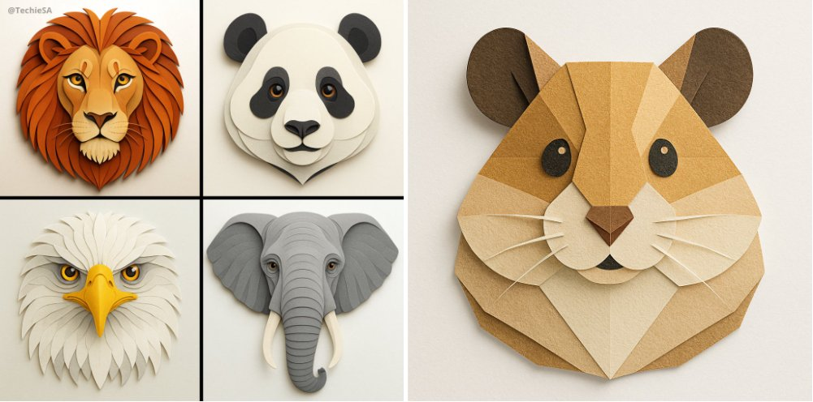


### 中文提示词

```
设计一幅[动物]头部的几何肖像，采用当代纸艺拼贴风格。运用多种重叠的纸张纹理和阴影效果来构建
立体深度。聚焦于植物灵感的色彩搭配，呈现哑光质感美学。构图应采用大胆的棱角切割，既塑造出该
动物的独特特征，又保持面部对称性。背景为简约风格，带有微妙的渐变效果。最终作品需展现出博物
馆级纸艺装置的精湛工艺。尺寸为正方形，1080x1080像素。
```

### 英文提示词

```
Design a geometric portrait of a [ANIMAL] head in the style of contemporary 
paper craft collage. Use multiple overlapping paper textures and shadow 
effects to build dimensional depth. Focus on botanical-inspired color palettes 
with matte finish aesthetics. The composition should feature bold, angular 
cuts that form the animal’s distinctive characteristics while maintaining 
facial symmetry. Set against a minimalist backdrop with subtle gradient. The 
final piece should evoke the craftsmanship of museum-quality paper 
installations. Square format, 1080x1080 pixels.
```
## 案例 34: 磨砂泡泡 3D 图标 (来源 @Anima_Labs)​

### 效果展示


  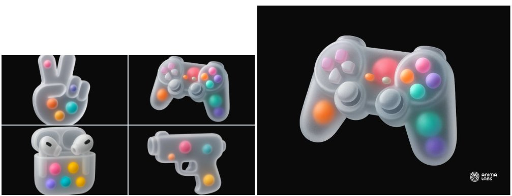


### 中文提示词

```
{
"风格名称": "磨砂泡泡3D图标",
"渲染模式": "3d_semi_transparent_detailed（3D半透明精细）",
"图标主题": "{{图标_PlayStation手柄}}",
"对象分析": {
"保留轮廓": true,
"几何敏感映射": true,
"细节保留": "平滑的圆角边缘，细微的内部反射"
},
"材质属性": {
"基础材质": [
"磨砂半透明塑料",
"半透明哑光亚克力"
],
"内部元素": "漂浮的彩色球体，可透过外壳看到",
"表面处理": "磨砂、漫射哑光质感，带有轻微透光性",
"纹理表现": "无外部色彩 tint，透明度可展现内部物体",
"品牌元素": "无"
},
"色彩搭配": {
"主色": ["#FFFFFF", "#F5F5F5"],
"强调色": ["#FF69B4", "#FFA500", "#6A5ACD", "#00CED1", "#FFD700"],
"对比度": "极高"
},
"光照": {
"类型": "柔和环境光+轮廓光",
"强度": "高",
"阴影": "物体下方柔和光晕",
"高光": "微弱的边缘发光和顶部柔和反射"
},
"渲染": {
"风格": "带有内部彩色元素的现代3D图标",
"背景": "纯黑色",
"相机角度": "等距3/4视图",
"景深": "无，所有细节均清晰对焦"
},
"风格说明": [
"黑色背景提升泡泡色彩的可见度",
"磨砂透明度在黑色背景下应呈现微妙的发光效果",
"非常适合高对比度、收藏品风格的图标"
]
}
```

### 英文提示词

```
{
"style_name": "Frosted Bubble 3D Icons",
"render_mode": "3d_semi_transparent_detailed",
"icon_subject": "{{icon_ PlayStation controller}}",
"object_analysis": {
"preserve_silhouette": true,
"geometry_sensitive_mapping": true,
"detail_retention": "smooth rounded edges, subtle internal reflections"
},
"material_properties": {
"base_material": [
"frosted translucent plastic",
"semi-transparent matte acrylic"
],
"internal_elements": "floating colorful spheres, visible through the outer 
shell",
"surface_finish": "frosted, diffused matte texture with light translucency",
"texture_behavior": "no external color tint, transparency reveals inner 
objects",
"branding_elements": "none"
},
"color_palette": {
"primary": ["#FFFFFF", "#F5F5F5"],
"accents": ["#FF69B4", "#FFA500", "#6A5ACD", "#00CED1", "#FFD700"],
"contrast": "very high"
}, 2 4 6 8 10 12 14 16 18 20 22 24

"lighting": {
"type": "soft ambient + rim lighting",
"intensity": "high",
"shadows": "soft glow under the object",
"highlights": "faint edge glow and top soft reflection"
},
"rendering": {
"style": "modern 3D icon with internal color elements",
"background": "pure black",
"camera_angle": "isometric 3/4 view",
"depth_of_field": "none, all details in focus"
},
"style_notes": [
"black background increases bubble color visibility",
"frosted transparency should glow subtly against black",
"perfect for high-contrast, collectible-style icons"
]
}
```
## 案例 35: 亚克力钥匙扣 (来源 @TechieBySA)​

### 效果展示


  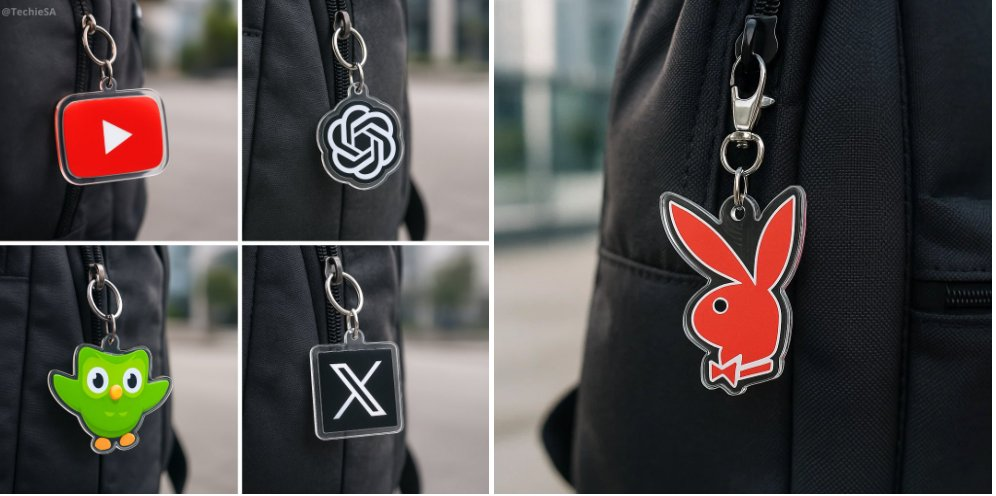


### 中文提示词

```
创建一张逼真的方形图片（1080x1080 像素），展示一个定制的 [LOGO] 标志亚克力钥匙扣，它挂在
一个深色背包（如黑色或灰色）的拉链上。该标志必须保持其原始形状、颜色和比例，不得有任何改
动。钥匙扣应有一层透明的光泽亚克力，配有银色金属环和扣具。使用柔和的日光或漫射光，避免黄色
调。背景设置为现代户外环境，但需模糊处理，以将焦点保持在标志钥匙扣上。
```

### 英文提示词

```
Create a photorealistic square image (1080x1080) showing a custom acrylic 
keychain version of the [LOGO] logo hanging from the zipper of a dark-colored 
backpack (e.g. black or grey). The logo must retain its original shape, color, 
and proportions without any alteration. The keychain should have a clear 
glossy acrylic layer, clipped with a silver metal ring and clasp. Use soft 
daylight or diffused lighting to avoid yellow tones. Set the background in a 
modern outdoor setting, but keep it blurred to maintain focus on the logo 
keychain.
```
## 案例 36: 怪诞又梦幻的超现实插画 (来源 @fy360593)​

### 效果展示


  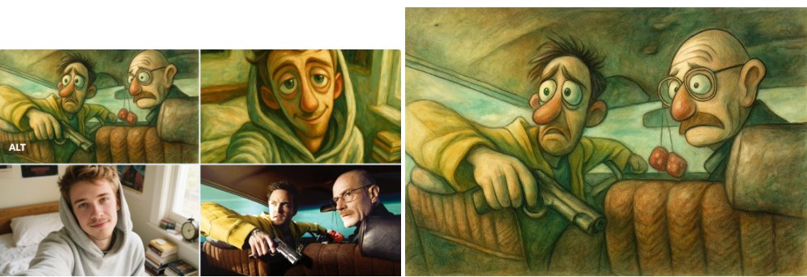


### 中文提示词

```
将上传的图片转换为一幅超现实插画，营造出怪诞又梦幻的氛围。
色彩搭配：采用柔和色调（浅绿、棕色、灰色），偶尔点缀一抹淡雅的绿色。
光线效果：柔和、弥漫的近乎空灵的光线，融合渐变色与细微的高光。
质感与媒介感：类似油画的笔触、淡淡的水彩晕染或松散的手绘线条，带有轻微的颗粒质感。
氛围与构图：具有夸张、富有表现力的特征（如拉长的脸型或饱含情感的眼睛），这是卡通或提线木偶
风格插画的典型特点，但要将其应用于超现实、略带奇幻色彩的场景中。
整体美学：将对细节的真实刻画与一丝超现实的怪诞感相融合 —— 营造出一种宁静又略带诡异的氛围。
```

### 英文提示词

```
Transform the uploaded image into a surreal illustration with a whimsical, 
dream‑like vibe.​
• Color palette: muted tones (soft greens, browns, greys) with occasional 
gentle pops of green.
• Lighting: soft, diffused, almost ethereal light that blends gradients and 
subtle highlights. 1 2 
• Texture & medium feel: oil‑painting‑like brushstrokes, faint watercolor 
washes, or loose hand‑drawn linework, with a slight grainy texture.​
• Mood & composition: exaggerated, expressive features (e.g., elongated faces 
or emotive eyes) characteristic of cartoonish or Muppet‑style illustrations, 
but applied in a surreal, slightly fantastical context.
• Overall aesthetic: blend realistic attention to detail with a touch of 
surreal whimsy—think serene, slightly uncanny atmosphere.
```
## 案例 37: 超细节盒状纸艺玩具 (来源 @Arminn_Ai)​

### 效果展示


  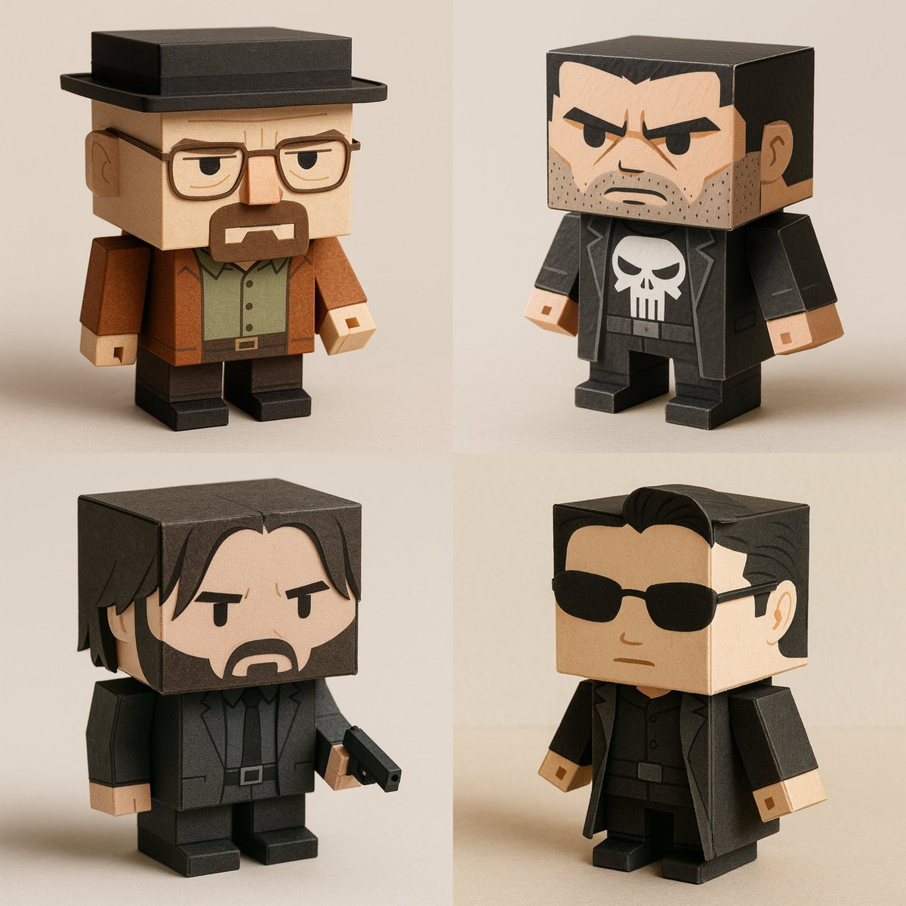


### 中文提示词

```
1×1大小的正方形，超细节渲染的[角色名称]盒状纸艺玩具版本。由折叠和裁剪的哑光卡纸制成，具有
可见的纸张纹理、清晰的边缘和整齐的折痕。立方体头部和身体，块状四肢，简化的面部特征，平印色
彩，以及用于体现深度的微妙阴影。服装和配饰以简约的几何纸艺风格忠实还原[角色名称]的标志性外
观，保持紧凑的比例和Q版风格。中性工作室灯光，柔和阴影，简洁背景，逼真的产品摄影效果，4K分
辨率，无文字或标志。
```

### 英文提示词

```
1×1 square, ultra-detailed render of a box-shaped papertoy version of 
[CHARACTER NAME]. Made from folded and cut matte cardstock with visible paper 
texture, crisp edges, and clean folds. Cubic head and body, blocky limbs, 
simplified facial features, flat printed colors, and subtle shading for depth. 
Clothing and accessories faithfully mimic [CHARACTER NAME]’s iconic look in a 
minimal geometric papercraft style, keeping proportions compact and chibi-
like. Neutral studio lighting, soft shadows, plain background, photorealistic 
product photography, 4K, no text or logos. 

--- Page 47 ---
```
## 案例 38: 被优雅水漩涡环绕的品牌产品 (来源 @Morph_VGart)​

### 效果展示


  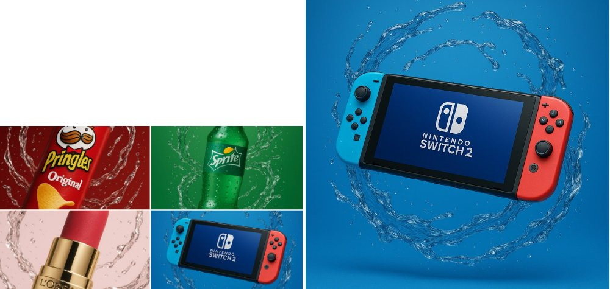


### 中文提示词

```
创建一个方形图像，是工作室照明的产品摄影，一个[产品]悬浮在空中，周围有许多厚重的动态水漩涡
以慢动作弧线环绕，晶莹剔透的液滴折射着光线，高光泽度，简约背景，电影般的照明，柔和的阴影和
高光，在纯色匹配渐变背景上拍摄，超逼真的细节，商业摄影风格，85mm 镜头景深。
```

### 英文提示词

```
Create square image of studio-lit product photography of a [Product] suspended 
in mid-air, lots of thick dynamic water swirls surrounding it in slow-motion 
arcs, crystal-clear droplets glistening with light refraction, high-gloss 
finish, minimal backdrop, cinematic lighting with soft shadows and highlights, 
shot on a pure matching gradient background, ultra-realistic detail, 
commercial photography style, 85mm lens depth of field.
```
## 案例 39: 路牌图片 (来源 @diegocabezas01)​

### 效果展示


  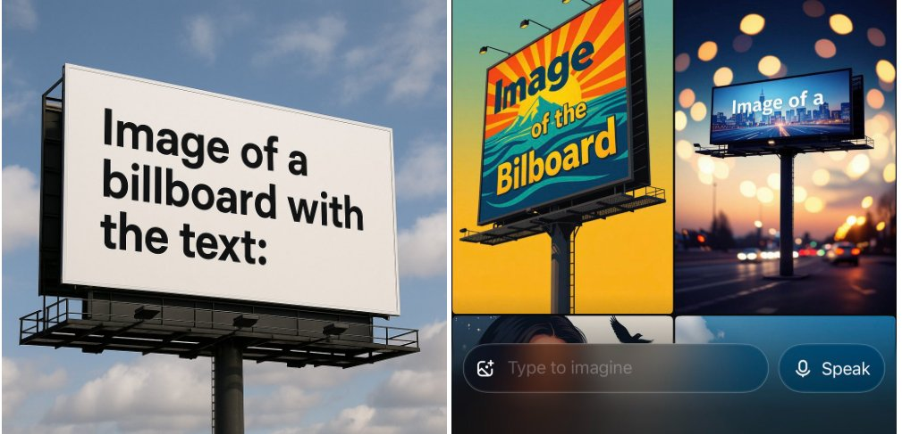

### 中文提示词

```
路牌图片，上面写着：“路牌图片，上面写着：”
```

### 英文提示词

```
Image of a billboard with the text: “Image of a billboard with the text:”
```
## 案例 40: 一张铅笔素描 (来源 @CharaspowerAI)​

### 效果展示


  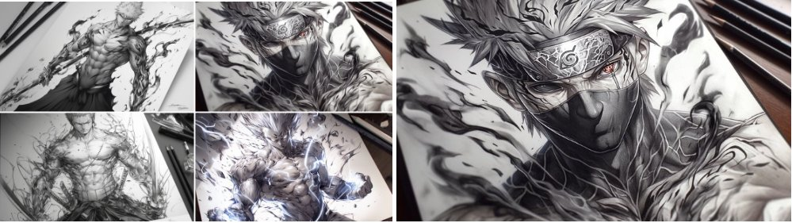

### 中文提示词

```
一张铅笔素描，描绘了 [你的角色]，在白纸上用细致的线条和阴影，捕捉了他肌肉身体中的能量和力
量 [带有元素效果] 围绕着角色，动态姿势，纸上的纹身设计，漫画艺术风格，深色背景，高对比度，
强烈的阴影，光影效果，黑色墨水绘画，动态姿势
```

### 英文提示词

```
A pencil drawing of [Your character], with detailed lines and shading on white 
paper, capturing the energy and strength in his muscular body [with element 
effects] around  the character, in a dynamic pose,   tattoo design on paper, 
manga art style, dark background, high contrast, strong shadows, light and 
shadow effects, black ink drawing,  dynamic pose
```
## 案例 41: 90年代美国卡通片定格动画风格插画 (来源 @cuchocapilla)​

### 效果展示


  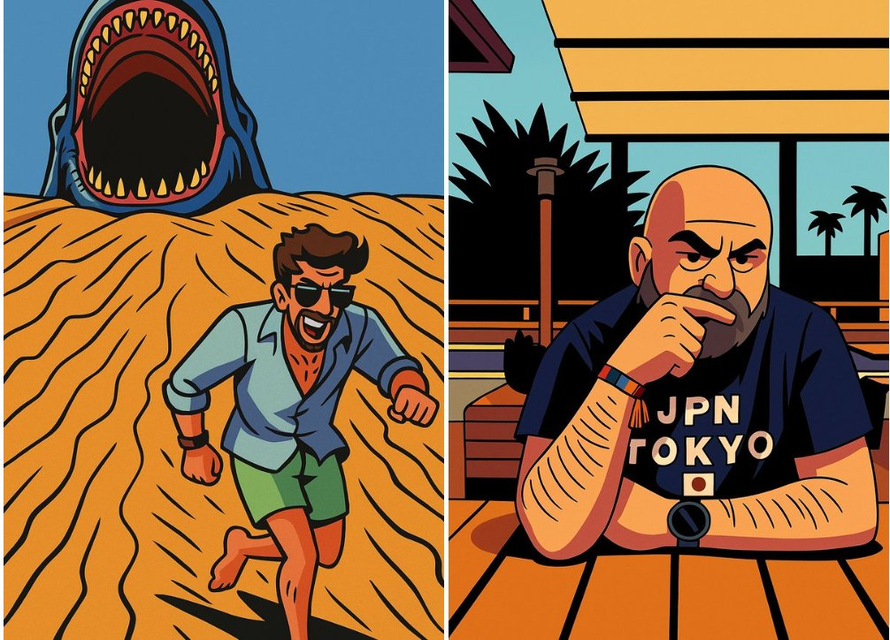


### 中文提示词

```
将这张图片转化为 90 年代美国卡通片定格动画风格插画。使用粗黑轮廓线、平面化鲜明的颜色，以及
锐利的定格动画阴影效果和硬阴影。强调夸张的面部表情和风格化的几何角色形状。背景应为平面或极
简，以突出角色。整张图片应感觉像是从周六早间卡通片中截取的一帧。
```

### 英文提示词

```
Transform this image into a 90s American cartoon cel-style illustration. Use 
thick black outlines, flat bold colors, and sharp cel shading with hard 
shadows. Emphasize exaggerated facial expressions and stylized, geometric 
character shapes. The background should be flat or minimal to keep the focus 
on the character. The whole image should feel like a frame from a Saturday 
morning cartoon.
```
## 案例 42: 色彩缤纷的手工雕塑 (来源 @Deshraj4x)​

### 效果展示


  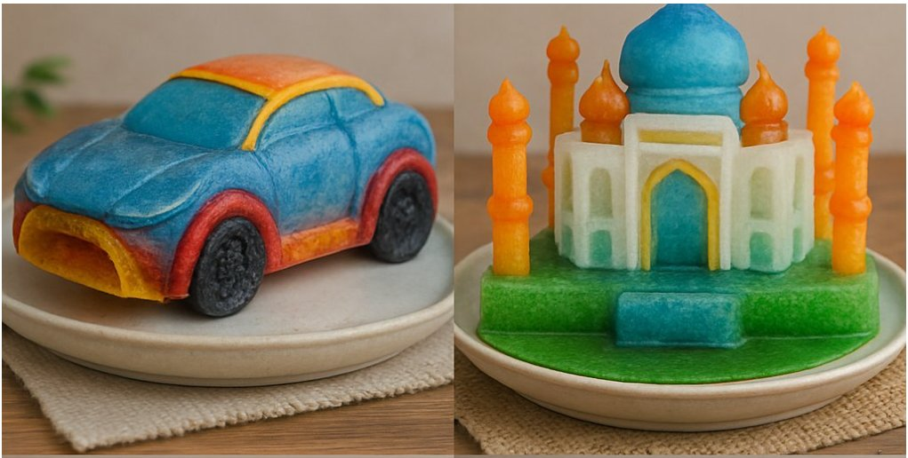


### 中文提示词

```
一个色彩缤纷的手工雕塑，由[插入主题]制成，使用半透明的冰块，形状定制。装饰如糖霜、糖果、毛
线或水果皮增强了面部特征、纹理或配饰。放置在陶瓷盘上，盘上覆盖着叶子或装饰垫，背景是干净、
柔和照明的摄影棚或自然桌面。光线突出了冰块的光泽质感，将食品艺术、玩具设计和摄影融合成一种
俏皮、艺术性的构图。
```

### 英文提示词

```
A colorful handcrafted sculpture of [insert subject], made from semi-
transparent ice blocks in custom shapes. Accents like icing, candy, yarn, or 
fruit skin enhance facial features, texture, or accessories. Placed on a 
ceramic plate over a leaf or decorative mat, with a clean, softly lit studio 
or natural tabletop background. Lighting highlights the glossy ice texture, 
blending food art, toy design, and photography into a playful, artistic 
composition.
```
## 案例 43: Kiro卡通幽灵 (来源 @松果先森)​

### 中文提示词

```
一个可爱的卡通鬼魂是图片的绝对主体。它拥有纯白色的身体，轮廓平滑圆润，两只简单的黑色椭圆形
眼睛，没有任何额外特征。这个鬼魂安静地漂浮在图片的正中央。背景是纯亮的紫色，营造出简洁、现
代和友好的氛围。构图是居中的特写，宽高比为 1:1 的正方形。整个图像中没有文字。图像风格典型
的扁平化设计和矢量艺术，极简主义，类似于应用图标或标志，以干净的线条和实色块为特点，没有任
何渐变或纹理细节。要求的图像质量是高分辨率，边缘清晰锐利。它给人的整体感觉是一幅可爱、简
洁、现代的数字艺术作品。
```

### 英文提示词

```
A cute cartoon ghost is the absolute main subject of the picture. It has a 
pure white body with a smooth and rounded contour, and two simple black oval 
eyes, with no extra features. This ghost is floating quietly in the very 
center of the picture. The background is a pure, bright purple, creating a 
simple, modern, and friendly atmosphere. The composition is a centered close-
up, and the aspect ratio is 1:1 square. There is no text in the entire image. 
The image style is typical flat design and vector art, minimalist, much like 
an app icon or a logo, characterized by clean lines and solid color blocks, 
without any gradients or textural details. The image quality required is high-
resolution with clean, sharp edges. The overall feeling it gives is one of a 
cute, simple, and modern piece of digital art.
```
## 案例 44: 转换马赛克风格照片 (来源 @fy360593)​

### 效果展示


  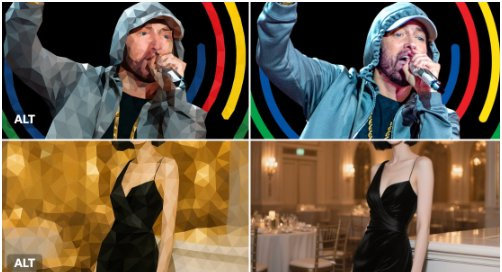


### 中文提示词

```
将此图像转换为精致的低多边形马赛克风格。保留原始结构和可识别的细节，特别是面部特征和轮廓。
使用小而高密度的多边形，以保持清晰度和身份，同时创造水晶般、多面体的外观。保留原始调色板，
以实现和谐自然的美学。避免更改或添加新元素。
```

### 英文提示词

```
Transform this image into a refined low-poly mosaic style. Preserve the 
original structure and recognizable details, especially facial features and 
contours. Use small, high-density polygons to maintain clarity and identity 
while creating a crystalline, faceted look. Keep the original color palette 
for a harmonious and natural aesthetic. Avoid altering or adding new elements.
```
## 案例 45: 卡通照片转换 (来源 @fy360593)​

### 效果展示


  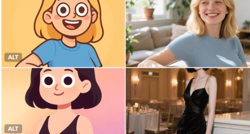


### 中文提示词

```
将角色转化为数字化的半身卡通风格肖像。使用适合矢量的俏皮风格，线条干净利落，圆润的脸庞，超
大号的玻璃眼球，以及极简的面部细节。展示角色胸部以上的部分，包括肩膀和上半身。对角色和背景
都应用平滑的渐变填充，营造色彩丰富、柔和的视觉效果。方形格式。
```

### 英文提示词

```
Transform the character into a digital, half-body cartoon-style portrait. Use 
a playful, vector-friendly style with clean solid lines, rounded face, 
oversized googly eyes, and minimal facial details. Show the character from 
chest up, including shoulders and upper torso. Apply smooth gradient fills to 
both the character and background for a colorful, soft look. Square format. 1 

--- Page 54 ---
```
## 案例 46: 有趣的块状 3D 世界 (来源 @egeberkina)​

### 效果展示


  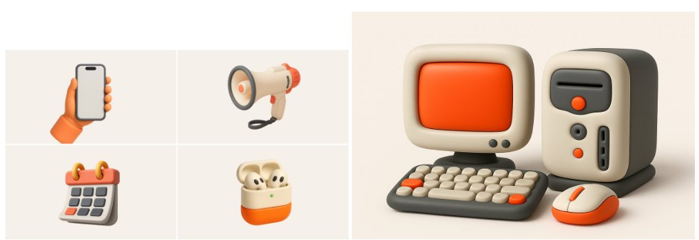


### 中文提示词

```
根据以下 JSON 对附加的图像进行重新纹理化
{
"style_name": "Playful Chunky 3D Aesthetic",
"retexture_mode": "stylized_3d_overlay",
"对象分析": {
"保留轮廓": true,
"几何敏感映射": true,
"细节保留": "中等 — 侧重于关键形态和比例"
},
"材料属性": {
"基础材料": ["柔软磨砂塑料", "弹性聚合物"],
"表面细节": [
"圆润的边缘和膨胀的体积",
"光滑、玩具般的表面",
"极少的接缝线"
]
},
"lighting": {
"type": "工作室漫射光",
"intensity": "中等",
"阴影": "柔和的基础阴影",
"高光行为": "曲线和凸起表面的柔和光泽"
},
"配色方案": {
"主色调": [" #f6f6f6 ", " #3a3a3a ", " #f05423 "],
"强调色": [" #ff875d ", " #b0b0b0 ", " #f3f3f3 "]
},
"背景": {
"color": " #f9f9f9 ",
"type": "solid",
"texture": "none"
},
"风格标签": []
"3D 卡通写实风格"
"UI 图标包美学"
"膨胀极简主义"
"柔和科技感",
"俏皮体积建模"
]
}
```

### 英文提示词

```
Retexture the image attached based on the JSON below
{
  "style_name": "Playful Chunky 3D Aesthetic",
  "retexture_mode": "stylized_3d_overlay",
  "object_analysis": {
    "preserve_silhouette": true,
    "geometry_sensitive_mapping": true,
    "detail_retention": "moderate — focus on key forms and proportions"
  },
  "material_properties": {
    "base_material": ["soft matte plastic", "rubbery polymer"],
    "surface_details": [
      "rounded edges and inflated volumes",
      "smooth, toy-like finish",
      "minimal seam lines"
    ]
  },
  "lighting": {
    "type": "studio diffused light",
    "intensity": "medium",
    "shadows": "soft base shadows",
    "highlight_behavior": "gentle gloss on curves and raised surfaces"
  },
  "color_palette": {
    "dominant_colors": ["#f6f6f6", "#3a3a3a", "#f05423"],
    "accent_colors": ["#ff875d", "#b0b0b0", "#f3f3f3"]
  },
  "background": {
    "color": "#f9f9f9",
    "type": "solid",
    "texture": "none"
  },
  "style_tags": [
    "3D cartoon realism",
    "UI icon pack aesthetic",
    "inflated minimalism",
    "soft tech look",
    "playful volume modeling"
  ]
}
```
## 案例 47: 9格Q版风格贴纸 (来源 @松果先森)​

### 中文提示词

```
创建一幅尺寸为 10-16 的 3D 可爱风格画布，其中包含 9 个 Q 版风格贴纸。这些贴纸要采用不同
的服装、姿势和表情，使用已经上传的附件图片。每个贴纸都要有白色边框，且包含一个带有日常用语
的 speech 气泡。背景设置为柔和的白到淡蓝色渐变，营造出有趣、积极的氛围，非常适合在
WhatsApp 应用中使用。
```

### 英文提示词

```
Create a 3D kawaii 10-16 canvas featuring nine chibi-style stickers in various 
outfits, poses, and expressions. Use the uploaded attachment image. Each 
sticker has a white border and includes a speech bubble with regular use 
phrases. Set on a soft white-to-pastel blue gradient background for a fun, 
positive vibe, perfect for WhatsApp app use.
```
## 案例 48: 定制的枕头 (来源 @TechieBySA)​

### 效果展示


  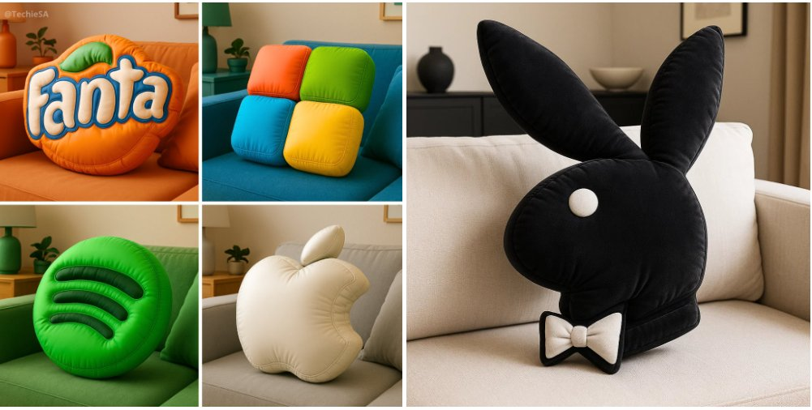


### 中文提示词

```
创建一个高分辨率的 3D 渲染图，将[BRAND]标志设计成一个充气、蓬松的物体。标志应看起来柔软、
圆润、充气——像一个毛绒气球或充气玩具。使用光滑的哑光纹理，带有细微的布料褶皱和缝线，以强调
充气效果。将标志以 45 度角摆放，以突出深度和真实感。将最终结果放置在风格时尚的客厅沙发上，
家具和装饰与[BRAND]标志的标志性颜色相匹配。输出尺寸：1080x1080。
```

### 英文提示词

```
Create a high-resolution 3D render of the [BRAND] logo designed as an 
inflatable, puffy object. The logo should appear soft, rounded, and air-filled 
– like a plush balloon or blow-up toy. Use a smooth, matte texture with subtle 
fabric creases and stitching to emphasize the inflatable look. Position the 
logo at a 45-degree angle to highlight depth and realism. Place the final 
result on a couch in a stylish living room with furniture and decor that 
matches the iconic colors of the [BRAND] logo. Output dimension: 1080x1080.
```
## 案例 49: 沙滩胶囊城市 (来源 @TechieBySA)​

### 效果展示


  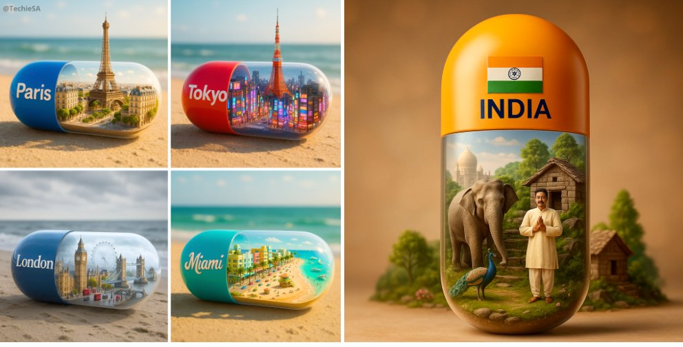


### 中文提示词

```
一个充满活力的、超写实的[CITY]微缩模型，放置在一个透明胶囊内，躺在沙滩上。胶囊一半是
[COLOR]色（与[COUNTRY]的国旗相匹配），彩色部分上用白色文字写着[CITY]。胶囊内部：[CITY]
的标志性地标、美丽的运河或街道、小巧精致的船只或汽车、阳光明媚的光线、电影般的景深、梦幻般
的氛围、背景中的海浪。
```

### 英文提示词

```
A vibrant, hyper-realistic miniature of [CITY] inside a transparent capsule 
lying on a sandy beach. The capsule is half [COLOR] (matching [COUNTRY]’s 
flag) with [CITY] written in white text on the colored section. Inside the 
capsule: iconic landmarks of [CITY], beautiful water canals or streets, small 
detailed boats or cars, sunny bright lighting, cinematic depth of field, 
dreamy atmosphere, ocean waves in the background.
```
## 案例 50: 用花朵美化你的产品 (来源 @Kerroudjm)​
### 效果展示


  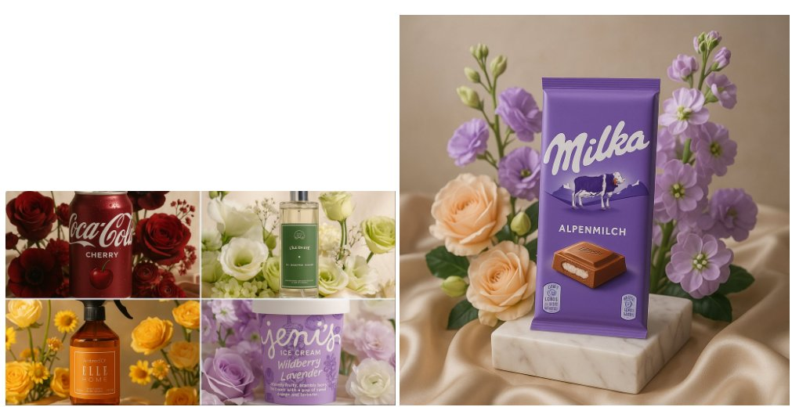

### 中文提示词

```
(产品名称或图片)放置在白色大理石底座上，休息在香槟色丝绸上，的高端编辑照片。它被淡色花朵环
绕，其类型和颜色自然与产品的主要颜色（调色板）协调——补充并增强其色调。来自左上方的柔和自然
光。3D 现实主义，奢华产品摄影，浅景深，1:1 格式。
```

### 英文提示词

```
A high-end editorial photo of (PRODUCT NAME OR IMAGE) placed on a white marble 
pedestal, resting on champagne-colored silk. It is surrounded by pastel 
flowers whose type and color naturally harmonize with the product’s primary 
colors (COLOR PALETTE) — complementing and enhancing its tones. Soft natural 
light from the upper left. 3D realism, luxury product photography, shallow 
depth of field, 1:1 format.
```
## 案例 51: 电影镜头拍摄 (来源 @CharaspowerAI)​

### 效果展示


  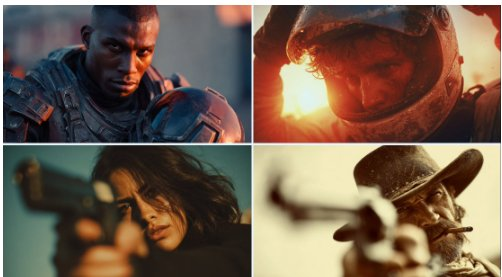

### 中文提示词

```
电影镜头拍摄[详细角色描述]，从[相机角度]拍摄，[灯光类型]，[色彩搭配]，近距离拍摄，35mm 胶
片颗粒，广角镜头，f2.0 浅景深，浅景深。
```

### 英文提示词

```
Cinematic shot of [detailed character description], shot from [camera angle], 
[lighting type], [color palette], shot at close range, 35mm film grain, wide 
angle lens, f2.0 bokeh, shallow depth of field.
```
## 案例 52: 直升机品牌广告 (来源 @TechieBySA)​

### 效果展示


  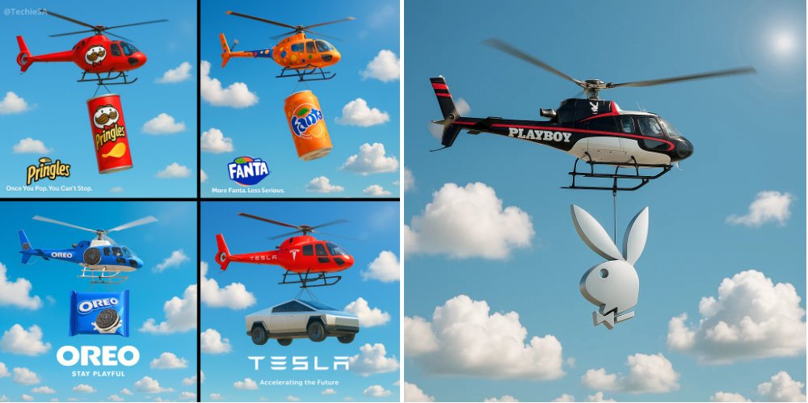

### 中文提示词

```
创作一张超写实的 1:1 方形图像，展现一架小型直升机在明亮的蓝天中飞行，周围有蓬松的白云和微
妙的镜头眩光。直升机涂装着[BRAND]的标志性颜色和图案。它下方悬挂着一个来自[BRAND]的巨大产
品。整个构图具有干净、俏皮（或高端、未来感）的广告风格。在底部，包含[BRAND]的标志和一句简
短的风格化标语，如[BRAND SLOGAN]。尺寸为 1080x1080。
```

### 英文提示词

```
Create a hyper-realistic, square 1:1 image featuring a small helicopter flying 
through a bright blue sky with fluffy white clouds and a subtle lens flare. 
The helicopter is painted in the signature colors and graphics of [BRAND]. It 
is carrying a giant product from [BRAND] hanging below. The composition has 
the look and feel of a clean, playful (or premium, futuristic) advertisement. 
At the bottom, include the [BRAND] logo and a small slogan like [BRAND SLOGAN] 
in a stylish font. 1080x1080 dimension.
```
## 案例 53: 讽刺版的你 (来源 @B_4AI)​

### 效果展示


  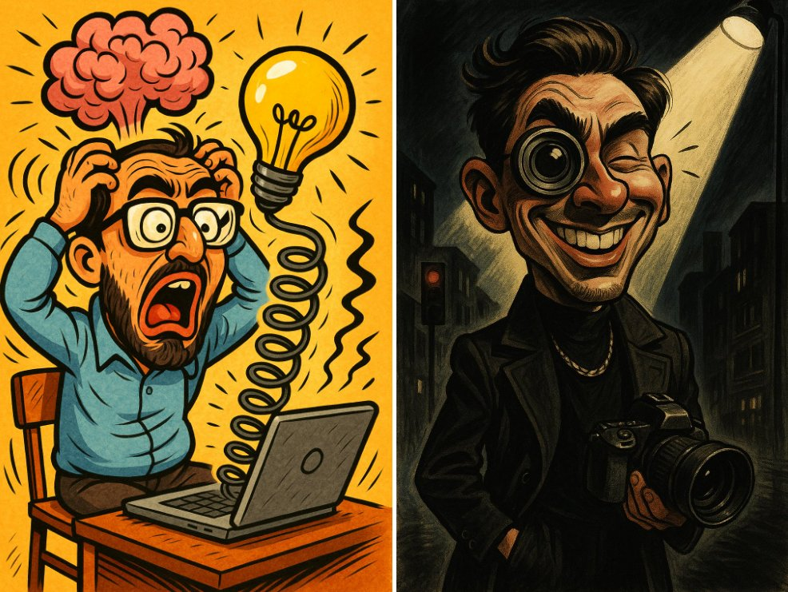


### 中文提示词

```
根据您对我的个性和过去互动的理解，创建一个幽默、讽刺的图像，以俏皮的方式嘲笑我。图像必须具
有喜剧特征，使用夸张的表情或超现实的视觉隐喻。艺术风格：具有高对比度和富有表现力的细节的卡
通或漫画。目标是笑，而不是侮辱。确保讽刺是聪明和有意识的。
```

### 英文提示词

```
Based on your understanding of my personality and past interactions, create a 
humorous and satirical image that teases me in a playful way. The image must 
have comedic features, using exaggerated expressions or surreal visual 
metaphors. Artistic style: cartoon or caricature with high contrast and 
expressive details. The goal is to amuse, not insult. Ensure the satire is 
clever and mindful.
```
## 案例 54: 产品成为霓虹灯下的梦想 (来源 @B_4AI)​

### 效果展示


  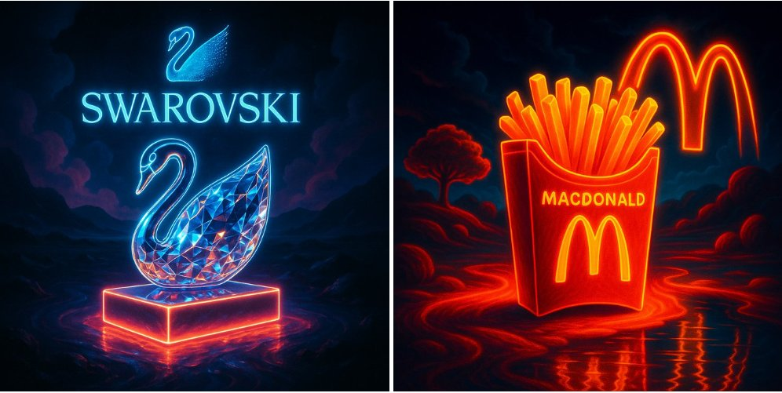

### 中文提示词

```
[Brand name] 品牌商品的超现实主义写实数字艺术作品。产品应该闪耀着霓虹灯轮廓，像高对比度的
3D渲染一样风格化。将其放置在受品牌身份、配色方案和文化启发的梦幻般的环境中。使用柔和的阴
影、深黑色和强烈的光照来获得戏剧性的效果。
```

### 英文提示词

```
a surreal-realistic digital artwork of a product from the brand [Brand name]. 
The product should be glowing with neon outlines, stylized like a high-
contrast 3D render. Place it in a dreamlike environment inspired by the 
brand’s identity, color scheme, and culture. Use soft shadows, deep blacks, 
and intense lighting for dramatic effect.
```
## 案例 55: 超现实鸟类幻想 (来源 @B_4AI)​

### 效果展示


  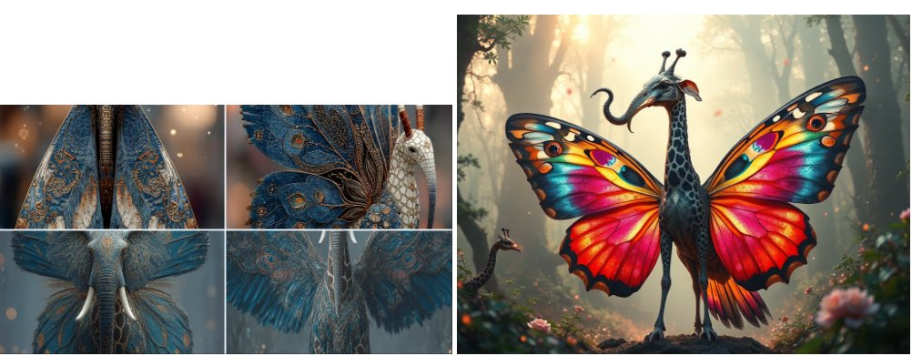


### 中文提示词

```
对神话鸟类生物的高度详细和超现实的描绘。它拥有优雅、多彩的蝴蝶身体，带有充满活力、对称的翅
膀图案。它的头是一头雄伟的大象，长着大耳朵、长长的卷曲的鼻子和象牙，赋予它强大而古老的光
环。长长的斑点长颈鹿脖子连接身体和头部，优雅地高高耸立。翅膀是巨大的鹰翅膀，完全伸展，羽毛
在运动中戏剧性。它的尾巴是一条彩虹色的孔雀尾巴，像皇家羽毛一样呈扇形展开。这个生物站在一片
迷人的迷雾森林中，沐浴在空灵的光芒中，周围环绕着发光的粒子。超逼真的电影般的照明、奇幻的氛
围、超详细的概念艺术
```

### 英文提示词

```
A highly detailed and surreal depiction of a mythical bird creature. It has 
the elegant, colorful body of a butterfly, with vibrant symmetrical wing 
patterns. Its head is that of a majestic elephant, complete with large ears, a 
long curling trunk, and ivory tusks, giving it a powerful and ancient aura. A 
long, spotted giraffe neck connects the body and the head, rising high with 
grace. The wings are enormous eagle wings, fully extended with dramatic 
feathers in motion. Its tail is an iridescent peacock tail, fanned out in full 
display like royal plumage. The creature stands in an enchanted misty forest, 
bathed in ethereal light and surrounded by glowing particles. Ultra-realistic, 
cinematic lighting, fantasy atmosphere, hyper-detailed concept art
```
## 案例 56: 胶囊从透明的药瓶中倾倒 (来源 @fy360593)​

### 效果展示


  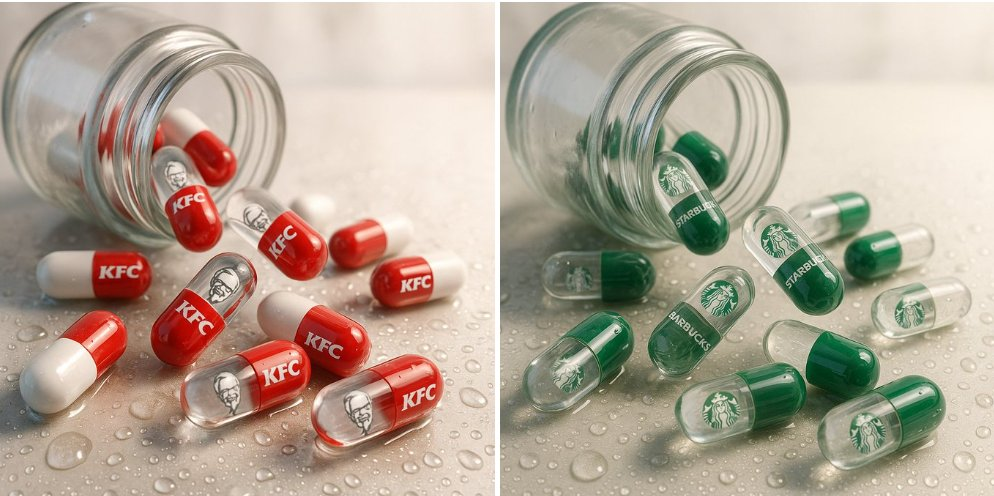


### 中文提示词

```
超写实的海报，1080x1080。小型的光亮/玻璃胶囊从透明的药瓶中倾倒在湿润的表面上。每个胶囊都
带有[白色]/[红色]塑料和透明玻璃，内有[KFC]标志和一个悬浮的 3D 图标。强烈的反光，工作室灯
光，水滴，柔和优雅的背景，DSLR 照片真实性。
```

### 英文提示词

```
Hyper-realistic poster, 1080x1080. Small glossy/glass capsules spilling from a 
transparent medicine bottle onto a wet surface. Each capsule features 
[white]/[red] plastic and transparent glass, with [KFC] logo and a floating 3D 
icon inside. Strong reflections, studio lighting, water droplets, soft elegant 
background, DSLR photo realism.
```
## 案例 57: 形状为生日气球文字 (来源 @Anima_Labs)​

### 效果展示


  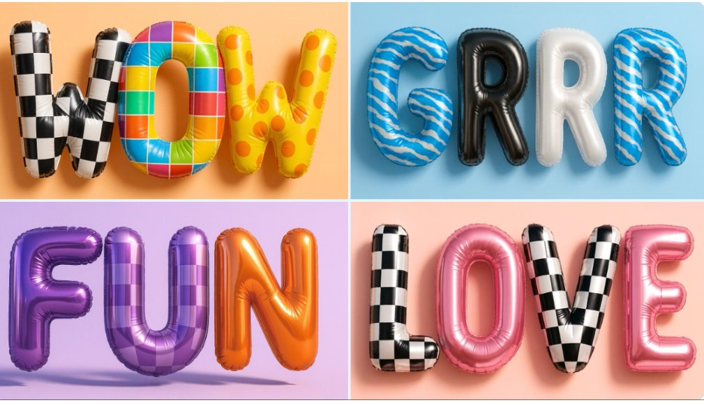


### 中文提示词

```
创建一个超逼真的 3D 渲染效果，将气球字母组成单词 [WOW]。每个字母看起来都像是一个闪亮的充
气镀铝气球，带有大胆印刷的图案。使用多种纹理，例如 [格子印刷、彩色网格、波点或光泽金属
黑]。气球应该是半反射的，具有真实的空气体积、接缝、皱纹和压力点。给每个字母一个独特、有趣
的表面设计，但保持整体外观协调一致。使用柔和的粉彩色背景，例如 [橙色]，以对比气球的纹理。
光线应产生清晰的反射和柔和的阴影。渲染效果必须是照片级的逼真、有趣且充满活力——就像创意波普
艺术生日装置或时尚活动的高端视觉效果。
```

### 英文提示词

```
Create a hyper-realistic 3D rendering of balloon letters forming the word 
[WOW]. Each letter should look like a shiny, inflatable mylar balloon with a 
bold printed pattern. Use a mix of textures such as [checkered print, color 
grids, polka dots, or glossy metallic black]. The balloons should be semi-
reflective with realistic air volume, seams, wrinkles, and pressure points. 
Give each letter a distinct, playful surface design but keep the overall look 
cohesive. Use a soft pastel background, like [Orange color], to contrast the 
balloon textures. Lighting should create crisp reflections and soft shadows. 
The rendering must be photorealistic, fun, and vibrant — like a high-end 
visual for a creative pop-art birthday installation or fashion campaign.
```
## 案例 58: 可爱的卡通灵魂 (来源 @松果先森)​

### 中文提示词

```
一个可爱的卡通幽灵是画面的绝对主体，它拥有纯白色的、轮廓圆润流畅的身体，以及两只简单的黑色
椭圆形眼睛，没有任何多余的特征。这个幽灵安静地漂浮着，位于整个画面的正中央。画面背景是纯粹
的亮紫色，营造出一种简洁、现代且友好的氛围。构图方式为居中特写，图片比例为1:1的正方形。整
个画面没有任何文字。这幅图像是典型的扁平化设计（Flat design）和矢量艺术风格，极简主义，非
常像一个App图标或logo，特点是线条干净利落，颜色是纯色块填充，无任何渐变或纹理细节。图像质
量要求高分辨率，边缘清晰锐利，整体给人一种可爱、简洁、现代化的数字艺术感受。
```

### 英文提示词

```
A cute cartoon ghost is the absolute main subject of the picture. It has a 
pure white body with a smooth and rounded contour, and two simple black oval 
eyes, with no extra features. This ghost is floating quietly in the very 
center of the picture. The background is a pure, bright purple, creating a 
simple, modern, and friendly atmosphere. The composition is a centered close-
up, and the aspect ratio is 1:1 square. There is no text in the entire image. 
The image style is typical flat design and vector art, minimalist, much like 
an app icon or a logo, characterized by clean lines and solid color blocks, 
without any gradients or textural details. The image quality required is high-
resolution with clean, sharp edges. The overall feeling it gives is one of a 
cute, simple, and modern piece of digital art.
```
## 案例 59: 品牌快餐胶囊 (来源 @TechieBySA)​

### 中文提示词

```
创建一个超逼真、时尚的海报[1080x1080]宽高比，展示一个水平平板胶囊悬浮在布满水汽和液滴的表
面上，其影子投射在湿润的地面上。胶囊一侧是透明玻璃，另一侧是光泽[品牌颜色]塑料，显示[品牌]
标志和名称。玻璃部分无缝漂浮着一张逼真的 3D 模型[品牌标志或图标]，完美居中并悬浮在零重力
中。玻璃和塑料表面展现出强烈的反射、折射和环境扭曲。背景是柔和模糊、优雅浅色调的设置。使用
动态视角和时尚的相机角度，结合专业工作室灯光和超高清细节，使图像看起来像是一张由单反相机拍
摄的真实照片，具有无懈可击的真实感。
```

### 英文提示词

```
Create a hyper-realistic, stylish poster [1080x1080] aspect ratio featuring a 
horizontal tablet-capsule hovering above a surface covered in condensation and 
water droplets, with its shadow cast on the wet ground. One side of the 
capsule is transparent glass, while the other is glossy [BRAND COLORS] 
plastic, displaying the [BRAND] logo and name. Seamlessly floating inside the 
glass portion of the capsule is a photorealistic 3D model of the [BRAND LOGO  1 
OR ICON], perfectly centered and suspended in zero gravity. The glass and 
plastic surfaces showcase strong reflections, refractions, and environmental 
distortions. The background is a softly blurred, elegant light-toned setting. 
Use a dynamic perspective with a stylish camera angle, professional studio 
lighting, and ultra-high detail to make the image look like a DSLR-captured 
photograph with impeccable realism.
```
## 案例 60: 日本搞笑漫画风格插画 (来源 @fy360593)​

### 效果展示


  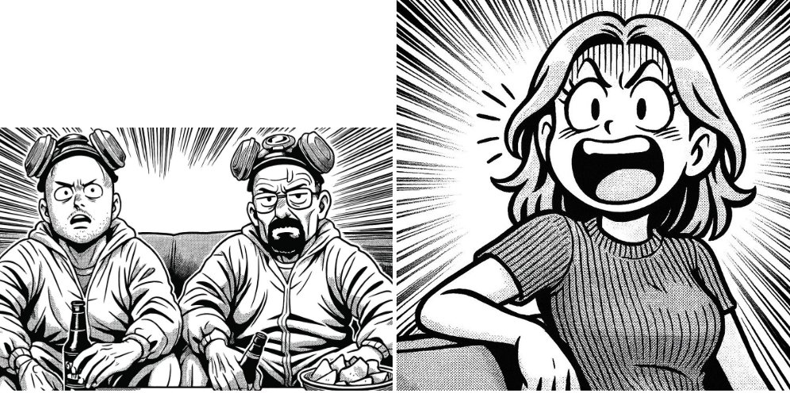


### 中文提示词

```
将这张图片转化为日本搞笑漫画风格插画。使用高对比度的黑白色彩搭配，粗犷的线条和网点（半色
调）阴影。角色应有夸张的面部表情，卡通化的比例（大头小身），以及喜剧张力。包含动态动作线条
或放射状背景效果。整体美学应模仿 80 年代和 90 年代的复古漫画，充满幽默和强烈的情感。
```

### 英文提示词

```
Transform this image into a Japanese gag manga style illustration. Use a high- 1

contrast black-and-white color palette with bold linework and screentone 
(halftone) shading. Characters should have exaggerated facial expressions, 
cartoonish proportions (big head, small body), and comedic intensity. Include 
dynamic action lines or radiating background effects. The overall aesthetic 
should mimic retro manga from the 80s and 90s with humorous and intense 
emotion.
```
## 案例 61: 糖果形状物品 (来源 @TheRelianceAI)​

### 效果展示


  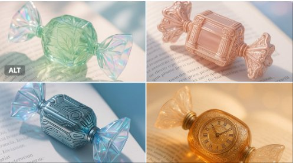


### 中文提示词

```
代
块一个闪亮的糖果形状的香水瓶静置在一本打开的书上，柔和的晨光，细腻的阴影，梦幻的背景虚化效
果，带有彩虹色透明膜包装。糖果设计灵感来源于[你的风格]
```

### 英文提示词

```
A glossy candy-shaped perfume bottle resting on an open book, soft morning 
light, delicate shadows, dreamy bokeh background with iridescent cellophane 
wrapping. The candy design is inspired by [YOUR STYLE]
```
## 案例 62: 电影场景 (来源 @Dd41Giant)​

### 中文提示词

```
特写。从极高视角拍摄的上视图，使用 Lomo LC-A 相机拍摄，ISO100 胶片，颗粒感极低，阴影真
实。艺术构图。整体偏蓝色调。光影美丽。黑色地板上投射着充满屏幕的蓝色天空图像。一位非常美丽
的日本小脸女演员，穿着黑色衬衫，盘腿坐在地板上，头发湿漉漉地显眼，穿着长红色裙子。闪亮的黑
发。长长的睫毛。明亮肌肤。美丽的闪亮眼睛。微笑的面容。女演员旁边的地板上有一个白色的土星模
型。这张照片看起来像电影中的一个场景。
```

### 英文提示词

```
Close-up. Overhead shot from an extremely high vantage point, extremely low 
grain with iso100 film shadows on a Lomo LC-A. Realistic depth of field. 
Artistic composition. Overall bluish tones. Beautiful light and shadows. The 
black floor with the projected image of the blue sky that fills the screen. A 
very beautiful small-faced Japanese film actress with wet showy hair in a 
black dress shirt sitting cross-legged on the floor. She is wearing a long red 
skirt. Shiny black hair. Long eyelashes. Bright skin. Beautiful shining eyes. 
A smiling face. On the floor next to the actress is a white model of Saturn. 
The picture looks like a scene from a movie.
```
## 案例 63: 时尚的胶囊海报 (来源 @TechieBySA)​

### 中文提示词

```
创作一张超逼真、时尚的海报[1080x1080]宽高比，展示一个水平放置的平板胶囊悬浮在布满水汽和水
滴的表面上，其影子投射在湿润的地面上。胶囊的一面是透明玻璃，另一面是光泽塑料[颜色/设计]，
显示[品牌]标志和名称。在胶囊的玻璃部分中，一个逼真的 3D 模型[标志]无缝漂浮，完美居中并悬
浮在零重力中。玻璃和塑料表面展现出强烈的反射、折射和环境扭曲。背景是一个柔和模糊、优雅浅色
调的设置。使用动态视角和时尚的相机角度，结合专业工作室灯光和超高清细节，使图像看起来像是一
张由单反相机拍摄的真实照片，具有无懈可击的真实感。
```

### 英文提示词

```
Create a hyper-realistic, stylish poster [1080x1080] aspect ratio featuring a 
horizontal tablet-capsule hovering above a surface covered in condensation and 
water droplets, with its shadow cast on the wet ground. One side of the 
capsule is transparent glass, while the other is glossy [COLOR/DESIGN] 
plastic, displaying the [BRAND] logo and name. Seamlessly floating inside the  1 1

glass portion of the capsule is a photorealistic 3D model of the [LOGO], 
perfectly centered and suspended in zero gravity. The glass and plastic 
surfaces showcase strong reflections, refractions, and environmental 
distortions. The background is a softly blurred, elegant light-toned setting. 
Use a dynamic perspective with a stylish camera angle, professional studio 
lighting, and ultra-high detail to make the image look like a DSLR-captured 
photograph with impeccable realism.
```
## 案例 64: 舒适的周末从这里开始 (来源 @egeberkina)​

### 效果展示


  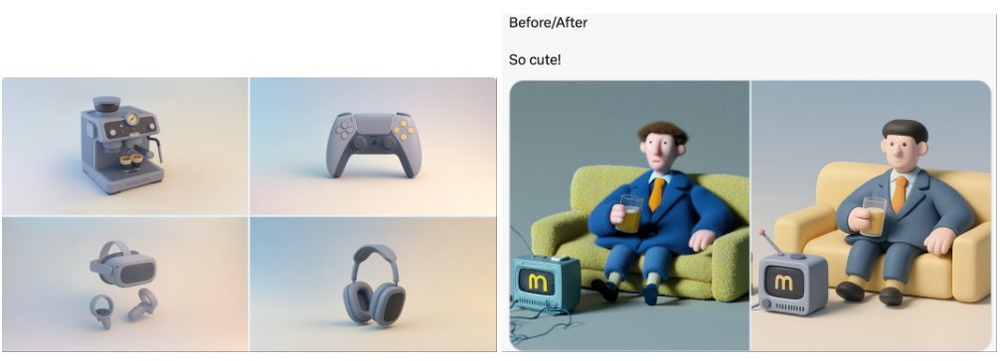


### 中文提示词

```
根据以下 JSON 重新纹理附加的图像：
{
"style_name": "柔和极简 3D 塑料风格",
"retexture_mode": "形状锁定",
"object_analysis": {
"preserve_silhouette": true,
"geometry_sensitive_mapping": true,
"detail_retention": "将复杂的细节简化为简化的几何块"
},
"material_properties": {
"base_material": [
"光滑磨砂塑料"，
"金属边缘饰条，缎面处理"，
"半反射黑色屏幕表面"
],
"表面细节": [
"微妙的颜色渐变"，
"圆润的斜角和边角"，
"表面之间的柔和过渡"
]
},
"lighting": {
"类型": "柔和渐变环境光",
"阴影": "极少，边缘柔和的阴影",
"高光": "弥散，低强度的反射"
},
"背景": {
"颜色": "柔和渐变（蓝色到奶油色）",
"纹理": "光滑无纹理",
"元素": "干净背景，无添加几何图形"
},
"渲染": {
"风格": "等距 3D 渲染",
"分辨率": "高，略带轻微泛光"
"focus": "中心对象，无深度模糊"
},
"color_palette": {
"primary": ["冷灰色", "钢蓝色", "柔和的炭黑色"],
"accents": ["浅薰衣草色", "淡黄色"]
}
}
```

### 英文提示词

```
retexture the image attached based on the json below:
{
  "style_name": "Soft Minimal 3D Plastic",
  "retexture_mode": "shape_lock", 1 3 
  "object_analysis": {
    "preserve_silhouette": true,
    "geometry_sensitive_mapping": true,
    "detail_retention": "flatten complex details into simplified geometry 
blocks"
  },
  "material_properties": {
    "base_material": [
      "smooth matte plastic",
      "metallic edge trim with satin finish",
      "semi-reflective black screen surface"
    ],
    "surface_details": [
      "subtle color gradient",
      "rounded bevels and corners",
      "soft transition between surfaces"
    ]
  },
  "lighting": {
    "type": "soft gradient ambient light",
    "shadows": "minimal, soft-edged shadows",
    "highlights": "diffused, low-intensity reflections"
  },
  "background": {
    "color": "pastel gradient (blue to cream)",
    "texture": "smooth and untextured",
    "elements": "clean background with no added geometry"
  },
  "rendering": {
    "style": "isometric 3D render",
    "resolution": "high, with slight bloom",
    "focus": "central object, no depth blur"
  },
  "color_palette": {
    "primary": ["cool grey", "steel blue", "soft charcoal"],
    "accents": ["light lavender", "pastel yellow"]
  }
}
```
## 案例 65: 惊人的外骨骼图像 (来源 @azed_ai)​

### 效果展示


  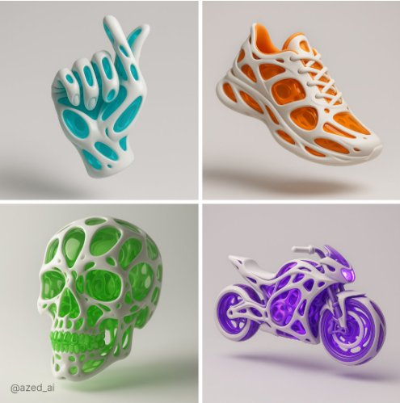

### 中文提示词

```
一个未来派的 3D 渲染[物体]，具有半透明的内部结构，被光滑的白色外骨骼包裹，外骨骼上有有机的
孔洞和流动的仿生图案，悬浮在极简的浅灰色背景中，高对比度光照，超写实材质，Octane 渲染，现
代数字雕塑
```

### 英文提示词

```
a futuristic 3D-rendered [object] made of translucent [color] inner structure 
encased in a smooth white exoskeleton with organic holes and flowing 
biomorphic patterns, floating in a minimal soft gray background, high contrast 
lighting, hyperrealistic materials, octane render, modern digital sculpture
```
## 案例 66: 宝石渲染风格 (来源 @alban_gz)​

### 效果展示


  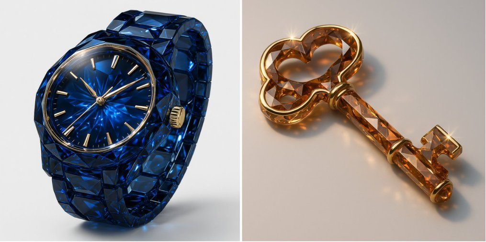


### 中文提示词

```
将提供的 JSON 参数应用于[插入图片]
{
"名称": "宝石渲染",
"物体": {
"类型": "自动",
"检测到的颜色": "自动",
"形态": "逼真、自然形态得以保留",
"材质": "水晶或多面宝石玻璃",
"表面": "精密切割的刻面、清晰的反光",
"透明度": "高清晰度，带有光线折射",
"内部特征": "色彩深度、内部光泽和光线色散"
},
"颜色与光线": {
"主色调": "{detected_color}",
"高光效果": "镜面高光、宝石光泽、焦散效果",
"照明设置": "工作室照明，搭配白色或柔和背景",
"金属装饰": {
"启用": true,
"材质": "黄金或铬合金",
"应用位置": "边缘、柄部或侧边细节"
}
},
"风格": {
"艺术风格": [
"照片级写实3D渲染",
"宝石渲染风格",
"奢华物体可视化"
],
"设计语言": [
"多面精密建模",
"珠宝式渲染",
"光学深度与光泽"
]
},
"技术细节": {
"渲染引擎": [
"Blender搭配Cycles",
"Cinema 4D + Redshift/Octane"
],
"渲染技术": [
"基于物理的渲染（PBR）",
"光线追踪",
"全局光照"
],
"分辨率": "超高分辨率（4K–8K）",
"后期处理": [
"柔和光晕",
"增强的反光",
"保持色彩的对比度提升"
]
},
"提示模板": "一张{物体}的3D渲染图像，由{detected_color}水晶制成，带有复杂的宝石般刻
面。它内部反光闪耀，置于干净的工作室背景上，融合了写实感与奢华设计。"
}
```

### 英文提示词

```
Apply the parameters of the JSON provided to [insert image]
{
  "name": "Gemstone Render",
  "object": {
    "type": "auto",
    "detected_color": "auto",
    "form": "realistic, natural form preserved",
    "material": "crystal or faceted gemstone glass",
    "surface": "precision-cut facets, sharp reflections",
    "transparency": "high clarity with light refraction",
    "internal_features": "color depth, internal shimmer, and light dispersion"
  },
  "color_and_light": {
    "primary_color": "{detected_color}",
    "highlight_effects": "specular highlights, gemstone brilliance, caustics",
    "lighting_setup": "studio lighting with white or soft background",
    "metallic_accents": {
      "enabled": true,
      "material": "gold or chrome",
      "application": "rim, stem, or edge detailing"
    }
  },
  "style": {
    "artistic_style": [
      "photorealistic 3D render",

      "Gemstone Render Style",
      "luxury object visualization"
    ],
    "design_language": [
      "faceted precision modeling",
      "jewelry-like rendering",
      "optical depth and brilliance"
    ]
  },
  "technical_details": {
    "render_engine": [
      "Blender with Cycles",
      "Cinema 4D + Redshift/Octane"
    ],
    "rendering_techniques": [
      "physically-based rendering (PBR)",
      "ray tracing",
      "global illumination"
    ],
    "resolution": "ultra high-res (4K–8K)",
    "post_processing": [
      "subtle glow",
      "enhanced reflections",
    "color-preserving contrast boost"
    ]
  },
  "prompt_template": "A 3D-rendered image of a {object} made of 
{detected_color} crystal, with intricate gemstone-like facets. It sparkles 
with internal reflections and sits on a clean studio background, blending 
realism with luxury design."
}
```
## 案例 67: 钻石镶嵌风格 (来源 @alban_gz)​

### 效果展示


  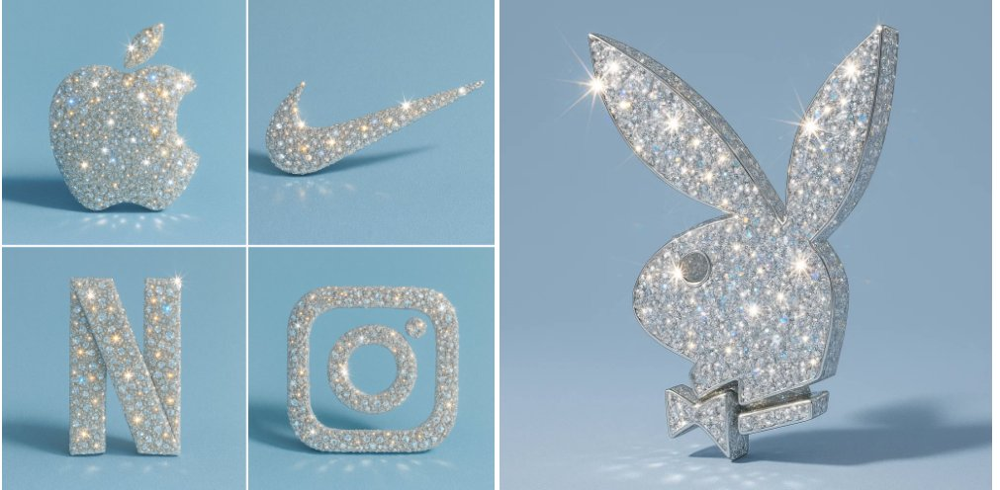


### 中文提示词

```
使用提供的 JSON 参数重新创建此图像。
{
"style_name": "钻石镶嵌奢华风格",
"description": "将超逼真的钻石镶嵌风格应用于任何物体、标志或形状。主体的表面完全覆盖着
闪闪发光的宝石，这些宝石以强烈的亮度反射光线，营造出奢华、引人注目和超现实的效果。",
"surface_texture": {
"material": "钻石水晶",
"涂层": "完全镶嵌有多面钻石",
"闪耀强度": "最大",
"反射类型": "镜面和高折射率",
"细节密度": "超精细，微宝石覆盖，无间隙"
"light_refraction": "通过切面产生强烈的彩虹色散"
},
"lighting": {
"light_source": "硬直射光源",
"高光效果": "镜头眩光，宝石边缘的闪光眩光",
"阴影类型": "柔和边缘，低不透明度的阴影以形成对比",
"光泽度": "非常高",
"反射源": "宝石切面的环境光和直接高光"
},
"background": {
"type": "极简纯色",
"color": " #B0C4DE ",
"纹理": "光滑磨砂质感",
"与主体对比度": "高对比度以增强闪耀效果",
"深度": "物体下方微妙阴影以产生悬浮效果"
},
"color_palette": {
"primary": "透明白色（钻石基底）",
"secondary": "棱镜反射（彩虹光散）",
"accent": "边缘金属光泽（可选：金色或银色底色）"
},
"camera": {
"angle": "略微俯视角度",
"depth_of_field": "浅景深（物体清晰，背景模糊）",
"镜头效果": ["微距对焦", "闪烁高光", "光晕"]
},
"风格关键词": [
"迷人",
"奢侈",
"水晶覆盖的",
"闪亮",
"超精细的",
"闪闪发光的",
"未来感的",
"引人注目的",
"超现实现实主义",
"受时尚启发的"
],
"适用性": {
"可用于": ["标志", "图标", "食品项目", "日常用品", "时尚配饰", "字体"],
"视觉要求": ["轮廓清晰", "宝石放置的形状干净"],
"可扩展性": "在中等至大型对象上获得最佳效果，以展现细节闪烁"
}
}
```

### 英文提示词

```
Recreate this image using the parameters of the JSON provided.
{
  "style_name": "Diamond-Encrusted Glamour",
  "description": "Applies a hyper-realistic diamond-encrusted style to any 
object, logo, or shape. The surface of the subject is entirely covered with 
sparkling gemstones that reflect light with intense brilliance, creating a 
luxurious, eye-catching, and surreal look.",
  "surface_texture": {
    "material": "diamond-crystal",
    "coating": "fully encrusted with multi-faceted diamonds",
    "sparkle_intensity": "maximum",
    "reflection_type": "specular and highly refractive",
    "detail_density": "ultra-fine, micro-gem coverage with no gaps",
    "light_refraction": "strong rainbow dispersion through facets"
  },
  "lighting": {
    "light_source": "hard directional light",
    "highlight_effects": "lens flares, sparkle flares on gem edges",
    "shadow_type": "soft-edged, low-opacity shadows for contrast",
    "specularity": "very high",
    "reflection_sources": "ambient and direct highlights across the gem facets" 2 4 6 8 10 12 14 16 18

  },
  "background": {
    "type": "minimalist solid color",
    "color": "#B0C4DE",
    "texture": "smooth matte",
    "contrast_with_subject": "high contrast to enhance sparkle",
    "depth": "subtle shadow under the object for floating effect"
  },
  "color_palette": {
    "primary": "transparent white (diamond base)",
    "secondary": "prismatic reflections (rainbow light dispersion)",
    "accent": "metallic shimmer on edges (optional: gold or silver undertones)"
  },
  "camera": {
    "angle": "slight top-down perspective",
    "depth_of_field": "shallow (sharp focus on object, blurred background)",
    "lens_effects": ["macro focus", "sparkle highlights", "light bloom"]
  },
  "style_keywords": [
    "glamorous",
    "luxury",
    "crystal-covered",
    "bling",
    "hyper-detailed",
    "sparkling",
    "futuristic",
    "eye-catching",
    "surreal realism",
    "fashion-inspired"
  ],
  "applicability": {
    "usable_on": ["logos", "icons", "food items", "everyday objects", "fashion 
accessories", "typography"],
    "visual_requirements": ["well-defined silhouette", "clean shapes for gem 
placement"],
    "scalability": "best results on medium to large subjects for detailed 
sparkle"
  }
}
```
## 案例 68: 3D店铺渲染图 (来源 @TechieBySA)​

### 效果展示


  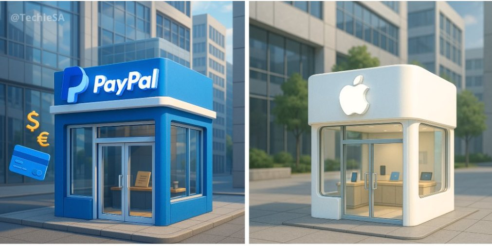


### 中文提示词

```
逼真的 3D 渲染图，展示了一个可爱、迷你版的[品牌名称]店铺建筑。采用品牌的标志性风格和色彩搭
配设计。外部设计简洁现代，配有大型玻璃窗，正面有一个发光的 3D[品牌名称]标志。店内包含细微
的品牌道具。背景与品牌身份相匹配——干净、相关且富有氛围。略微的等距角度，温暖的照明，柔和的
阴影，居中构图。
```

### 英文提示词

```
Ultra-realistic 3D render of a cute, miniature [BRAND NAME] storefront 
building. Designed using the brand’s signature style and color palette. 
Features a clean, modern exterior with large glass windows and a glowing 3D 
[BRAND NAME] logo sign on the front. Includes subtle branded props inside the 
store. Background matches the brand’s identity — clean, relevant, and 
atmospheric. Slight isometric angle, warm lighting, soft shadows, and centered 
composition.
```
## 案例 69: 冬日国家 (来源 @TheRelianceAI)​

### 效果展示


  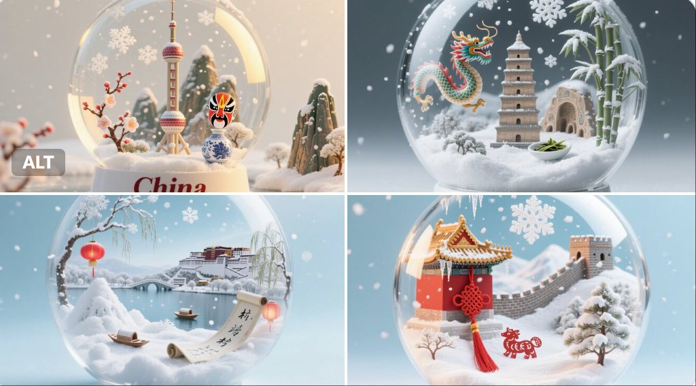


### 中文提示词

```
一个超级精细、逼真的雪球，包含着[国家名称]的精髓。球内：微型的雪景、标志性建筑、文化符号以
及代表[国家名称]的自然元素，以极致的逼真感和丰富的纹理呈现。细腻的飘落雪花在球内营造出神奇
的、充满氛围的效果。背景干净且柔和照明，完全聚焦于雪球。图像为 1:1 的宽高比。图像底部，用
优雅的衬线字体清晰地书写着“[国家名称]”
```

### 英文提示词

```
A super detailed, realistic snow globe containing the essence of [Country 
Name]. Inside the globe: miniature snowy landscapes, iconic landmarks, 
cultural symbols, and natural elements representing [Country Name], rendered 
with extreme realism and rich textures. Delicate falling snow creates a 
magical, atmospheric effect inside the globe. The background is clean and 
softly lit to focus entirely on the globe. The image is 1:1 aspect ratio. At 
the bottom of the image, the text “[Country Name]” is clearly written in an 
elegant serif font
```
## 案例 70: 超现实的黑白彩色页面 (来源 @gnrlyxyz)​

### 中文提示词

```
创建一个超现实的黑白彩色页面，中心是融化的[主题]，周围有大型、有趣的形状和流畅的图案。背景
包括诸如带眼睛的向日葵、融化的眼球、融化的心形、融化的蘑菇、云朵和星星等奇幻和超现实元素。
使用粗犷、干净的轮廓和完全封闭的形状来创建易于上色的不同区域。避免过多的精细细节或杂乱。保
持构图开放、宽敞和有趣。方形长宽比，白色背景。无文字或颜色。
```

### 英文提示词

```
Create a psychedelic black and white coloring page featuring melting [SUBJECT] 
in the center, surrounded by large, playful shapes and smooth flowing 
patterns. The background includes whimsical and surreal elements such as 
sunflowers with eyes, melting eyeballs, melting hearts, melting mushrooms, 
clouds, and stars. Use bold, clean outlines and fully enclosed shapes to 
create distinct sections for easy coloring. Avoid excessive fine detail or 
clutter. Keep the composition open, spacious, and fun. Square aspect ratio 
with a white background. No text or color.
```
## 案例 71: 卡通现代风格插画 (来源 @Artedeingenio)​

### 中文提示词

```
将这张图片转换为卡通现代风格插画，灵感来源于经典的 UPA 动画，如《摩根先生》和《太空家
庭》。
使用扁平的几何形状重新设计角色：椭圆形、矩形、简单的曲线和角度。避免真实比例——设计应该是风
格化的和抽象的。
使用有限的调色板，最好是柔和的粉彩色或鲜明的对比色（例如薄荷绿、三文鱼色、天空蓝、芥末
黄），使用扁平色调且没有渐变。
简化面部特征和身体结构，使其具有标志性且极简——大头、小四肢、富有表现力的姿势，但细节极少。
背景应极简或象征性，使用基本形状或抽象场景（漂浮的楼梯、积木家具、风格化的树木或星星）。
最终图像应像 1950 年代或 1960 年代现代主义卡通的一帧——活泼、图形化且高度风格化。
```

### 英文提示词

```
Transform this image into a Cartoon Modern Style illustration, inspired by 
classic UPA animation like Mr. Magoo and The Jetsons. 1 1

Redesign the character using flat, geometric shapes: ovals, rectangles, simple 
curves and angles. Avoid realistic proportions — the design should be stylized 
and abstract.
Use a limited color palette, preferably soft pastels or bold contrasts (e.g. 
mint green, salmon, sky blue, mustard yellow), with flat tones and no 
gradients.
Simplify facial features and body structure to be iconic and minimalist — 
large heads, small limbs, expressive poses, but with minimal detail.
The background should be minimal or symbolic, using basic shapes or abstract 
scenery (floating stairs, blocky furniture, stylized trees or stars).
The final image should look like a frame from a 1950s or 1960s modernist 
cartoon — playful, graphic, and highly stylized.
```
## 案例 72: 穿越梦境迷宫 (来源 @B_4AI)​

### 效果展示


  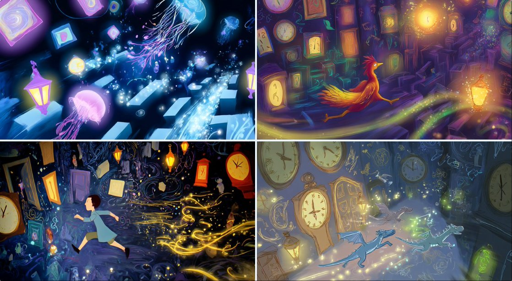


### 中文提示词

```
[角色] 冲过梦境元素，故事书插画风格，漂浮的门、时钟和低语组成的迷宫，灯笼光芒和周围闪烁的
轨迹，[颜色 1]和[颜色 2]，奇幻且节奏快速，跟随镜头风格，带有轨迹的 POV 视角
```

### 英文提示词

```
[Character] sprinting past dream elements, Storybook illustration, Maze of 
floating doors, clocks, and whispers, Lantern glow and ambient sparkle trails, 
[Color1] and [Color2], Whimsical and fast-paced, Follow-cam style with 
trailing POV
```
## 案例 73: Gorillaz风格 (来源 @azed_ai)​

### 效果展示


  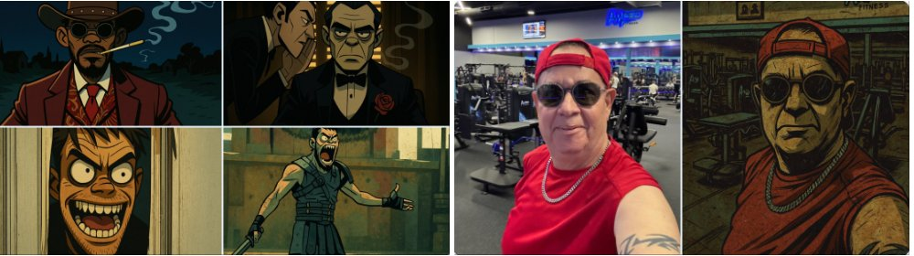


### 中文提示词

```
将这张图片改造成硬朗的 Gorillaz 风格插画，粗犷的黑色轮廓线，尖锐的角边，平面化的表现性光
照，风格化的高对比度阴影，脏污的磨损表面纹理，柔和的调色板：褪色的蓝绿色，橄榄绿，锈红色，
芥末黄，尘土棕，原始的粗糙都市氛围，漫画书平面感与绘画性粗糙的混合，手绘效果带有褪色渐变，
漫画小说美学带有叛逆、动画化的风格，暗黑时尚的调调，充满态度。
```

### 英文提示词

```
Restyle this image into a gritty Gorillaz-style illustration, bold thick black 
outlines, sharp angular edges, flat expressive lighting, stylized high-
contrast shadows, dirty distressed surface textures, muted color palette: 
washed-out teals, olive greens, rusty reds, mustard yellows, dusty browns, raw 
grungy urban atmosphere, comic book flatness mixed with painterly grit, hand-
drawn finish with faded gradients, graphic novel aesthetic
with a rebellious, animated tone, dark stylish tone, full of attitude.
```
## 案例 74: 部分咬掉的糕点 (来源 @umesh_ai)​

### 效果展示


  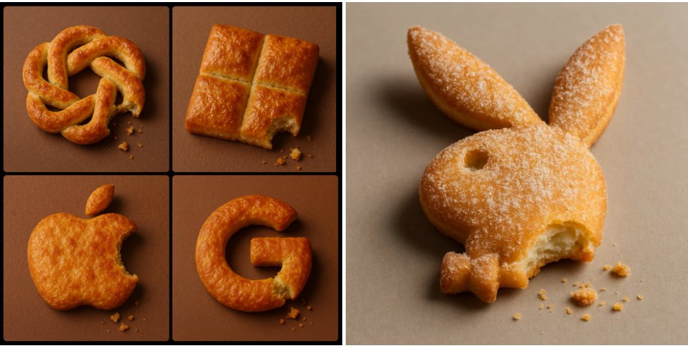

### 中文提示词

```
一张高分辨率的、影棚照明的微距照片，展示一个形状像[主题]的糕点，部分咬掉，放在一个中性哑光
表面上，有明显的面包屑和柔和的阴影，突出质感和细节
```

### 英文提示词

```
A high-resolution, studio-lit macro photograph of a pastry shaped like a 
[SUBJECT], with a partial bite taken out, placed on a neutral matte surface 
with visible crumbs and soft shadows, highlighting texture and detail
```
## 案例 75: 3D蓬松的物体 (来源 @TechieBySA)​
### 效果展示


  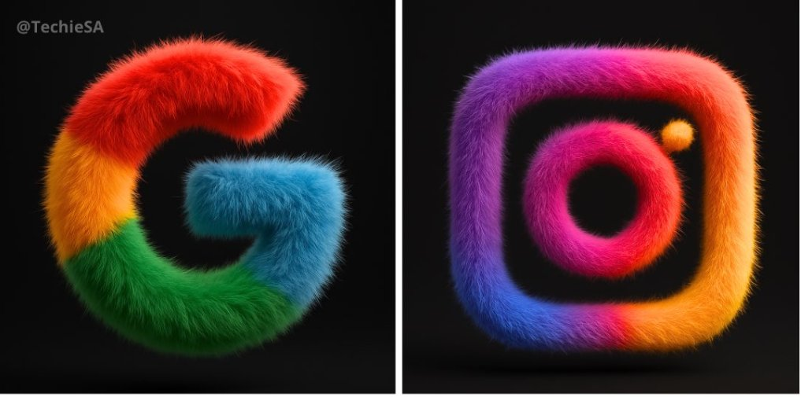

### 中文提示词

```
将[品牌名称]标志转化为超逼真、3D 蓬松的物体。保持原始形状和品牌的确切颜色。用柔软、细节丰
富的毛皮覆盖整个表面，具有逼真的毛发纹理。使用电影感光效创造微妙的后光和柔和的阴影，使标志
看起来有触感和超现实。将标志放在干净黑色背景的中心，轻轻漂浮，具有现代时尚感。风格应感觉温
馨、俏皮、视觉上引人注目。以超高清 4K 分辨率渲染，具有照片级真实质量。
```

### 英文提示词

```
Transform the [BRAND NAME] logo into a hyper-realistic, 3D fluffy object. Keep 
the original shape and exact brand colors. Cover the entire surface in soft, 
detailed fur with a realistic hair texture. Use cinematic lighting to create 
subtle backlighting and soft shadows, making the logo appear tactile and 
surreal. Place the logo in the center of a clean black background, floating 
gently with a modern, stylish look. The style should feel cozy, playful, and 
visually striking. Render in ultra-high 4K resolution with photorealistic 
quality.
```
## 案例 76: 品牌在悬浮平台上 (来源 @TheRelianceAI)​

### 效果展示


  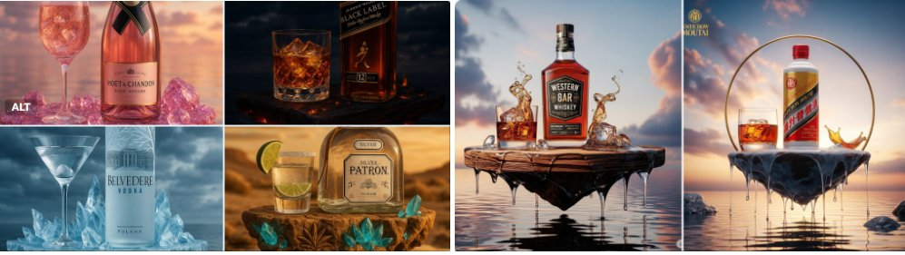

### 中文提示词

```
一个高度细致的影视广告场景，展示[酒类类型，品牌]，站在一个体现其精神的超现实悬浮平台上。平
台由代表饮品本质的材料制成（例如香槟的闪亮水晶、威士忌的浓郁深色木材、伏特加的冰霜），戏剧
性的倒影和融化的细节滴入平静的反射水面。一个匹配的玻璃杯装满了饮品，具有艺术纹理（冰块、宝
石、旋转的液体）。柔和的彩色日落天空背景中有戏剧性的云朵，高端奢华美学，照片级真实感，宏观
细节，梦幻般的光芒，高端产品摄影。
```

### 英文提示词

```
A highly detailed cinematic advertisement scene featuring [TYPE OF ALCOHOL, 
BRAND], standing on a surreal floating platform that visually embodies its 
spirit. The platform is made of materials that represent the drink’s essence 
(e.g. sparkling crystals for champagne, rich dark wood for whiskey, frosted 
ice for vodka), with dramatic reflections and melting details dripping into a 
calm reflective water surface. A matching glass is filled with the drink, 
featuring artistic textures (ice, gems, swirling liquid). Soft, colorful 
sunset sky with dramatic clouds in the background, high-end luxury aesthetic, 
photorealistic, macro details, dreamy glow, premium product photography.
```
## 案例 77: 灯泡中的城市 (来源 @TechieBySA)​

### 效果展示


  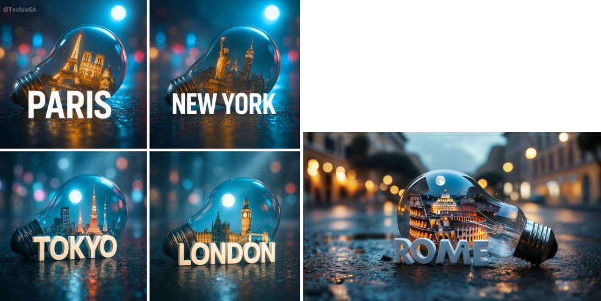

### 中文提示词

```
创作一张超逼真、时尚的海报，展示一个躺在湿漉漉的城市柏油路面上的灯泡。在灯泡内部放置一个
[CITY]的微缩版，并包含其标志性地标。在灯泡前方，应突出显示一个光滑的白色 3D 文字，写着城
市名称‘[CITY]’。背景是柔和模糊的城市景观，霓虹灯光在灯泡的玻璃和湿滑的路面上映射。添加体
积光以增强深度和氛围。图像应看起来像一张高质量的数码单反相机照片，具有清晰的细节、电影般的
灯光和忧郁的未来感。
```

### 英文提示词

```
Create a hyper-realistic, stylish poster featuring a light bulb lying on wet 
urban asphalt. Inside the bulb, place a miniature version of [CITY] with its 
iconic landmarks. A sleek white 3D text of the city name ‘[CITY]’ should stand 
prominently in front of the bulb. The background is a softly blurred cityscape 
with neon lights reflecting on the bulb’s glass and the wet pavement. Add 
volumetric moonlight for depth and atmosphere. The image should look like a 
high-quality DSLR photograph with sharp details, cinematic lighting, and a 
moody, futuristic vibe.
```
## 案例 78: 90年代风格的摔跤人物 (来源 @CharaspowerAI)​

### 效果展示


  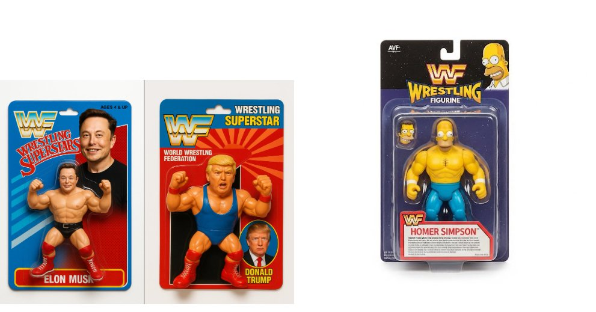

### 中文提示词

```
产品摄影，一个 90 年代风格的 WWF 摔角人偶包装，包装中的人偶是[你的角色]。人偶色彩鲜艳，角
色设计精细，背景为白色，配有专业工作室灯光。
```

### 英文提示词

```
Product photography, a 1990's style WWF Wrestling Figurine package with the 
figurine wrestler in the package being [your character]. The figure features 
bright colors, a detailed character design,  white background with 
professional studio lighting.
```
## 案例 79: 吃掉你的文字 (来源 @aziz4ai)​

### 效果展示


  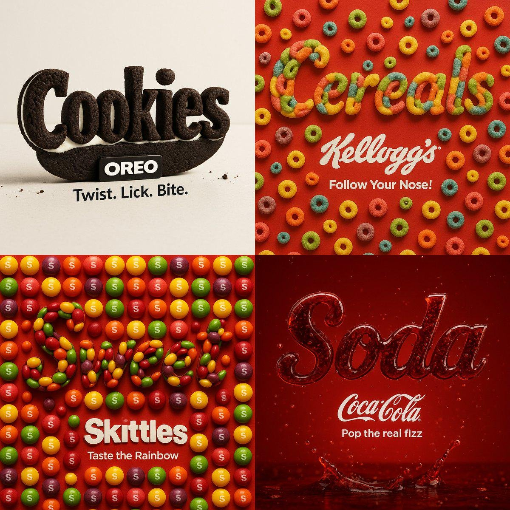


### 中文提示词

```
创建由其真实质感完全构成，并使用与其最具有标志性的品牌相联系的标识进行风格的“[单词]”。
该单词应：
• 视觉上反映材料（例如蜂蜜、巧克力、汽水、糖果）。
• 使用该品牌的标志性颜色和字体。
• 在文字下方包含品牌标志。
• 添加一个与产品氛围相符的简短口号（3-4 个字）。
• 居中放置在受产品启发的简约背景中（例如：早餐桌、汽水飞溅、饼干托盘）。
• 尺寸：1:1
• 风格：简洁、醒目、以产品为中心
• 渲染：超高清、HDR、8K
```

### 英文提示词

```
Create the word “[WORD]” made entirely from its real texture and styled using 
the identity of the most iconic brand associated with it.
The word should:
• Visually reflect the material (e.g. honey, chocolate, soda, candy).
• Use the brand’s signature colors and typography.
• Include the brand logo beneath the word.
• Add a short slogan (3–4 words) matching the product’s vibe. 2 4 6 
• Be centered in a minimal background inspired by the product (e.g. breakfast 
table, soda splash, cookie tray).
• Dimensions: 1:1
• Style: clean, bold, product-focused
• Render: ultra-HD, HDR, 8K
```
## 案例 80: 逼真的产品照片 (来源 @azed_ai)​

### 效果展示


  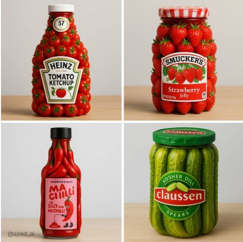

### 中文提示词

```
一个逼真的产品照片，展示一个[品牌名称][瓶子或罐子]，完全由新鲜[原料名称]雕刻而成，完美排列
形成原始包装的形状，包括前面详细且准确的标签。背景是干净柔和的浅灰色，带有自然木质表面。工
作室灯光，柔和阴影，1:1 方形构图，专业产品摄影风格，超精细纹理，生动有光泽的表面。
```

### 英文提示词

```
A realistic product photo of a [brand name] [bottle or jar] sculpted entirely 
from fresh [ingredient name], arranged perfectly to form the shape of the 
original packaging, including a detailed and accurate label on the front. The 
background is a clean, soft light gray with a natural wooden surface. Studio 
lighting, soft shadows, 1:1 square composition, professional product 
photography style, ultra-detailed textures, vibrant and glossy finish
```
## 案例 81: 超现实的高冲击力的图像 (来源 @azed_ai)​

### 效果展示


  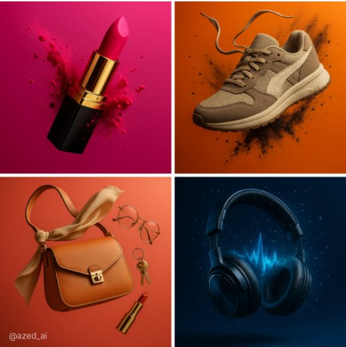


### 中文提示词

```
创建一个超现实的、高冲击力的图像，展示一个[主题]在空中悬停，捕捉到爆炸性时刻的巅峰。用动态
的[粒子/飞溅/碎片]围绕它，增强运动感和能量。宏观细节，大胆的边缘照明，以及充满活力的[背景
颜色]，以强调形状、质感和对比度，电影般的、现代的、视觉上引人注目。非常适合高端产品活动。
```

### 英文提示词

```
Create a hyperrealistic, high-impact image of a [subject] suspended mid-air, 
captured at the peak of an explosive moment. Surround it with dynamic 
[particles/splashes/fragments] that enhance motion and energy. macro-level 
detail, bold rim lighting, and a vibrant [background color] to emphasize form, 
texture, and contrast, cinematic, modern, and visually striking. perfect for 
premium product campaigns.
```
## 案例 82: 工业内部品牌广告 (来源 @aziz4ai)​

### 效果展示


  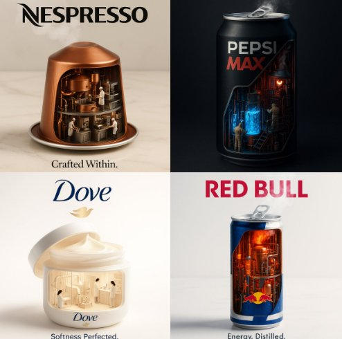


### 中文提示词

```
创建一个超现实、1:1 比例的品牌广告。
将产品内部转化为微型工厂或实验室。
展示详细的内部系统：管道、工人、发光的液体、蒸汽和机器——所有这些都运作起来，反映产品的核心
功能（能量、美丽、风味等）。
保持外层产品的品牌标识真实锐利。
将背景设置得简约且电影感十足。
在顶部添加品牌标志，底部添加一句简短有力的口号。
风格：影棚级灯光，高对比度，照片级真实纹理。
```

### 英文提示词

```
Create a hyperrealistic, surreal 1:1 advertisement for [Brand Name].
Transform the product into a miniature industrial factory or laboratory from 
the inside.
Reveal detailed internal systems: pipes, workers, glowing fluids, steam, and 
machines — all functioning to reflect the product’s core purpose (energy, 
beauty, flavor, etc).
Keep the outer product branding realistic and sharp.
Set the background minimal and cinematic.
Add the brand logo at the top, and a short, powerful slogan at the bottom.
Style: studio-grade lighting, high contrast, photorealistic textures.
```
## 案例 83: 以动物为灵感的品牌 (来源 @Kerroudjm)​

### 效果展示


  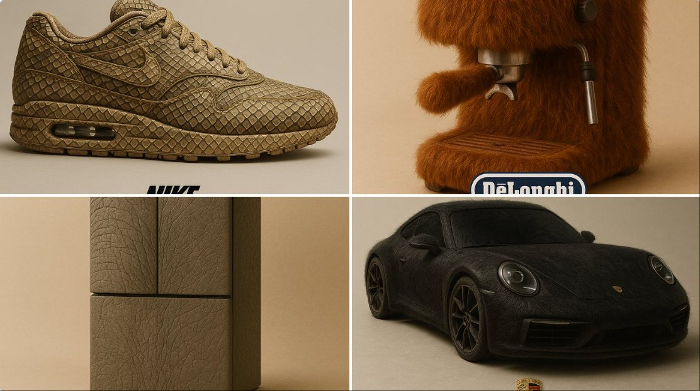


### 中文提示词

```
一张高品质的影棚照片，展示一个[品牌+物品]完全覆盖着超逼真的[动物]纹理（例如毛发、羽毛、皮
肤或鳞片），放置在柔和的中性背景前。物品的原始形状、关键设计元素和品牌标识在动物的自然表面
下依然清晰可见。将品牌的官方标志显著地融入构图。自动生成一个引人入胜且符合品牌调性的口号，
从动物的品质中汲取象征性灵感，匹配高端广告活动的基调。图像必须具备整洁的构图、柔和的阴影、
极简风格、专业的灯光和高度精细的纹理——每一根毛发、鳞片或皱纹都应在锐利的细节中清晰可见。格
式 1:1。
```

### 英文提示词

```
A high-quality studio photograph of a [BRAND + OBJECT] fully covered in ultra-
realistic [ANIMAL] texture (e.g., fur, feathers, skin, or scales), placed 
against a soft neutral background. The object’s original shape, key design 
elements, and brand identity remain clearly visible beneath the animal’s 
organic surface. Integrate the official logo of the brand prominently into the 
composition. Automatically generate a compelling and brand-appropriate slogan 
that draws symbolic inspiration from the animal’s qualities and matches the 
tone of a premium advertising campaign. The image must feature clean 
composition, soft shadows, minimalist styling, professional lighting, and 
highly detailed textures—each hair, scale, or wrinkle should be visible in 
sharp detail. Format 1:1.
```
## 案例 84: 黑客帝国的绿色代码 (来源 @umesh_ai)​

### 效果展示


  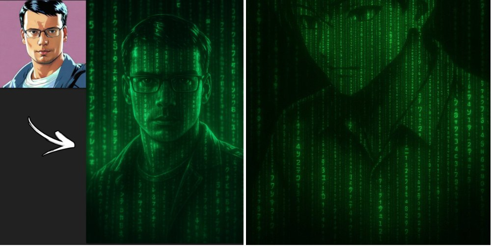


### 中文提示词

```
将这张图像转化为数字《黑客帝国》风格场景。背景和主题应由倾泻而下的霓虹绿色代码组成，在黑色
背景下，类似于标志性的《黑客帝国》数字雨。使用发光的绿色符号（日语假名、数字和拉丁字母），
带有一些运动模糊和深度。添加微妙的光照效果来模拟屏幕辉光，增强赛博朋克、高科技氛围
```

### 英文提示词

```
Transform this image into a digital Matrix-style scene. The background and 
subject should be composed of cascading neon green code on a black backdrop, 
similar to the iconic Matrix digital rain. Use glowing green symbols (Japanese 
katakana, numbers, and Latin letters), with some motion blur and depth. Add 
subtle lighting effects to simulate screen glow and enhance the cyberpunk, 
high-tech atmosphere
```
## 案例 85: 3D表情符号头部 (来源 @TechieBySA)​

### 效果展示


  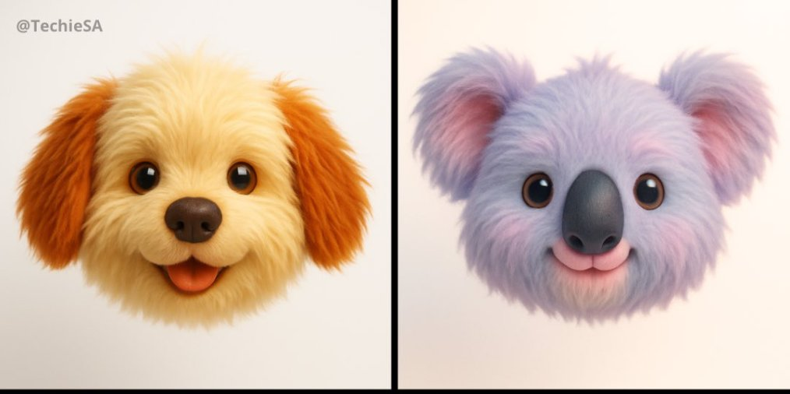


### 中文提示词

```
生成一个超逼真的 3D 渲染效果，将[表情符号 🐱 ]设计成一个漂浮的动物头部，具有毛绒玩具的美
学风格。设计应强调超柔软的长毛、俏皮可爱和童真魅力。使用正面直视的相机角度，搭配柔和的漫射
光线，营造出温暖诱人的光泽。保持背景纯白色，以呈现干净现代的外观。色彩搭配应鲜明而舒缓，增
强玩具般的吸引力。风格：超精细、奇幻、超可爱，将现实主义与柔软的毛绒质感相结合，以达到最大
的视觉冲击力。
```

### 英文提示词

```
Generate a hyper-realistic 3D render of a [EMOJI🐱] as a floating animal head 
with plush toy aesthetics. The design should emphasize ultra-soft, long fur, 
playful cuteness, and a childlike charm. Use a straight-on camera angle with 
soft, diffused lighting to create a warm and inviting glow. Keep the 
background pure white for a clean, modern look. The color palette should be 
vibrant yet soothing, enhancing the toy-like appeal. Style: Ultra-detailed, 
whimsical, and hyper-cute, blending realism with a soft, plush texture for 
maximum visual impact.
```
## 案例 86: 创建半透明图标 (来源 @azed_ai)​

### 效果展示


  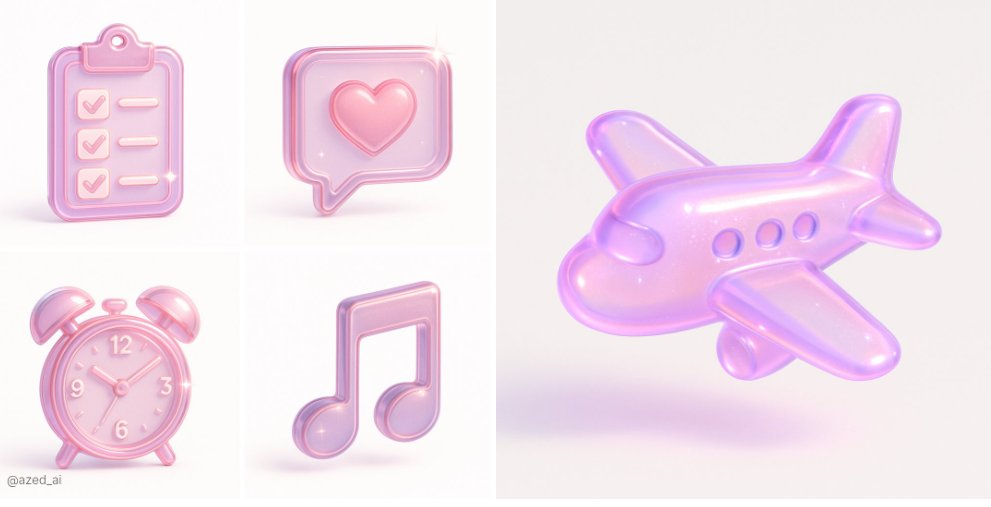


### 中文提示词

```
创建一个以[主题]为原型的 3D 渲染图标，采用梦幻般的、半透明的、类似玻璃的塑料材质，带有柔和
的粉红色和紫色色调。表面光亮、边缘圆润、高光闪烁，并带有柔和的闪烁或闪光效果。UI 设计，悬
浮在干净的白色背景上，带有柔和的阴影和自然光照，优雅且现代。
```

### 英文提示词

```
Create a 3D-rendered icon of [Subject] in a dreamy, translucent, glass-like 
plastic material with soft pink and purple hues. glossy, smooth, rounded 
edges, glowing highlights, and soft shimmer or sparkle effects. UI, floating 
against a clean white background with soft shadows and natural lighting, 
elegant, and modern.
```
## 案例 87: 纸上的小卡通角色 (来源 @jimmj1010)​

### 效果展示


  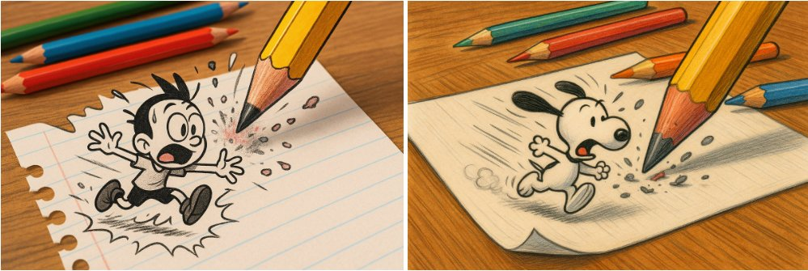


### 中文提示词

```
想象你是一个在纸上活过来的小卡通角色！画自己从一只试图擦掉你的巨大铅笔逃跑。添加彩色铅笔、
书桌，也许还有一些飞行的橡皮屑以增加乐趣。用你最狂野的想象力让它看起来像是从页面上爆发出
来！
```

### 英文提示词

```
Imagine you're a tiny cartoon character who has come to life on a piece of 
paper! Draw yourself running away from a giant pencil that's trying to erase 
you. Add colorful pencils, a desk, and maybe some flying eraser bits for extra 
excitement. Use your wildest imagination to make it look like you're bursting 
out of the page!
```
